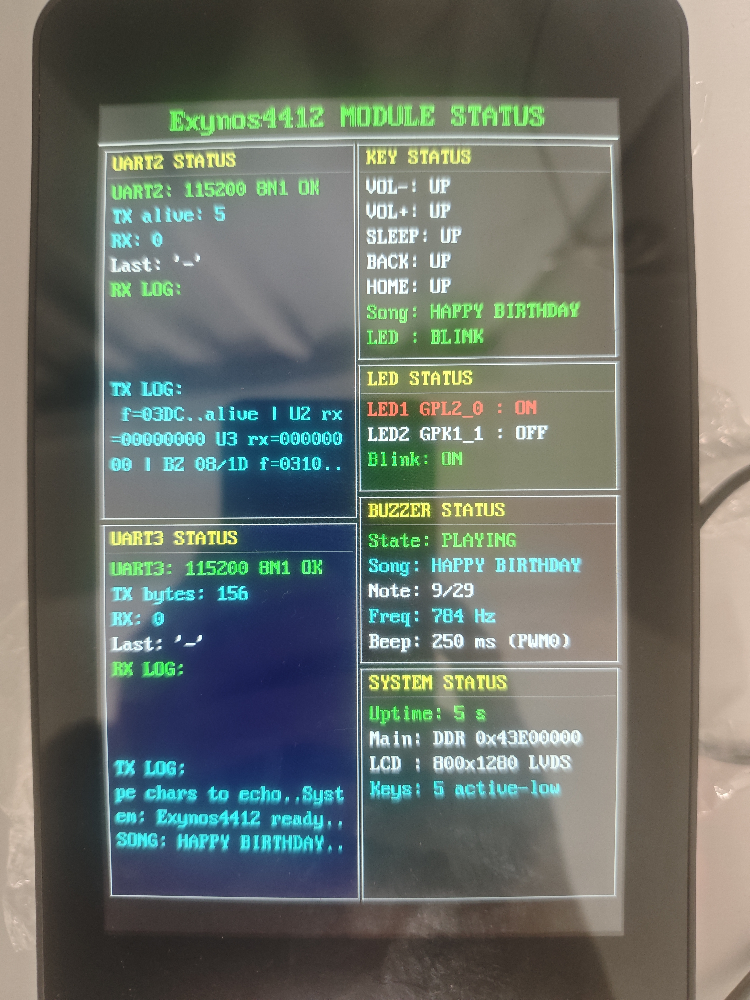

# Exynos4412 裸机开发完整教程（STM32 库风格）

> 目标板：**iTOP-4412 精英版（POP 封装，LPDDR2 1G）**
> 工程：本仓库 `exynos4412`，仿 STM32 标准外设库编写
>
> 本文每一章 = **详细讲解（含每一句关键代码的作用） + 该模块完整源码**。
> 完整源码由 `tools/gen_tutorial.py` 从工程实时读取，保证与代码 100% 一致；
> 照着本文即可复刻整个工程。

## 本文框架

全文分 **8 个部分**，按“先看懂 → 再动手 → 后排错”的顺序组织：

| 部分 | 讲什么 |
| ---- | ---- |
| **第一部分 预备知识** | 启动流程、工具下载、目录结构——先建立整体概念 |
| **第二部分 启动与链接** | start.S / main_start.S / 链接脚本——程序怎么跑起来 |
| **第三部分 外设库详解** | GPIO/UART/DDR/LCD/蜂鸣器/按键/时钟——每个模块逐句讲解 + 完整源码 |
| **第四部分 应用层** | main.c 逐段、User/App 各模块——业务逻辑怎么组织 |
| **第五部分 显示与构建** | 8x16 字模、Windows 编译（build.ps1 / Makefile） |
| **第六部分 烧录与上板** | 确认 SD 磁盘号、烧录 SD 卡、上电验证 |
| **第七部分 速查与排错** | 关键项速查表、完整五步流程、常见问题 |
| **第八部分 附录** | 构建与烧录脚本完整源码 |

---

## 运行效果演示（视频 + 截图）

以下为本工程在 **iTOP-4412（POP 封装）** 开发板上的实际运行效果。
视频约 4MB，GitHub / Gitee 页面可直接播放（无法播放时点击下载）。



<video src="media/运行效果.mp4" controls width="720"></video>

> 视频内容：上电 → BL2 初始化时钟与 DDR → 主程序搬运到 DDR `0x43E00000` →
> LCD 显示分块状态面板（UART2/UART3 收发计数与 LOG、LED、蜂鸣器、按键、
> 系统状态）→ 蜂鸣器播放内置歌曲，VOL± 切歌、SLEEP 停止、BACK/HOME 控制 LED。

---

## 目录

**第一部分 预备知识**
- 1. [总体架构与启动流程](#1-总体架构与启动流程)
- 2. [需要的工具与下载地址](#2-需要的工具与下载地址)
- 3. [工程目录结构](#3-工程目录结构)

**第二部分 启动与链接**
- 4. [启动文件 start.S 逐句讲解 + 完整源码](#4-启动文件-starts-逐句讲解--完整源码)
- 5. [主程序启动文件 main_start.S + 完整源码](#5-主程序启动文件-main_starts--完整源码)
- 6. [链接脚本 .lds 讲解 + 完整源码](#6-链接脚本-lds-讲解--完整源码)

**第三部分 外设库详解**
- 7. [GPIO 驱动讲解 + 完整源码](#7-gpio-驱动讲解--完整源码)
- 8. [UART 驱动讲解 + 完整源码](#8-uart-驱动讲解--完整源码)
- 9. [DDR 驱动详解 + 完整源码（重点）](#9-ddr-驱动详解--完整源码重点)
- 10. [LCD 驱动详解 + 完整源码（重点）](#10-lcd-驱动详解--完整源码重点)
- 11. [蜂鸣器与按键驱动 + 完整源码（含音乐数组）](#11-蜂鸣器与按键驱动--完整源码含音乐数组)
- 12. [时钟与毫秒节拍 + 完整源码](#12-时钟与毫秒节拍--完整源码)

**第四部分 应用层**
- 13. [主程序 main.c 逐段讲解 + 完整源码](#13-主程序-mainc-逐段讲解--完整源码)
- 14. [应用模块 User/App + 完整源码](#14-应用模块-userapp--完整源码)

**第五部分 显示与构建**
- 15. [8x16 字模表 font8x16.h](#15-8x16-字模表-font8x16h)
- 16. [Windows 下编译（build.ps1 / Makefile）](#16-windows-下编译buildps1--makefile)

**第六部分 烧录与上板**
- 17. [如何确认 SD 卡磁盘号（详细步骤）](#17-如何确认-sd-卡磁盘号详细步骤)
- 18. [Windows 下烧录 SD 卡](#18-windows-下烧录-sd-卡)
- 19. [上电验证](#19-上电验证)

**第七部分 速查与排错**
- 20. [关键项速查表](#20-关键项速查表)
- 21. [完整操作流程（编译→烧录→上电）](#21-完整操作流程编译烧录上电)
- 22. [常见问题](#22-常见问题)

**第八部分 附录**
- 23. [构建与烧录脚本完整源码](#23-附录构建与烧录脚本完整源码)

---

# 第一部分：预备知识

> **本部分讲什么**：先建立整体概念——芯片怎么启动、需要哪些工具、工程文件怎么
> 组织。看完这部分，你对“BL1/BL2/main 三个镜像”和“哪些文件干什么”就有数了。

---


## 1. 总体架构与启动流程

Exynos4412 上电后的启动链路：**iROM(BL1) → BL2(IRAM) → 主程序(DDR)**。

```text
上电
 │
 ├─ 芯片内部 iROM 固化代码（三星出厂写好，用户不可改）
 │    ├─ 初始化时钟/DDR 的"最小部分"
 │    └─ 从 SD 卡扇区 1 读 8KB BL1 到 IRAM 0x02020000 并运行
 │
 ├─ BL1（tools/bl1/E4412.S.BL1.SSCR.EVT1.1.bin，迅为/三星提供）
 │    └─ 从 SD 卡扇区 17 读 14KB BL2 到 IRAM 0x02023400 并运行
 │
 ├─ BL2（本工程编译，运行在 IRAM，受 14KB 限制）
 │    ├─ 关闭看门狗、配置异常模式
 │    ├─ SystemInit()：DDR_Init() → System_ClockInit() → DDR_DllStartPost()
 │    └─ 用 iROM 拷贝函数把 SD 扇区 49 起的 512KB 主程序搬到 DDR 0x43E00000
 │
 └─ 主程序 main.bin（运行在 DDR）
      ├─ UART2/UART3 初始化
      ├─ LVDS-LCD 初始化（800x1280）
      ├─ 分栏状态面板（左半 UART2/UART3，右半 KEY/LED/BUZZER/SYSTEM）
      ├─ 蜂鸣器循环播放 3 首歌（生日快乐/小星星/两只老虎）
      ├─ 5 个按键：VOL± 切歌、SLEEP 停止、BACK/HOME 控制 LED
      └─ UART3 打印歌曲名等系统信息 + 收到字符回显
```

**为什么要分 BL2 和 main 两个镜像？**

- BL2 只能放在 IRAM（BL1 加载到 `0x02023400`，实际限制 **14KB**），
  放不下 LCD 驱动、字库、状态面板这些大代码；
- 所以 BL2 只做“初始化时钟 + DDR + 搬运”，把真正的大程序搬到 1GB 的 DDR
  （`0x43E00000`）里运行，空间随便用。

> **关键项 1**：BL2 必须小于 14332 字节（14KB − 4 字节校验和），否则 BL1 加载失败。
> **关键项 2**：DDR 初始化必须在切换高速时钟之前完成（先 `DDR_Init()` 再
> `System_ClockInit()`），与官方 U-Boot 流程一致。

---

## 2. 需要的工具与下载地址

| 工具 | 用途 | 下载地址 |
| ---- | ---- | ---- |
| **arm-none-eabi 交叉编译器** | 把 C/汇编编译成 ARM 裸机程序 | xPack：<https://github.com/xpack-dev-tools/arm-none-eabi-gcc-xpack/releases>（选 `win-x64.zip`）；或 Arm 官方：<https://developer.arm.com/downloads/-/arm-gnu-toolchain-downloads> |
| **串口助手** | 查看 UART2 输出、给 UART3 发字符 | SSCOM：<https://www.daxia.com/download/sscom.rar>；XCOM；PuTTY：<https://www.putty.org> |
| **USB 转串口驱动** | PL2303/CH340 驱动 | 搜"PL2303 官方驱动"/"CH340 驱动" |
| **SD 卡 + 读卡器** | 存放启动镜像 | 普通 SD/microSD 卡 |
| **管理员权限** | 烧录脚本直接写物理磁盘 | Windows UAC |

**工具链安装步骤（仓库已内置分片，离线恢复，链接永不过期）：**

1. 在工程根目录打开 PowerShell，执行：

```powershell
powershell -ExecutionPolicy Bypass -File tools\toolchain\join_toolchain.ps1
```

2. 脚本把 `tools\toolchain\parts\` 里的安装包分片（320MB，随 git 仓库
   提交）合并、校验 SHA256 并解压到 `tools\toolchain\`（约 1.4GB，全程离线）；
3. 之后直接编译即可，`tools\build.ps1` 会自动在 `tools\toolchain\` 下
   找到工具链（找不到再回退到系统 PATH），**无需修改任何脚本路径**。

> 备用：如果 `parts\` 分片缺失（旧版本克隆），才需要在线下载：
> `powershell -ExecutionPolicy Bypass -File tools\toolchain\download_toolchain.ps1`

> **关键项 3**：工具链请放在 `tools\toolchain\` 下（或加入 PATH）。
> ⚠ 绝对路径警告：**不要**像旧教程那样把工具链写死成
> `C:\Users\xxx\...\bin`——工程拷贝到其他目录/其他电脑后，绝对路径必然失效。
> 本工程所有脚本均以工程目录为基准的相对路径定位工具。

---

## 3. 工程目录结构

```text
exynos4412/
├── Libraries/
│   ├── inc/                     # 外设库头文件
│   └── src/                     # 外设库源码
│       ├── exynos4412_gpio.c    # GPIO
│       ├── exynos4412_uart.c    # UART
│       ├── exynos4412_ddr.c     # LPDDR2
│       ├── exynos4412_clock.c   # 时钟 + 毫秒节拍
│       ├── exynos4412_lcd.c     # FIMD + LVDS
│       ├── exynos4412_buzzer.c  # PWM0 蜂鸣器 + 3 首歌
│       └── exynos4412_key.c     # 5 按键
├── User/
│   ├── main.c                   # 主程序
│   └── App/                     # 功能模块
│       ├── led.c/h              # LED
│       ├── panel.c/h            # 状态面板
│       ├── debug.c/h            # 调试打印
│       └── system_4412.c        # SystemInit
├── startup/
│   ├── start.S                  # BL2 启动
│   ├── main_start.S             # 主程序启动
│   ├── aeabi_div.S              # 软件除法
│   ├── exynos4412.lds           # BL2 链接脚本
│   └── main.lds                 # 主程序链接脚本
├── tools/
│   ├── build.ps1                # Windows 一键编译
│   ├── burn_sd.ps1              # Windows 烧录 SD 卡
│   ├── list_disks.ps1           # 查看磁盘号
│   ├── verify_sd.ps1            # 读回校验 SD
│   ├── gen_tutorial.py          # 生成本文档的脚本
│   ├── toolchain/               # 交叉编译器
│   │   ├── parts/               # 安装包分片（已入库，链接不过期）
│   │   ├── join_toolchain.ps1   # 首选：分片合并解压（离线）
│   │   └── download_toolchain.ps1 # 备用：在线下载
│   ├── teraterm/                # 串口终端
│   ├── pl2303_v150/             # PL2303 串口驱动
│   ├── bl1/                     # 三星 BL1
│   │   └── E4412.S.BL1.SSCR.EVT1.1.bin
│   └── other/                   # 参考资料（体积大，不提交 git）
├── Makefile
├── build/                       # 编译输出（自动生成）
└── README.md
```

---

# 第二部分：启动与链接

> **本部分讲什么**：程序是怎么跑起来的——BL2 启动文件（start.S）、主程序入口
> （main_start.S）、链接脚本（.lds）和软件除法（aeabi_div.S）。这是整个工程的
> “地基”，先看懂它，后面外设库才有运行环境。

---


## 4. 启动文件 start.S 逐句讲解 + 完整源码

BL2 被 BL1 加载到 IRAM `0x02023400` 后从 `_start` 执行。核心步骤：

1. **关看门狗**：不关的话系统每隔几秒自动复位，串口只看到零星字节；
2. **进 SVC 模式、关中断**：裸机不需要中断打扰；
3. **关 MMU/D-Cache/I-Cache**：没配页表前不能开 MMU；
4. **设栈、清 BSS**：C 语言运行环境；
5. **SystemInit()**：`DDR_Init()` → `System_ClockInit()` → `DDR_DllStartPost()`；
6. **iROM 拷贝**：把 SD 扇区 49 起的 512KB 主程序搬到 DDR `0x43E00000`；
7. **跳转 DDR** 运行 main。

关键点说明：

- `0x02020030` 存着 iROM 提供的 `copy_sd_mmc_to_mem` 函数指针（BL1 启动后有效），
  参数是（起始扇区，块数，目标地址），每块 512 字节；
- BL2 头部 4 个字 `0x2000 0 0 0` 与迅为已验证程序一致，不能省；
- 搬运后打印主程序首 4 字节，用于校验 SD 读取是否正确。

#### 完整文件：startup/start.S

```asm
/*--------------------------------------------------------------
 * Exynos4412 BL2 启动文件 (参照 STM32 工程的 startup 风格编写)
 *
 * 启动流程:
 *   1. 关闭看门狗, 配置 0x1002330C (时钟启动相关)
 *   2. 进入 SVC 模式并关闭中断 (IRQ/FIQ)
 *   3. 关闭 MMU / D-Cache / I-Cache
 *   4. 建立栈 (IRAM 顶部), 清零 BSS
 *   5. 调用 SystemInit (时钟 + DDR 初始化)
 *   6. 用 iROM 拷贝函数把 SD 卡扇区 49 起的主程序 (512KB)
 *      搬运到 DDR 0x43E00000
 *   7. 跳转到 DDR 0x43E00000 运行 main
 *
 * 说明:
 *   - iROM 拷贝函数指针在 0x02020030 (BL1 启动后有效), 参数为
 *     copy_sd_mmc_to_mem(start_block, block_count, dest_addr), 每块 512 字节
 *   - BL2 只做搬运, 全部业务代码 (LCD/串口等) 都在 main.bin 里,
 *     从而避开 IRAM 14KB 空间限制
 *--------------------------------------------------------------*/
.section .text.entry, "ax"
.arm

/* BL2 头部: 与迅为已验证汇编程序完全一致 (0x2000 0x0 0x0 0x0) */
.word 0x2000
.word 0x0
.word 0x0
.word 0x0

.global _start

_start:
    /* 0. 关闭看门狗 (WTCON @ 0x10060000 = 0):
     *    iROM/BL1 会开启看门狗, 若不关闭, 每隔几秒系统自动复位,
     *    导致程序不断重启、串口只看到零星字节 */
    ldr     r0, =0x10060000
    mov     r1, #0
    str     r1, [r0]

    /* 0. 与迅为 iTOP-4412 已验证可用的汇编程序保持一致:
     *    把 0x1002330C 的 bit[9:8] 置 1 (时钟启动相关配置, 见 4412 手册) */
    ldr     r0, =0x1002330C
    ldr     r1, [r0]
    orr     r1, r1, #0x300
    str     r1, [r0]

    /* 0b. 与已验证程序一致: GPX0PUD (0x11000C08) 清零, 关闭 GPX0 上下拉 */
    ldr     r0, =0x11000C08
    mov     r1, #0
    str     r1, [r0]

    /* 1. 进入 SVC 模式, 关闭 IRQ/FIQ */
    mrs     r0, cpsr
    bic     r0, r0, #0x1F
    orr     r0, r0, #0xD3
    msr     cpsr, r0

    /* 2. 关闭 MMU / D-Cache / I-Cache */
    mrc     p15, 0, r0, c1, c0, 0
    bic     r0, r0, #0x00002000   /* I(bit12): 关闭 I-Cache */
    bic     r0, r0, #0x00000007   /* M/C/A(bit0-2): 关闭 MMU/D-Cache/对齐 */
    bic     r0, r0, #0x00000002   /* A(bit1): 保持关闭对齐检查 (允许未对齐访问) */
    orr     r0, r0, #0x00000800   /* Z(bit11): 开启 BTB */
    mcr     p15, 0, r0, c1, c0, 0

    /* 无效化 TLB 和 I-Cache */
    mov     r0, #0
    mcr     p15, 0, r0, c8, c7, 0
    mcr     p15, 0, r0, c7, c5, 0
    dsb
    isb

    /* 3. 栈指针指向 IRAM 顶部 (链接脚本定义 __stack_top) */
    ldr     sp, =__stack_top

    /* 清零 BSS */
    ldr     r0, =__bss_start
    ldr     r1, =__bss_end
    mov     r2, #0
1:
    cmp     r0, r1
    bge     2f
    str     r2, [r0], #4
    b       1b
2:

    /* 4. 系统初始化 (时钟 / DDR, 见 system_4412.c) */
    bl      SystemInit

    /* 5. 快速初始化 UART2 (仅用于 BL2 阶段调试打印) */
    bl      UART2_QuickInit

    ldr     r0, =msg_init_ok
    bl      UART2_Print

    /* 6. 通过 iROM 拷贝函数搬运主程序:
     *    copy_sd_mmc_to_mem(49, 1024, 0x43E00000)
     *    扇区 49 起 1024 块 = 512KB, 与烧录脚本布局一致 */
    ldr     r3, =0x02020030
    ldr     r3, [r3]              /* 取 iROM 函数指针 */
    mov     r0, #49               /* 起始扇区 */
    mov     r1, #1024             /* 块数 (每块 512 字节) */
    ldr     r2, =0x43E00000       /* 目标地址 (DDR) */
    blx     r3

    /* 打印搬运后主程序首 4 字节, 用于校验 SD 读取是否正确 */
    ldr     r0, =msg_copy_ok
    bl      UART2_Print
    ldr     r0, =0x43E00000
    ldr     r0, [r0]
    bl      UART2_PrintHex32
    ldr     r0, =msg_crlf
    bl      UART2_Print

    /* 7. 跳转到 DDR 运行主程序 */
    ldr     pc, =0x43E00000

/* 主程序跳转失败时死循环 */
3:
    b       3b

/*--------------------------------------------------------------
 * UART2 快速初始化 (GPA1_0/1 复用功能 2, 115200 8N1, SCLK_UART=100MHz)
 * 与主程序中的 UART_Init 参数一致: ULCON=0x3, UCON=0x3C5,
 * UFCON=0x111, UBRDIV=53, UDIVSLOT=4
 *--------------------------------------------------------------*/
UART2_QuickInit:
    /* GPA1CON = 0x22222222 (全部复用功能 2) */
    ldr     r0, =0x11400020
    ldr     r1, =0x22222222
    str     r1, [r0]
    /* GPA1PUD = 0 (无上下拉) */
    ldr     r0, =0x11400028
    mov     r1, #0
    str     r1, [r0]

    /* UART2 寄存器初始化 */
    ldr     r0, =0x13820000
    ldr     r1, =0x3              /* ULCON: 8N1 */
    str     r1, [r0]
    ldr     r1, =0x3C5            /* UCON: 收发使能, SCLK_UART */
    str     r1, [r0, #0x04]
    ldr     r1, =0x111            /* UFCON: FIFO 使能 */
    str     r1, [r0, #0x08]
    mov     r1, #0                /* UMCON: 无流控 */
    str     r1, [r0, #0x0C]
    ldr     r1, =53               /* UBRDIV: 115200 */
    str     r1, [r0, #0x28]
    ldr     r1, =4                /* UDIVSLOT */
    str     r1, [r0, #0x2C]
    mov     pc, lr

/*--------------------------------------------------------------
 * UART2 打印字符串 (r0 = 字符串地址, 盲写 + 延时, 不等待标志)
 *--------------------------------------------------------------*/
UART2_Print:
    ldr     r1, =0x13820000
1:
    ldrb    r2, [r0], #1
    cmp     r2, #0
    moveq   pc, lr
    str     r2, [r1, #0x20]       /* UTXH */
    ldr     r3, =0x9000
2:
    subs    r3, r3, #1
    bne     2b
    b       1b

/*--------------------------------------------------------------
 * UART2 打印 32 位十六进制 (r0 = 数据)
 *--------------------------------------------------------------*/
UART2_PrintHex32:
    stmfd   sp!, {r4-r6, lr}
    mov     r4, r0                /* 保存数据 */
    ldr     r5, =hex_chars
    mov     r6, #8                /* 8 个十六进制字符 */
1:
    mov     r0, r4, lsr #28
    ldrb    r0, [r5, r0]
    ldr     r1, =0x13820000
    str     r0, [r1, #0x20]
    ldr     r2, =0x9000
2:
    subs    r2, r2, #1
    bne     2b
    mov     r4, r4, lsl #4
    subs    r6, r6, #1
    bne     1b
    ldmfd   sp!, {r4-r6, pc}

/* 只读字符串与数据 (放在 .rodata, 避免 BL2 空间浪费) */
.section .rodata
msg_init_ok:
    .asciz  "BL2: clocks+DDR ok\r\n"
msg_copy_ok:
    .asciz  "BL2: main copied to 0x43E00000, head="
msg_crlf:
    .asciz  "\r\n"
hex_chars:
    .asciz  "0123456789ABCDEF"

.end
```

---

## 5. 主程序启动文件 main_start.S + 完整源码

主程序被搬到 DDR 后从这里进入：

1. **关对齐检查（A=0）**：面板字符串拼接会产生未对齐的半字存储，
   开着对齐检查会触发数据访问异常（`FAULT D, DFSR=0x801`）；
2. **设异常向量表**（VBAR）：诊断用，异常时打印 DFSR/DFAR/PC；
3. **设栈（DDR 顶部 0x7FFFE000）、清 BSS**；
4. **跳 main()**。

#### 完整文件：startup/main_start.S

```asm
/*--------------------------------------------------------------
 * Exynos4412 主程序 (DDR) 入口文件
 *
 * 由 BL2 把本镜像从 SD 卡搬运到 DDR 0x43E00000 后跳转到这里:
 *   1. 栈指针指向 DDR 顶部 0x7FFFE000 (1GB DDR 顶端留 8KB 余量)
 *   2. 清零 BSS
 *   3. 跳转 C 语言的 main()
 *
 * 说明: 所有业务代码 (LCD/串口/LED 等) 都运行在 DDR 中,
 *       不再受 IRAM 14KB 的 BL2 空间限制。
 *--------------------------------------------------------------*/
.section .text.entry, "ax"
.arm

.global _start

_start:
    /* 关闭对齐检查 (A=0): 面板字符串拼接会产生未对齐的半字存储,
     * 若开启对齐检查会触发数据对齐异常 (FAULT D, DFSR=0x801) */
    mrc     p15, 0, r0, c1, c0, 0
    bic     r0, r0, #0x00000002
    mcr     p15, 0, r0, c1, c0, 0
    dsb
    isb

    /* 设置异常向量表基地址 (诊断用: 捕获数据访问异常并打印故障信息) */
    ldr     r0, =VectorTable
    mcr     p15, 0, r0, c12, c0, 0
    dsb
    isb

    /* 栈指针 = DDR 顶部 (链接脚本定义 __stack_top = 0x7FFFE000) */
    ldr     sp, =__stack_top

    /* 清零 BSS */
    ldr     r0, =__bss_start
    ldr     r1, =__bss_end
    mov     r2, #0
1:
    cmp     r0, r1
    bge     2f
    str     r2, [r0], #4
    b       1b
2:

    /* 进入 C 主函数 */
    bl      main

/* main 返回后死循环 */
3:
    b       3b

/*--------------------------------------------------------------
 * 异常向量表 + 故障打印 (诊断用)
 *
 * 若程序发生数据访问异常/未定义指令等, CPU 会跳到对应向量,
 * 这里打印故障类型 + DFSR(故障状态) + DFAR(故障地址) + PC,
 * 然后死循环, 便于定位是"异常"还是"死循环"导致的卡死。
 *--------------------------------------------------------------*/
.section .text.vectors, "ax"
.balign 32
.global VectorTable
VectorTable:
    b   .Lvec_reset
    b   .Lvec_undef
    b   .Lvec_swi
    b   .Lvec_prefetch
    b   .Lvec_dabort
    b   .Lvec_reserved
    b   .Lvec_irq
    b   .Lvec_fiq

.Lvec_reset:   b .Lvec_reset
.Lvec_undef:   mov r0, #'U'; b .Lvec_fault
.Lvec_swi:     mov r0, #'S'; b .Lvec_fault
.Lvec_prefetch: mov r0, #'P'; b .Lvec_fault
.Lvec_dabort:  mov r0, #'D'; b .Lvec_fault
.Lvec_reserved: b .Lvec_reserved
.Lvec_irq:     mov r0, #'I'; b .Lvec_fault
.Lvec_fiq:     mov r0, #'F'; b .Lvec_fault

/* r0 = 故障类型字符; 保存 DFSR/DFAR/PC 后打印并挂起 */
.Lvec_fault:
    ldr     r1, =FaultRec
    str     r0, [r1, #0]          /* 类型 */
    mrc     p15, 0, r2, c5, c0, 0 /* DFSR */
    str     r2, [r1, #4]
    mrc     p15, 0, r2, c6, c0, 0 /* DFAR */
    str     r2, [r1, #8]
    mov     r2, lr
    sub     r2, r2, #8            /* 故障 PC */
    str     r2, [r1, #12]
    /* 切到 SVC 模式, 屏蔽中断, 使用主栈 */
    mrs     r2, cpsr
    bic     r2, r2, #0x1F
    orr     r2, r2, #0xD3
    msr     cpsr, r2
    /* 打印 "\r\nFAULT " */
    ldr     r5, =0x13820000       /* UART2 */
    ldr     r6, =FaultMsg
1:  ldrb    r2, [r6], #1
    cmp     r2, #0
    beq     2f
    str     r2, [r5, #0x20]       /* UTXH */
    bl      .Lvec_delay
    b       1b
2:
    /* 打印类型字符 */
    ldr     r2, [r1, #0]
    str     r2, [r5, #0x20]
    bl      .Lvec_delay
    /* 打印 DFSR / DFAR / PC (从 offset 4 起 3 个 32 位) */
    mov     r4, #3
3:
    ldr     r0, [r1, r4, lsl #2]
    bl      .Lvec_hex32
    subs    r4, r4, #1
    bne     3b
.Lvec_hang:
    b       .Lvec_hang

/* r0 = 32 位值, r5 = UART2 基址; 打印 8 位十六进制 */
.Lvec_hex32:
    mov     r7, #8
4:
    mov     r2, r0, lsr #28
    and     r2, r2, #0xF
    ldr     r8, =FaultHex
    ldrb    r2, [r8, r2]
    str     r2, [r5, #0x20]
    /* 内联延时 (不能用 bl, 会覆盖 lr) */
    mov     r9, #0x8000
5:  subs    r9, r9, #1
    bne     5b
    mov     r0, r0, lsl #4
    subs    r7, r7, #1
    bne     4b
    mov     pc, lr

.Lvec_delay:
    mov     r9, #0x8000
5:  subs    r9, r9, #1
    bne     5b
    mov     pc, lr

.section .rodata
FaultMsg:
    .asciz  "\r\nFAULT "
FaultHex:
    .ascii  "0123456789ABCDEF"

.section .bss
.balign 8
FaultRec:
    .space  16

.end
```

---

## 6. 链接脚本 .lds 讲解 + 完整源码

链接脚本决定代码/数据放在内存的哪个地址。本工程有两个：

### 6.1 exynos4412.lds（BL2）

- 基址 `0x02023400`（IRAM），由编译脚本通过 `--defsym __LINK_BASE` 传入；
- `KEEP(*(.text.entry))` 保证 `_start` 在镜像最前；
- 导出 `__bss_start/__bss_end` 供 start.S 清 BSS；
- `__stack_top = 0x02060000`（IRAM 顶部）。

### 6.2 main.lds（主程序）

- 基址固定 `0x43E00000`（DDR），必须与 start.S 的搬运目标一致；
- `__stack_top = 0x7FFFE000`（1GB DDR 顶端留 8KB 给栈）；
- 帧缓冲在 `0x50000000`，与代码/栈互不冲突。

#### 完整文件：startup/exynos4412.lds

```ld
/*--------------------------------------------------------------
 * Exynos4412 BL2 链接脚本
 *
 * 链接基址由 Makefile 通过 --defsym __LINK_BASE=0x02023400 传入:
 *   BL2 由 BL1 加载到 IRAM 0x02023400 运行 (与迅为已验证程序一致)
 *
 * 本阶段只做: 时钟 + DDR 初始化 + 用 iROM 拷贝函数把主程序搬到 DDR,
 * 所以镜像必须小于 14KB-4 字节。
 *--------------------------------------------------------------*/
ENTRY(_start)

SECTIONS
{
    . = __LINK_BASE;

    .text : {
        KEEP(*(.text.entry))      /* _start 必须位于镜像最前 */
        *(.text .text.*)
        . = ALIGN(4);
    }

    .rodata : {
        *(.rodata .rodata.*)
        . = ALIGN(4);
    }

    .data : {
        *(.data .data.*)
        . = ALIGN(4);
    }

    __bss_start = .;
    .bss : {
        *(.bss .bss.*)
        *(COMMON)
        . = ALIGN(4);
    }
    __bss_end = .;

    /* 栈固定在 IRAM 顶部 (0x02020000 + 256KB) */
    __stack_top = 0x02060000;
}
```

#### 完整文件：startup/main.lds

```ld
/*--------------------------------------------------------------
 * Exynos4412 主程序 (DDR) 链接脚本
 *
 * 镜像被 BL2 从 SD 卡扇区 49 搬运到 DDR 0x43E00000 运行,
 * 所以链接地址固定为 0x43E00000 (与 U-Boot 的 CFG_PHY_UBOOT_BASE 相同)。
 *
 * 内存布局:
 *   0x43E00000 : main.bin (代码 + 只读数据 + 数据, 容量 512KB)
 *   0x50000000 : LCD 帧缓冲 (800*1280*4 字节 ≈ 4MB)
 *   0x7FFFE000 : 栈顶 (向下增长)
 *--------------------------------------------------------------*/
ENTRY(_start)

SECTIONS
{
    . = 0x43E00000;

    .text : {
        KEEP(*(.text.entry))      /* _start 必须位于镜像最前 */
        *(.text .text.*)
        . = ALIGN(4);
    }

    .rodata : {
        *(.rodata .rodata.*)
        . = ALIGN(4);
    }

    .data : {
        *(.data .data.*)
        . = ALIGN(4);
    }

    __bss_start = .;
    .bss : {
        *(.bss .bss.*)
        *(COMMON)
        . = ALIGN(4);
    }
    __bss_end = .;

    /* 栈固定在 1GB DDR 顶部 (0x40000000 + 1GB = 0x80000000, 留 8KB) */
    __stack_top = 0x7FFFE000;
}
```


### 6.3 startup/aeabi_div.S —— 软件除法

裸机没有 libgcc，用汇编实现 64/32 位除法，供 C 代码里的 `/` `%` 运算符使用。

#### 完整文件：startup/aeabi_div.S

```asm
/*--------------------------------------------------------------
 * 软件除法辅助函数 (供 -nostdlib 工程使用)
 *
 * 在 ARM Cortex-A9 上没有硬件除法指令, GCC 对 32 位整数除法
 * 会生成对 __aeabi_uidiv / __aeabi_uidivmod 的调用, 这里给出
 * 最小实现, 避免依赖 libgcc。
 *
 * 入口: r0 = 被除数, r1 = 除数
 * 出口: r0 = 商, r1 = 余数 (uidivmod)
 *--------------------------------------------------------------*/
.text
.arm

.global __aeabi_uidiv
.global __aeabi_uidivmod

__aeabi_uidivmod:
__aeabi_uidiv:
    stmfd   sp!, {r4, lr}

    cmp     r1, #0
    beq     .Ldiv_zero

    mov     r2, r0              /* r2 = 被除数 */
    mov     r4, r1              /* r4 = 保存除数 */
    mov     r0, #0              /* r0 = 商 */
    mov     r3, #1              /* r3 = 当前位权 */

    /* 把除数左移, 直到大于 被除数/2 */
.Lalign:
    cmp     r1, r2, lsr #1
    bhi     .Lloop
    mov     r1, r1, lsl #1
    mov     r3, r3, lsl #1
    b       .Lalign

.Lloop:
    cmp     r2, r1
    subhs   r2, r2, r1
    orrhs   r0, r0, r3
    mov     r1, r1, lsr #1
    movs    r3, r3, lsr #1
    bne     .Lloop

    mov     r1, r2              /* 余数 */
    ldmfd   sp!, {r4, pc}

.Ldiv_zero:
    mov     r0, #0
    mov     r1, #0
    ldmfd   sp!, {r4, pc}

.end
```


> **关键项 5**：链接基址（0x43E00000）、搬运目标（start.S 扇区49）、
> 烧录布局（burn_sd.ps1）三处必须一致。

---

# 第三部分：外设库详解

> **本部分讲什么**：芯片外设库（Libraries/）每个模块的完整源码和逐句讲解——
> GPIO、UART、DDR、LCD、蜂鸣器、按键、时钟。每个模块 = 讲解 + 完整源码。
> 这一部分是全文最长的部分，也是“照着复刻”的核心。

---


## 7. GPIO 驱动讲解 + 完整源码

`GPIO_Init()` 是核心：每组 GPIO 有 `CON`（每引脚 4 位：0=输入 1=输出 2~15=复用）、
`PUD`（每引脚 2 位：00=无 01=下拉 11=上拉）、`DRV`（驱动强度）三个配置寄存器。
函数先读回再按位修改，**只影响指定的引脚**，不会破坏同组其他引脚（比如背光 GPD0_1）。

4412 GPIO 基址速查（`exynos4412_gpio.h`）：

| 控制器 | 基地址 | 组 |
| ------ | ------ | -- |
| 0 | `0x11400000` | GPA0、GPA1、GPB、GPC0/1、GPD0/1、GPF0~3、GPJ0/1 |
| 1 | `0x11000000` | GPK0~3、GPL0~2、GPM0~4、GPY0~6、GPX0~3 |
| 2 | `0x03860000` | GPZ |
| 3 | `0x106E0000` | GPV0~4 |

本工程用到的引脚：UART2=GPA1_0/1、UART3=GPA1_4/5、LCD=GPF0~3/GPL0/GPL1、
蜂鸣器=GPD0_0、LED=GPL2_0/GPK1_1、按键=GPX1/GPX2/GPX3。

#### 完整文件：Libraries/src/exynos4412_gpio.c

```c
/**
 * @file    exynos4412_gpio.c
 * @brief   Exynos4412 GPIO 库实现 (STM32 库风格)
 */
#include "exynos4412_gpio.h"

/**
 * @brief  初始化 GPIO 引脚: 功能、上下拉、驱动强度
 * @param  GPIOx            组指针, 如 GPA0
 * @param  GPIO_InitStruct  初始化参数
 */
void GPIO_Init(GPIO_TypeDef *GPIOx, GPIO_InitTypeDef *GPIO_InitStruct)
{
    uint32_t pinpos = 0;
    uint32_t pos = 0;
    uint32_t con = GPIOx->CON;
    uint32_t pud = GPIOx->PUD;
    uint32_t drv = GPIOx->DRV;

    for (pinpos = 0; pinpos < 8; pinpos++) {
        pos = ((uint32_t)0x0001) << pinpos;

        /* 只配置结构体中指定的引脚 */
        if ((GPIO_InitStruct->GPIO_Pin & pos) != pos) {
            continue;
        }

        /* CON: 每引脚 4 位, 0=输入 1=输出 2~15=复用功能 */
        {
            uint32_t shift = pinpos * 4;
            uint32_t mode  = GPIO_InitStruct->GPIO_Mode;

            if (mode == GPIO_Mode_AF) {
                mode = GPIO_InitStruct->GPIO_AF & 0x0F;
            }
            con &= ~(((uint32_t)0x0F) << shift);
            con |= (mode & 0x0F) << shift;
        }

        /* PUD: 每引脚 2 位, 00=无 01=下拉 11=上拉 */
        {
            uint32_t shift = pinpos * 2;
            pud &= ~(((uint32_t)0x03) << shift);
            pud |= (GPIO_InitStruct->GPIO_PuPd & 0x03) << shift;
        }

        /* DRV: 每引脚 2 位, 00=LV1 01=LV2 10=LV3 11=LV4 */
        {
            uint32_t shift = pinpos * 2;
            drv &= ~(((uint32_t)0x03) << shift);
            drv |= (GPIO_InitStruct->GPIO_Drv & 0x03) << shift;
        }
    }

    GPIOx->CON = con;
    GPIOx->PUD = pud;
    GPIOx->DRV = drv;
}

/**
 * @brief 将指定引脚输出置 1
 */
void GPIO_SetBits(GPIO_TypeDef *GPIOx, uint32_t GPIO_Pin)
{
    GPIOx->DAT |= GPIO_Pin;
}

/**
 * @brief 将指定引脚输出清零
 */
void GPIO_ResetBits(GPIO_TypeDef *GPIOx, uint32_t GPIO_Pin)
{
    GPIOx->DAT &= ~GPIO_Pin;
}

/**
 * @brief 按 BitVal 写指定引脚
 */
void GPIO_WriteBit(GPIO_TypeDef *GPIOx, uint32_t GPIO_Pin, BitAction BitVal)
{
    if (BitVal != Bit_RESET) {
        GPIOx->DAT |= GPIO_Pin;
    } else {
        GPIOx->DAT &= ~GPIO_Pin;
    }
}

/**
 * @brief 翻转指定引脚输出
 */
void GPIO_ToggleBits(GPIO_TypeDef *GPIOx, uint32_t GPIO_Pin)
{
    GPIOx->DAT ^= GPIO_Pin;
}

/**
 * @brief 读取单个引脚输入电平
 * @retval 0 或 1
 */
uint8_t GPIO_ReadInputDataBit(GPIO_TypeDef *GPIOx, uint32_t GPIO_Pin)
{
    return (GPIOx->DAT & GPIO_Pin) ? 1 : 0;
}

/**
 * @brief 读取整组引脚输入
 */
uint32_t GPIO_ReadInputData(GPIO_TypeDef *GPIOx)
{
    return GPIOx->DAT;
}

/**
 * @brief 读取整组引脚输出
 */
uint32_t GPIO_ReadOutputData(GPIO_TypeDef *GPIOx)
{
    return GPIOx->DAT;
}
```

#### 完整文件：Libraries/inc/exynos4412_gpio.h

```c
/**
 * @file    exynos4412_gpio.h
 * @brief   Exynos4412 GPIO 库头文件 (STM32 库风格)
 *
 * Exynos4412 的 GPIO 每个引脚由 4 位 CON 寄存器控制:
 *   0 = 输入, 1 = 输出, 2~15 = 各种复用功能(具体功能号查芯片手册)
 * 每组寄存器: CON(0x00) DAT(0x04) PUD(0x08) DRV(0x0C)
 */
#ifndef __EXYNOS4412_GPIO_H
#define __EXYNOS4412_GPIO_H

#ifdef __cplusplus
extern "C" {
#endif

#include "exynos4412.h"

/*------------------- GPIO 寄存器组 -------------------*/
typedef struct {
    __IO uint32_t CON;      /* 0x00 引脚功能配置(每引脚 4 位) */
    __IO uint32_t DAT;      /* 0x04 数据寄存器 */
    __IO uint32_t PUD;      /* 0x08 上/下拉电阻(每引脚 2 位) */
    __IO uint32_t DRV;      /* 0x0C 驱动强度(每引脚 2 位) */
    __IO uint32_t CONPDN;   /* 0x10 掉电模式配置 */
    __IO uint32_t PUDPDN;   /* 0x14 掉电模式上下拉 */
} GPIO_TypeDef;

/*------------------- GPIO 外设地址 -------------------*/
/* 控制器1: 0x11400000 */
#define GPA0    ((GPIO_TypeDef *)(EXYNOS4412_GPIO1_BASE + 0x000UL))
#define GPA1    ((GPIO_TypeDef *)(EXYNOS4412_GPIO1_BASE + 0x020UL))
#define GPB     ((GPIO_TypeDef *)(EXYNOS4412_GPIO1_BASE + 0x040UL))
#define GPC0    ((GPIO_TypeDef *)(EXYNOS4412_GPIO1_BASE + 0x060UL))
#define GPC1    ((GPIO_TypeDef *)(EXYNOS4412_GPIO1_BASE + 0x080UL))
#define GPD0    ((GPIO_TypeDef *)(EXYNOS4412_GPIO1_BASE + 0x0A0UL))
#define GPD1    ((GPIO_TypeDef *)(EXYNOS4412_GPIO1_BASE + 0x0C0UL))
#define GPF0    ((GPIO_TypeDef *)(EXYNOS4412_GPIO1_BASE + 0x180UL))
#define GPF1    ((GPIO_TypeDef *)(EXYNOS4412_GPIO1_BASE + 0x1A0UL))
#define GPF2    ((GPIO_TypeDef *)(EXYNOS4412_GPIO1_BASE + 0x1C0UL))
#define GPF3    ((GPIO_TypeDef *)(EXYNOS4412_GPIO1_BASE + 0x1E0UL))
#define GPJ0    ((GPIO_TypeDef *)(EXYNOS4412_GPIO1_BASE + 0x240UL))
#define GPJ1    ((GPIO_TypeDef *)(EXYNOS4412_GPIO1_BASE + 0x260UL))

/* 控制器2: 0x11000000 */
#define GPK0    ((GPIO_TypeDef *)(EXYNOS4412_GPIO2_BASE + 0x040UL))
#define GPK1    ((GPIO_TypeDef *)(EXYNOS4412_GPIO2_BASE + 0x060UL))
#define GPK2    ((GPIO_TypeDef *)(EXYNOS4412_GPIO2_BASE + 0x080UL))
#define GPK3    ((GPIO_TypeDef *)(EXYNOS4412_GPIO2_BASE + 0x0A0UL))
#define GPL0    ((GPIO_TypeDef *)(EXYNOS4412_GPIO2_BASE + 0x0C0UL))
#define GPL1    ((GPIO_TypeDef *)(EXYNOS4412_GPIO2_BASE + 0x0E0UL))
#define GPL2    ((GPIO_TypeDef *)(EXYNOS4412_GPIO2_BASE + 0x100UL))
#define GPM0    ((GPIO_TypeDef *)(EXYNOS4412_GPIO2_BASE + 0x260UL))
#define GPM1    ((GPIO_TypeDef *)(EXYNOS4412_GPIO2_BASE + 0x280UL))
#define GPM2    ((GPIO_TypeDef *)(EXYNOS4412_GPIO2_BASE + 0x2A0UL))
#define GPM3    ((GPIO_TypeDef *)(EXYNOS4412_GPIO2_BASE + 0x2C0UL))
#define GPM4    ((GPIO_TypeDef *)(EXYNOS4412_GPIO2_BASE + 0x2E0UL))
#define GPY0    ((GPIO_TypeDef *)(EXYNOS4412_GPIO2_BASE + 0x120UL))
#define GPY1    ((GPIO_TypeDef *)(EXYNOS4412_GPIO2_BASE + 0x140UL))
#define GPY2    ((GPIO_TypeDef *)(EXYNOS4412_GPIO2_BASE + 0x160UL))
#define GPY3    ((GPIO_TypeDef *)(EXYNOS4412_GPIO2_BASE + 0x180UL))
#define GPY4    ((GPIO_TypeDef *)(EXYNOS4412_GPIO2_BASE + 0x1A0UL))
#define GPY5    ((GPIO_TypeDef *)(EXYNOS4412_GPIO2_BASE + 0x1C0UL))
#define GPY6    ((GPIO_TypeDef *)(EXYNOS4412_GPIO2_BASE + 0x1E0UL))
#define GPX0    ((GPIO_TypeDef *)(EXYNOS4412_GPIO2_BASE + 0xC00UL))
#define GPX1    ((GPIO_TypeDef *)(EXYNOS4412_GPIO2_BASE + 0xC20UL))
#define GPX2    ((GPIO_TypeDef *)(EXYNOS4412_GPIO2_BASE + 0xC40UL))
#define GPX3    ((GPIO_TypeDef *)(EXYNOS4412_GPIO2_BASE + 0xC60UL))

/* 控制器3: 0x03860000 */
#define GPZ     ((GPIO_TypeDef *)(EXYNOS4412_GPIO3_BASE + 0x000UL))

/* 控制器4: 0x106E0000 */
#define GPV0    ((GPIO_TypeDef *)(EXYNOS4412_GPIO4_BASE + 0x000UL))
#define GPV1    ((GPIO_TypeDef *)(EXYNOS4412_GPIO4_BASE + 0x020UL))
#define GPV2    ((GPIO_TypeDef *)(EXYNOS4412_GPIO4_BASE + 0x040UL))
#define GPV3    ((GPIO_TypeDef *)(EXYNOS4412_GPIO4_BASE + 0x060UL))
#define GPV4    ((GPIO_TypeDef *)(EXYNOS4412_GPIO4_BASE + 0x080UL))

/*------------------- 引脚定义 -------------------*/
#define GPIO_Pin_0      ((uint32_t)0x0001)
#define GPIO_Pin_1      ((uint32_t)0x0002)
#define GPIO_Pin_2      ((uint32_t)0x0004)
#define GPIO_Pin_3      ((uint32_t)0x0008)
#define GPIO_Pin_4      ((uint32_t)0x0010)
#define GPIO_Pin_5      ((uint32_t)0x0020)
#define GPIO_Pin_6      ((uint32_t)0x0040)
#define GPIO_Pin_7      ((uint32_t)0x0080)
#define GPIO_Pin_All    ((uint32_t)0x00FF)

/*------------------- 模式定义 -------------------*/
typedef enum {
    GPIO_Mode_IN  = 0x0,   /* 输入 */
    GPIO_Mode_OUT = 0x1,   /* 输出 */
    GPIO_Mode_AF  = 0x2    /* 复用功能(具体功能号由 GPIO_AF 指定, 2~15) */
} GPIOMode_TypeDef;

/* 上下拉 */
typedef enum {
    GPIO_PuPd_NOPULL = 0x0,  /* 无上下拉 */
    GPIO_PuPd_DOWN   = 0x1,  /* 下拉 */
    GPIO_PuPd_UP     = 0x3   /* 上拉 */
} GPIOPuPd_TypeDef;

/* 驱动强度 */
typedef enum {
    GPIO_Drv_LV1 = 0x0,  /* 1x */
    GPIO_Drv_LV2 = 0x1,  /* 2x */
    GPIO_Drv_LV3 = 0x2,  /* 3x */
    GPIO_Drv_LV4 = 0x3   /* 4x */
} GPIODrv_TypeDef;

/*------------------- 初始化结构体 (STM32 风格) -------------------*/
typedef struct {
    uint32_t GPIO_Pin;      /* 要配置的引脚, 可多个 "|" 组合 */
    uint32_t GPIO_Mode;     /* GPIO_Mode_IN / GPIO_Mode_OUT / GPIO_Mode_AF */
    uint32_t GPIO_AF;       /* 复用功能号 0~15, GPIO_Mode_AF 时有效 */
    uint32_t GPIO_PuPd;     /* 上下拉 */
    uint32_t GPIO_Drv;      /* 驱动强度 */
} GPIO_InitTypeDef;

/*------------------- 函数声明 -------------------*/
void    GPIO_Init(GPIO_TypeDef *GPIOx, GPIO_InitTypeDef *GPIO_InitStruct);
void    GPIO_SetBits(GPIO_TypeDef *GPIOx, uint32_t GPIO_Pin);
void    GPIO_ResetBits(GPIO_TypeDef *GPIOx, uint32_t GPIO_Pin);
void    GPIO_WriteBit(GPIO_TypeDef *GPIOx, uint32_t GPIO_Pin, BitAction BitVal);
void    GPIO_ToggleBits(GPIO_TypeDef *GPIOx, uint32_t GPIO_Pin);
uint8_t GPIO_ReadInputDataBit(GPIO_TypeDef *GPIOx, uint32_t GPIO_Pin);
uint32_t GPIO_ReadInputData(GPIO_TypeDef *GPIOx);
uint32_t GPIO_ReadOutputData(GPIO_TypeDef *GPIOx);

#ifdef __cplusplus
}
#endif

#endif /* __EXYNOS4412_GPIO_H */
```

---

## 8. UART 驱动讲解 + 完整源码

`UART_Init()` 做四件事：开外设时钟 → 配帧格式（ULCON）→ 开 FIFO → 算波特率
（`UBRDIV = UART时钟/(波特率x16) − 1`，100MHz/115200/16−1=53）。

`UART_SendData()` 是**盲写 + 固定延时**：写完 `UTXH` 后 `System_Delay(0x9000)`
约 185us，比 115200 线路速率（每字节 87us）慢一倍多，防止 PL2303 仿冒串口线丢字节。

> **关键项 6**：改 CPU 主频后，`System_Delay(0x9000)` 的实际时长会变，
> 若发现串口丢字节，需要同步调整这个延时。

#### 完整文件：Libraries/src/exynos4412_uart.c

```c
/**
 * @file    exynos4412_uart.c
 * @brief   Exynos4412 UART 库实现（STM32 库风格）
 *
 * UCON 采用三星/迅为已验证的标准值 0x3C5:
 *   [1:0]=01 RX 模式, [3:2]=01 TX 模式, [6]=1 RX 超时使能,
 *   [9:8]=11, [11:10]=11 时钟源 = SCLK_UART (100MHz)
 */
#include "exynos4412_uart.h"
#include "exynos4412_clock.h"
#include "exynos4412_gpio.h"

/* UART 时钟门控 (CMU, 与内核 clock-exynos4.c 一致):
 *   CLK_GATE_IP_PERIL[0:3]  = UART0~UART3 IP 时钟
 *   CLK_SRC_MASK_PERIL0     = UART0~3 源时钟: bit0/bit4/bit8/bit12 */
#define CLK_GATE_IP_PERIL     0x1003C950UL
#define CLK_SRC_MASK_PERIL0   0x1003C350UL

/**
 * @brief 发送通知弱回调 (STM32 风格钩子)
 * @note  应用层(如 User/App/panel.c)可定义同名强符号覆盖, 用于 TX LOG 显示;
 *        默认空实现, 不影响任何现有调用。
 */
__attribute__((weak)) void UART_TxNotify(UART_TypeDef *UARTx, uint8_t ch)
{
    (void)UARTx;
    (void)ch;
}

/**
 * @brief 发送通知屏蔽标志
 * @note  置 1 后 UART_SendData 不触发 UART_TxNotify (用于"回显"等不希望
 *        计入 TX LOG 的场景, 例如把上位机发来的字符原样弹回时)
 */
uint8_t UART_TxNotifyMask = 0;

/**
 * @brief  打开/关闭 UART 外设时钟 (STM32 库风格 RCC 使能)
 * @param  UARTx   UART0~UART3
 * @param  Enable  1 = 开时钟, 0 = 关时钟
 */
void UART_ClockCmd(UART_TypeDef *UARTx, uint8_t Enable)
{
    uint32_t gate_bit = 0;
    uint32_t src_bit  = 0;

    if (UARTx == UART0) {
        gate_bit = (1u << 0);
        src_bit  = (1u << 0);
    } else if (UARTx == UART1) {
        gate_bit = (1u << 1);
        src_bit  = (1u << 4);
    } else if (UARTx == UART2) {
        gate_bit = (1u << 2);
        src_bit  = (1u << 8);
    } else if (UARTx == UART3) {
        gate_bit = (1u << 3);
        src_bit  = (1u << 12);
    } else {
        return;
    }

    if (Enable) {
        *(volatile uint32_t *)CLK_GATE_IP_PERIL   |= gate_bit;
        *(volatile uint32_t *)CLK_SRC_MASK_PERIL0 |= src_bit;
    } else {
        *(volatile uint32_t *)CLK_GATE_IP_PERIL   &= ~gate_bit;
        *(volatile uint32_t *)CLK_SRC_MASK_PERIL0 &= ~src_bit;
    }
}

/**
 * @brief  配置 UART 对应引脚为复用功能 (AF2)
 * @param  UARTx  UART0~UART3
 * @note   引脚表 (Exynos4412 用户手册 4.3.2):
 *           UART0: GPA0_0(RXD)/GPA0_1(TXD)
 *           UART1: GPA0_4(RXD)/GPA0_5(TXD)
 *           UART2: GPA1_0(RXD)/GPA1_1(TXD)
 *           UART3: GPA1_4(RXD)/GPA1_5(TXD)
 */
void UART_GPIO_Init(UART_TypeDef *UARTx)
{
    GPIO_InitTypeDef GPIO_InitStructure;

    GPIO_InitStructure.GPIO_Mode  = GPIO_Mode_AF;
    GPIO_InitStructure.GPIO_AF    = 2;
    GPIO_InitStructure.GPIO_PuPd  = GPIO_PuPd_NOPULL;
    GPIO_InitStructure.GPIO_Drv   = GPIO_Drv_LV1;

    if (UARTx == UART0) {
        GPIO_InitStructure.GPIO_Pin = GPIO_Pin_0 | GPIO_Pin_1;
        GPIO_Init(GPA0, &GPIO_InitStructure);
    } else if (UARTx == UART1) {
        GPIO_InitStructure.GPIO_Pin = GPIO_Pin_4 | GPIO_Pin_5;
        GPIO_Init(GPA0, &GPIO_InitStructure);
    } else if (UARTx == UART2) {
        GPIO_InitStructure.GPIO_Pin = GPIO_Pin_0 | GPIO_Pin_1;
        GPIO_Init(GPA1, &GPIO_InitStructure);
    } else if (UARTx == UART3) {
        GPIO_InitStructure.GPIO_Pin = GPIO_Pin_4 | GPIO_Pin_5;
        GPIO_Init(GPA1, &GPIO_InitStructure);
    }
}

/**
 * @brief  初始化 UART: 帧格式 + 时钟源 + 波特率
 * @param  UARTx              UART0~UART3
 * @param  UART_InitStruct    初始化参数
 */
void UART_Init(UART_TypeDef *UARTx, UART_InitTypeDef *UART_InitStruct)
{
    uint32_t ucon      = 0;
    uint32_t ubrdiv    = 0;
    uint32_t slot      = 0;
    uint32_t divisor   = 0;

    /* 0. 打开 UART 外设时钟 (IP 门控 + 源时钟) */
    UART_ClockCmd(UARTx, 1);

    /* 1. 帧格式: 数据位 + 停止位 + 校验 */
    UARTx->ULCON = (UART_InitStruct->UART_WordLength & 0x03)
                 | ((UART_InitStruct->UART_StopBits & 0x03) << 2)
                 | (UART_InitStruct->UART_Parity & 0x60);

    /* 2. 使能 FIFO (0x111), 与迅为已验证例程逐字节一致; 关闭流控 */
    UARTx->UFCON = 0x111;
    UARTx->UMCON = 0x00;

    /* 3. 控制寄存器: 标准三星配置 0x3C5 (SCLK_UART 时钟源) */
    ucon = 0x3C5;
    if (UART_InitStruct->UART_ClockSource == UART_ClockSource_PCLK) {
        ucon &= ~(0x3 << 10);   /* 时钟源改为 PCLK */
    }
    UARTx->UCON = ucon;

    /* 4. 波特率:
     *    UBRDIV  = UART时钟 / (波特率 * 16) - 1
     *    UDIVSLOT = 分频余数折算值(三星公式), 与已验证例程 UFRACVAL=0x4 一致 */
    divisor = UART_InitStruct->UART_Clock / (UART_InitStruct->UART_BaudRate * 16);
    ubrdiv = (divisor > 1) ? (divisor - 1) : 1;

    slot = ((UART_InitStruct->UART_Clock % (UART_InitStruct->UART_BaudRate * 16)) * 16)
         / (UART_InitStruct->UART_BaudRate * 16);

    UARTx->UBRDIV   = ubrdiv;
    UARTx->UDIVSLOT = slot;
}

/**
 * @brief 发送一个字节 (盲写, 与已验证汇编例程一致)
 *
 * 注意: 之前尝试等待 UTRSTAT/UFSTAT 状态标志都会导致发送卡死, 采用盲写。
 * 每个字节后加一个节拍延时, 让数据按线路速率(115200, 每字节约 87us)
 * 均匀发送, 避免突发导致 PL2303 仿冒串口线丢字节。
 * 2026-08-08: CPU 提到 800MHz 后 0x4000(约 82us) 已略快于线路速率,
 * 会造成仿冒线丢字节(启动横幅乱码)。改为 0x9000(约 185us) 留足余量。
 */
void UART_SendData(UART_TypeDef *UARTx, uint16_t Data)
{
    /* 通知应用层: 本字节已发送 (用于 TX LOG) */
    if (UART_TxNotifyMask == 0) {
        UART_TxNotify(UARTx, (uint8_t)(Data & 0xFF));
    }

    /* 盲写发送 */
    UARTx->UTXH = Data & 0xFF;
    System_Delay(0x9000);   /* 约 185us (800MHz 主频), 慢于 115200 字节间隔, 防丢字节 */
}

/**
 * @brief 接收一个字节 (查询 RXNE 标志, 阻塞)
 * @retval 接收到的数据
 */
uint16_t UART_ReceiveData(UART_TypeDef *UARTx)
{
    /* 等待接收数据就绪 */
    while (UART_GetFlagStatus(UARTx, UART_FLAG_RXNE) == RESET) {
    }
    return (uint16_t)(UARTx->URXH & 0xFF);
}

/**
 * @brief 发送字符串 (以 '\0' 结束)
 */
void UART_SendString(UART_TypeDef *UARTx, const char *str)
{
    while (*str != '\0') {
        UART_SendData(UARTx, (uint16_t)(*str));
        str++;
    }
}

/**
 * @brief 查询 UART 状态标志
 * @retval SET / RESET
 */
FlagStatus UART_GetFlagStatus(UART_TypeDef *UARTx, uint16_t UART_FLAG)
{
    return (UARTx->UTRSTAT & UART_FLAG) ? SET : RESET;
}
```

#### 完整文件：Libraries/inc/exynos4412_uart.h

```c
/**
 * @file    exynos4412_uart.h
 * @brief   Exynos4412 UART 库头文件（STM32 库风格）
 *
 * 重要: Exynos4412 的 UART 寄存器偏移与老款 s3c2410 不同!
 *   4412 实际偏移(已用迅为 iTOP-4412 实测汇编例程核对):
 *     ULCON 0x00  UCON 0x04  UFCON 0x08  UMCON 0x0C
 *     UTRSTAT 0x10  UERSTAT 0x14  UFSTAT 0x18  UMSTAT 0x1C
 *     UTXH 0x20  URXH 0x24  UBRDIV 0x28  UDIVSLOT 0x2C
 *
 * 常用引脚复用（功能号 2, 已按 Exynos4412 用户手册 4.3.2 GPA0CON/GPA1CON 核对）:
 *   UART0: GPA0_0=RXD, GPA0_1=TXD
 *   UART1: GPA0_4=RXD, GPA0_5=TXD   <-- 底板 GPS/核心板连接器 (XuTXD1/XuRXD1)
 *   UART2: GPA1_0=RXD, GPA1_1=TXD   <-- iTOP-4412 底板 DB9 调试串口
 *   UART3: GPA1_4=RXD, GPA1_5=TXD   <-- iTOP-4412 底板 CON2 DB9 "串口1"
 *
 * 波特率: UBRDIV = UART时钟/(波特率*16) - 1
 *          UDIVSLOT 由分频余数确定(16 位 slot 表)
 * 本工程时钟配置下 SCLK_UART = 100MHz, 115200 波特率对应 UBRDIV=53。
 */
#ifndef __EXYNOS4412_UART_H
#define __EXYNOS4412_UART_H

#ifdef __cplusplus
extern "C" {
#endif

#include "exynos4412.h"

/*------------------- UART 寄存器组 -------------------*/
typedef struct {
    __IO uint32_t ULCON;     /* 0x00 线控制: 帧格式 */
    __IO uint32_t UCON;      /* 0x04 控制(时钟源/收发模式) */
    __IO uint32_t UFCON;     /* 0x08 FIFO 控制 */
    __IO uint32_t UMCON;     /* 0x0C 调制解调控制 */
    __I  uint32_t UTRSTAT;   /* 0x10 收发状态 */
    __I  uint32_t UERSTAT;   /* 0x14 错误状态 */
    __I  uint32_t UFSTAT;    /* 0x18 FIFO 状态 */
    __I  uint32_t UMSTAT;    /* 0x1C 调制解调状态 */
    __O  uint32_t UTXH;      /* 0x20 发送缓冲(写) */
    __I  uint32_t URXH;      /* 0x24 接收缓冲(读) */
    __IO uint32_t UBRDIV;    /* 0x28 波特率分频 */
    __IO uint32_t UDIVSLOT;  /* 0x2C 分频余数 slot 表 */
    __IO uint32_t UINTP;     /* 0x30 中断请求 */
    __IO uint32_t UINTSP;    /* 0x34 中断源 */
    __IO uint32_t UINTM;     /* 0x38 中断屏蔽 */
} UART_TypeDef;

/*------------------- UART 外设地址 -------------------*/
#define UART0   ((UART_TypeDef *)EXYNOS4412_UART0_BASE)
#define UART1   ((UART_TypeDef *)EXYNOS4412_UART1_BASE)
#define UART2   ((UART_TypeDef *)EXYNOS4412_UART2_BASE)
#define UART3   ((UART_TypeDef *)EXYNOS4412_UART3_BASE)

/*------------------- 状态标志 (UTRSTAT) -------------------*/
#define UART_FLAG_RXNE   ((uint16_t)0x0001)  /* UTRSTAT[0]: 接收缓冲数据就绪 */
#define UART_FLAG_TXE    ((uint16_t)0x0002)  /* UTRSTAT[1]: 发送缓冲空 */

/*------------------- 帧格式定义 -------------------*/
typedef enum {
    UART_WordLength_5b = 0x0,  /* ULCON[1:0] */
    UART_WordLength_6b = 0x1,
    UART_WordLength_7b = 0x2,
    UART_WordLength_8b = 0x3
} UARTWordLength_TypeDef;

typedef enum {
    UART_StopBits_1 = 0x0,     /* ULCON[3:2] */
    UART_StopBits_2 = 0x1
} UARTStopBits_TypeDef;

typedef enum {
    UART_Parity_No   = 0x00,   /* ULCON[6:5] */
    UART_Parity_Odd  = 0x20,
    UART_Parity_Even = 0x60
} UARTParity_TypeDef;

typedef enum {
    UART_Mode_Rx    = 0x1,
    UART_Mode_Tx    = 0x2,
    UART_Mode_Tx_Rx = 0x3
} UARTMode_TypeDef;

/* UCON[11:10] 时钟源 */
#define UART_ClockSource_PCLK   ((uint32_t)0x0)   /* PCLK */
#define UART_ClockSource_SCLK   ((uint32_t)0x3)   /* SCLK_UART (推荐, 100MHz) */

/*------------------- 初始化结构体 (STM32 库风格) -------------------*/
typedef struct {
    uint32_t UART_BaudRate;      /* 波特率, 如 115200 */
    uint32_t UART_WordLength;    /* 数据位 */
    uint32_t UART_StopBits;      /* 停止位 */
    uint32_t UART_Parity;        /* 校验 */
    uint32_t UART_Mode;          /* 收发模式 */
    uint32_t UART_Clock;         /* UART 输入时钟 (Hz), 本工程 100000000 */
    uint32_t UART_ClockSource;   /* UART_ClockSource_PCLK / UART_ClockSource_SCLK */
} UART_InitTypeDef;

/*------------------- 函数声明 -------------------*/
void     UART_ClockCmd(UART_TypeDef *UARTx, uint8_t Enable);
void     UART_GPIO_Init(UART_TypeDef *UARTx);
void     UART_Init(UART_TypeDef *UARTx, UART_InitTypeDef *UART_InitStruct);
void     UART_SendData(UART_TypeDef *UARTx, uint16_t Data);
uint16_t UART_ReceiveData(UART_TypeDef *UARTx);
void     UART_SendString(UART_TypeDef *UARTx, const char *str);
FlagStatus UART_GetFlagStatus(UART_TypeDef *UARTx, uint16_t UART_FLAG);

/** @brief 发送通知弱回调 (应用层可定义强符号覆盖, 用于 TX LOG) */
void UART_TxNotify(UART_TypeDef *UARTx, uint8_t ch);

/** @brief 发送通知屏蔽: 置 1 时 UART_SendData 不触发 UART_TxNotify (用于回显) */
extern uint8_t UART_TxNotifyMask;

#ifdef __cplusplus
}
#endif

#endif /* __EXYNOS4412_UART_H */
```

---

## 9. DDR 驱动详解 + 完整源码（重点）

### 9.1 为什么 DDR 初始化最难

Exynos4412（POP 封装）内封装了 LPDDR2 颗粒，上电后 DMC（内存控制器）完全是"裸"的：
没有时序、没有 ZQ 校准、DLL 没启动，直接读写就是死机。必须按官方序列一步步配好。

> **关键项 7**：本序列只适用 **POP 1G LPDDR2**；DDR3 板卡时序完全不同。

### 9.2 初始化顺序

```c
void SystemInit(void)
{
#ifdef EXYNOS4412_BOOT_SD
    DDR_Init();            /* 1. 先初始化 DDR (低速时钟下) */
    System_ClockInit();    /* 2. 再切高速时钟 APLL/MPLL=800MHz */
    DDR_DllStartPost();    /* 3. 时钟稳定后 DLL 收尾 */
#endif
}
```

### 9.3 核心步骤解读

`DDR_DmcInit()` 逐条解读：

- `PHYZQCONTROL=0xE3855403`：ZQ 校准，LPDDR2 上电必需；
- `PHYCONTROL0/1` 抖动序列：启动 PHY DLL（**不能写 SHGATE**）；
- `CONCONTROL=0x0FFF30CA`：先**关闭自动刷新**（初始化期间不能刷新）；
- `MEMCONFIG0=0x40C01323`：片选基址 0x40000000、容量 1G；
- `IVCONTROL=0x8000001D`：DMC0/DMC1 之间 128 字节交织，拼成连续 1G；
- `TIMINGREF/ROW/DATA/POWER`：AC 时序（DMC 400MHz）；
- `DIRECTCMD` 6 条：NOP（拉高 CKE）→ 5 条 MRS/MRW 写模式寄存器，**一条不能少**；
- `CONCONTROL=0x0FFF303A`：打开 DREX（自动刷新使能）。

> **关键项 8**：初始化期间**不要等待 PHYSTATUS**，官方序列就是固定延时；
> 等待会卡死。

### 9.4 DDR 读写 API

```c
DDR_WriteByte(0x40000000, 0x31);              /* 写 1 字节 */
DDR_WriteWord(0x40001000, 0x12345678);        /* 写 1 个字 */
DDR_WriteBuffer(0x40000000, buf, 6);          /* 写一段 */
DDR_ReadBuffer(0x40000000, buf, 6);           /* 读一段 */
DDR_MemSet(0x40000000, 0xFF, 1024);           /* 填充 */
```

这些 API 就是 volatile 指针的内存读写，DDR 初始化成功后直接可用。

#### 完整文件：Libraries/src/exynos4412_ddr.c

```c
/**
 * @file    exynos4412_ddr.c
 * @brief   Exynos4412 DDR(LPDDR2 POP) 库实现
 *
 * 初始化流程逐寄存器移植自迅为官方 POP 1G u-boot
 * (iTop4412_uboot_public 仓库 uboot_pop_1GDDR 分支 cpu_init.S
 *  mem_ctrl_asm_init, 与 ITOP4412-POP-1G-uboot-2017 dmc_init_exynos4.c
 *  CONFIG_ITOP4412 分支完全一致, 该分支已在 TF 卡上验证可运行)。
 *
 * 注意:
 *   1) 本序列只适用于 LPDDR2(POP 封装) 1G 核心板;
 *   2) DDR_Init 必须在高速时钟切换之前调用(SD 卡裸机启动时),
 *      即先 DDR_Init() 再 System_ClockInit(), 与 u-boot 流程一致;
 *   3) 不要在 DDR 初始化时等待 PHYSTATUS, 官方序列为固定延时。
 */
#include "exynos4412_ddr.h"
#include "exynos4412_clock.h"

/*------------------- mem_ctrl_init 前置寄存器 -------------------*/
#define DDR_ASYNC_CONFIG        0x10010350UL   /* CPU_core 异步桥配置: 1=half_sync */
#define DDR_CLK_DIV_DMC0        0x10040500UL   /* CMU_DMC 分频 0 */
#define DDR_CLK_DIV_DMC0_INIT   0x13113113UL   /* iROM 低速 DMC 时钟下的初始分频 */
#define DDR_CLK_DIV_DMC0_FAST   0x00117713UL   /* 第二次写入(官方原样保留) */
#define DDR_REG_10020A00        0x10020A00UL   /* 官方序列保留寄存器 */
#define DDR_REG_10040A00        0x10040A00UL   /* 官方序列保留寄存器 */

/*------------------- TZASC -------------------*/
#define DMC_TZASC_STRIDE      0x10000UL
#define DMC_TZASC_ATTR0_OFF   0x108UL
#define DMC_TZASC_ALLOW_NSEC  0xf0000000UL   /* 允许安全/非安全访问全部内存 */

/**
 * @brief 配置 TrustZone 地址空间控制器, 允许所有主设备访问 DDR
 */
static void DDR_TzascInit(void)
{
    uint32_t base = EXYNOS4412_DMC_TZASC_BASE;
    uint32_t i;

    for (i = 0; i < 4; i++) {
        *(volatile uint32_t *)(base + i * DMC_TZASC_STRIDE + DMC_TZASC_ATTR0_OFF)
            = DMC_TZASC_ALLOW_NSEC;
    }
}

/**
 * @brief 初始化单个 DMC 控制器(官方 POP 1G LPDDR2 序列)
 * @param dmc DMC0(0x10600000) 或 DMC1(0x10610000)
 *
 * 与官方 cpu_init.S mem_ctrl_asm_init 逐条一致:
 *   PHYZQCONTROL=0xE3855403
 *   PHYCONTROL0/1 抖动序列(不开 SHGATE)
 *   CONCONTROL=0x0FFF30CA -> MEMCONTROL -> MEMCONFIG0 -> IVCONTROL
 *   PRECHCONFIG=0xFF000000 -> 时序 -> 6 条 DIRECTCMD -> CONCONTROL=0x0FFF303A
 */
static void DDR_DmcInit(DMC_TypeDef *dmc)
{
    /* ZQ 校准: 终止关闭, 自动校准启动 */
    dmc->PHYZQCONTROL = 0xE3855403UL;

    /* PHY DLL 启动序列(与官方逐条一致, 不写 SHGATE) */
    dmc->PHYCONTROL0 = 0x71101008UL;
    dmc->PHYCONTROL0 = 0x7110100AUL;
    dmc->PHYCONTROL1 = 0x00000084UL;
    dmc->PHYCONTROL0 = 0x71101008UL;
    dmc->PHYCONTROL1 = 0x0000008CUL;
    dmc->PHYCONTROL1 = 0x00000084UL;
    dmc->PHYCONTROL1 = 0x0000008CUL;
    dmc->PHYCONTROL1 = 0x00000084UL;

    /* 控制器配置(先关闭自动刷新) */
    dmc->CONCONTROL  = 0x0FFF30CAUL;

    /* 存储器控制 / 配置 */
    dmc->MEMCONTROL  = 0x00202500UL;
    dmc->MEMCONFIG0  = 0x40C01323UL;   /* 片选基址 0x40000000 */

    /* DMC 间 128B 交织 */
    dmc->IVCONTROL   = 0x8000001DUL;

    /* 预充电配置 */
    dmc->PRECHCONFIG = 0xFF000000UL;

    /* AC 时序(DMC 400MHz, 与 DRAM_CLK_400 一致) */
    dmc->TIMINGREF   = 0x0000005DUL;
    dmc->TIMINGROW   = 0x34498691UL;
    dmc->TIMINGDATA  = 0x36330306UL;
    dmc->TIMINGPOWER = 0x50380365UL;

    System_Delay(0x100000);

    /* 直接命令序列: NOP -> MRS -> MRS -> MRS -> MRS -> MRS (LPDDR2 MRW) */
    dmc->DIRECTCMD   = 0x07000000UL;   /* NOP: 拉高 CKE */
    System_Delay(0x100000);

    dmc->DIRECTCMD   = 0x00071C00UL;
    System_Delay(0x100000);

    dmc->DIRECTCMD   = 0x00010BFCUL;
    System_Delay(0x100000);

    dmc->DIRECTCMD   = 0x00000488UL;
    dmc->DIRECTCMD   = 0x00000810UL;
    dmc->DIRECTCMD   = 0x00000C08UL;

    /* 打开 DREX(自动刷新使能) */
    dmc->CONCONTROL  = 0x0FFF303AUL;
}

/**
 * @brief  DDR 初始化入口(官方 POP 1G 流程)
 * @param  ram_size_mb 保留参数(官方序列固定为 1G POP, 可传 0/1024)
 *
 * 必须在 System_ClockInit() 之前调用!
 */
void DDR_InitEx(uint32_t ram_size_mb)
{
    (void)ram_size_mb;

    /* 1. CPU_core 异步桥配置: half_sync */
    *(volatile uint32_t *)DDR_ASYNC_CONFIG = 1UL;

    /* 2. 低速时钟下的 DMC 分频(官方原样两次写入) */
    *(volatile uint32_t *)DDR_CLK_DIV_DMC0 = DDR_CLK_DIV_DMC0_INIT;
    *(volatile uint32_t *)DDR_CLK_DIV_DMC0 = DDR_CLK_DIV_DMC0_FAST;

    /* 3. 官方保留寄存器写入 */
    *(volatile uint32_t *)DDR_REG_10020A00 = 0x00000000UL;
    *(volatile uint32_t *)DDR_REG_10040A00 = 0x00010905UL;

    /* 4. 分别初始化 DMC0 和 DMC1 */
    DDR_DmcInit(DMC0);
    DDR_DmcInit(DMC1);

    /* 5. 允许非安全访问 */
    DDR_TzascInit();
}

/**
 * @brief 自动初始化 DDR(POP 1G)
 * @note  仅用于 DDR 尚未初始化的场景(SD 卡裸机启动), 须先于时钟切换
 */
void DDR_Init(void)
{
    DDR_InitEx(1024);
}

/**
 * @brief 时钟切换后的 DLL 启动与控制器收尾(官方 lowlevel_init_POP.S
 *        system_clock_init 末尾 MEM_DLLl_ON 块)
 *
 * 顺序: DDR_Init() -> System_ClockInit() -> DDR_DllStartPost()
 * 对应官方: mem_ctrl_asm_init -> system_clock_init
 */
void DDR_DllStartPost(void)
{
    /* DMC0 */
    DMC0->PHYCONTROL0 = 0x7F10100AUL;
    DMC0->PHYCONTROL1 = 0xE0000084UL;
    DMC0->PHYCONTROL0 = 0x7F10100BUL;
    System_Delay(0x20000);
    DMC0->PHYCONTROL1 = 0x0000008CUL;
    DMC0->PHYCONTROL1 = 0x00000084UL;
    System_Delay(0x20000);

    /* DMC1 */
    DMC1->PHYCONTROL0 = 0x7F10100AUL;
    DMC1->PHYCONTROL1 = 0xE0000084UL;
    DMC1->PHYCONTROL0 = 0x7F10100BUL;
    System_Delay(0x20000);
    DMC1->PHYCONTROL1 = 0x0000008CUL;
    DMC1->PHYCONTROL1 = 0x00000084UL;
    System_Delay(0x20000);

    /* 打开自动刷新并配置 MEMCONTROL(与官方一致) */
    DMC0->CONCONTROL  = 0x0FFF30FAUL;
    DMC1->CONCONTROL  = 0x0FFF30FAUL;
    DMC0->MEMCONTROL  = 0x00202533UL;
    DMC1->MEMCONTROL  = 0x00202533UL;
}

/**
 * @brief 向 DDR 写入一个字节
 */
void DDR_WriteByte(uint32_t addr, uint8_t data)
{
    *(volatile uint8_t *)addr = data;
}

/**
 * @brief 从 DDR 读取一个字节
 */
uint8_t DDR_ReadByte(uint32_t addr)
{
    return *(volatile uint8_t *)addr;
}

/**
 * @brief 向 DDR 写入一个字 (32 位)
 */
void DDR_WriteWord(uint32_t addr, uint32_t data)
{
    *(volatile uint32_t *)addr = data;
}

/**
 * @brief 从 DDR 读取一个字 (32 位)
 */
uint32_t DDR_ReadWord(uint32_t addr)
{
    return *(volatile uint32_t *)addr;
}

/**
 * @brief 向 DDR 写入一段数据
 */
void DDR_WriteBuffer(uint32_t addr, const uint8_t *buf, uint32_t len)
{
    uint32_t i;
    for (i = 0; i < len; i++) {
        *(volatile uint8_t *)(addr + i) = buf[i];
    }
}

/**
 * @brief 从 DDR 读出一段数据
 */
void DDR_ReadBuffer(uint32_t addr, uint8_t *buf, uint32_t len)
{
    uint32_t i;
    for (i = 0; i < len; i++) {
        buf[i] = *(volatile uint8_t *)(addr + i);
    }
}

/**
 * @brief 向 DDR 一段区域填充指定值
 */
void DDR_MemSet(uint32_t addr, uint8_t val, uint32_t len)
{
    uint32_t i;
    for (i = 0; i < len; i++) {
        *(volatile uint8_t *)(addr + i) = val;
    }
}
```

#### 完整文件：Libraries/inc/exynos4412_ddr.h

```c
/**
 * @file    exynos4412_ddr.h
 * @brief   Exynos4412 DDR 库头文件 (STM32 库风格)
 *
 * Exynos4412 有 2 个动态内存控制器 DMC0 / DMC1:
 *   DMC0 = 0x10600000, DMC1 = 0x10610000
 * POP 封装对应的存储器件是 LPDDR2, DDR 起始地址 0x40000000。
 */
#ifndef __EXYNOS4412_DDR_H
#define __EXYNOS4412_DDR_H

#ifdef __cplusplus
extern "C" {
#endif

#include "exynos4412.h"

/*------------------- DMC 寄存器组 -------------------*/
typedef struct {
    __IO uint32_t CONCONTROL;    /* 0x00 控制 */
    __IO uint32_t MEMCONTROL;    /* 0x04 存储器控制 */
    __IO uint32_t MEMCONFIG0;    /* 0x08 存储器配置 0 */
    __IO uint32_t MEMCONFIG1;    /* 0x0C 存储器配置 1 */
    __IO uint32_t DIRECTCMD;     /* 0x10 直接命令 */
    __IO uint32_t PRECHCONFIG;   /* 0x14 预充电配置 */
    __IO uint32_t PHYCONTROL0;   /* 0x18 PHY 控制 0 */
    __IO uint32_t PHYCONTROL1;   /* 0x1C PHY 控制 1 */
    __IO uint32_t PHYCONTROL2;   /* 0x20 PHY 控制 2 */
    __IO uint32_t PHYCONTROL3;   /* 0x24 PHY 控制 3 */
    __IO uint32_t PWRDNCONFIG;   /* 0x28 掉电配置 */
    __IO uint32_t RESERVED0;     /* 0x2C */
    __IO uint32_t TIMINGREF;     /* 0x30 刷新时序 */
    __IO uint32_t TIMINGROW;     /* 0x34 行时序 */
    __IO uint32_t TIMINGDATA;    /* 0x38 数据时序 */
    __IO uint32_t TIMINGPOWER;   /* 0x3C 电源时序 */
    __I  uint32_t PHYSTATUS;     /* 0x40 PHY 状态 */
    __IO uint32_t PHYZQCONTROL;  /* 0x44 ZQ 校准控制 */
    __I  uint32_t CHIP0STATUS;   /* 0x48 片选0状态 */
    __I  uint32_t CHIP1STATUS;   /* 0x4C 片选1状态 */
    __I  uint32_t AREFSTATUS;    /* 0x50 自动刷新状态 */
    __I  uint32_t MRSTATUS;      /* 0x54 MR 状态 */
    __I  uint32_t PHYTEST0;      /* 0x58 PHY 测试 0 */
    __I  uint32_t PHYTEST1;      /* 0x5C PHY 测试 1 */
    __IO uint32_t QOSCONTROL0;   /* 0x60 QoS 控制 0 */
    __IO uint32_t QOSCONFIG0;    /* 0x64 QoS 配置 0 */
    __IO uint32_t QOSCONTROL1;   /* 0x68 */
    __IO uint32_t QOSCONFIG1;    /* 0x6C */
    __IO uint32_t QOSCONTROL2;   /* 0x70 */
    __IO uint32_t QOSCONFIG2;    /* 0x74 */
    __IO uint32_t QOSCONTROL3;   /* 0x78 */
    __IO uint32_t QOSCONFIG3;    /* 0x7C */
    __IO uint32_t QOSCONTROL4;   /* 0x80 */
    __IO uint32_t QOSCONFIG4;    /* 0x84 */
    __IO uint32_t QOSCONTROL5;   /* 0x88 */
    __IO uint32_t QOSCONFIG5;    /* 0x8C */
    __IO uint32_t QOSCONTROL6;   /* 0x90 */
    __IO uint32_t QOSCONFIG6;    /* 0x94 */
    __IO uint32_t QOSCONTROL7;   /* 0x98 */
    __IO uint32_t QOSCONFIG7;    /* 0x9C */
    __IO uint32_t QOSCONTROL8;   /* 0xA0 */
    __IO uint32_t QOSCONFIG8;    /* 0xA4 */
    __IO uint32_t QOSCONTROL9;   /* 0xA8 */
    __IO uint32_t QOSCONFIG9;    /* 0xAC */
    __IO uint32_t QOSCONTROL10;  /* 0xB0 */
    __IO uint32_t QOSCONFIG10;   /* 0xB4 */
    __IO uint32_t QOSCONTROL11;  /* 0xB8 */
    __IO uint32_t QOSCONFIG11;   /* 0xBC */
    __IO uint32_t QOSCONTROL12;  /* 0xC0 */
    __IO uint32_t QOSCONFIG12;   /* 0xC4 */
    __IO uint32_t QOSCONTROL13;  /* 0xC8 */
    __IO uint32_t QOSCONFIG13;   /* 0xCC */
    __IO uint32_t QOSCONTROL14;  /* 0xD0 */
    __IO uint32_t QOSCONFIG14;   /* 0xD4 */
    __IO uint32_t QOSCONTROL15;  /* 0xD8 */
    __IO uint32_t QOSCONFIG15;   /* 0xDC */
    __IO uint32_t QOSTIMEOUT0;   /* 0xE0 */
    __IO uint32_t QOSTIMEOUT1;   /* 0xE4 */
    __IO uint32_t RESERVED2[2];  /* 0xE8 */
    __IO uint32_t IVCONTROL;     /* 0xF0 DMC 间交织控制 */
} DMC_TypeDef;

/*------------------- DMC 外设地址 -------------------*/
#define DMC0    ((DMC_TypeDef *)EXYNOS4412_DMC0_BASE)
#define DMC1    ((DMC_TypeDef *)EXYNOS4412_DMC1_BASE)

/*------------------- 函数声明 -------------------*/
void     DDR_Init(void);                  /* 自动检测 1GB/2GB 并初始化 DMC0+DMC1 */
void     DDR_InitEx(uint32_t ram_size_mb);/* 指定容量: 1024/2048, 0=自动 */
void     DDR_DllStartPost(void);          /* 时钟切换后的 DLL 启动(官方 system_clock_init 尾块) */

void     DDR_WriteByte(uint32_t addr, uint8_t data);
uint8_t  DDR_ReadByte(uint32_t addr);
void     DDR_WriteWord(uint32_t addr, uint32_t data);
uint32_t DDR_ReadWord(uint32_t addr);
void     DDR_WriteBuffer(uint32_t addr, const uint8_t *buf, uint32_t len);
void     DDR_ReadBuffer(uint32_t addr, uint8_t *buf, uint32_t len);
void     DDR_MemSet(uint32_t addr, uint8_t val, uint32_t len);

#ifdef __cplusplus
}
#endif

#endif /* __EXYNOS4412_DDR_H */
```

---

## 10. LCD 驱动详解 + 完整源码（重点）

### 10.1 屏幕与引脚

7.0 寸 IPS 电容屏，LVDS 接口，有效扫描 800x1280，通过 GM8285C 桥接芯片把
FIMD 的 RGB 信号转成 LVDS。

| 功能 | 引脚 | 说明 |
| ---- | ---- | ---- |
| 背光电源使能 | GPL0_4 | 输出高电平 |
| LVDS 桥使能 | GPL1_0 | 输出高电平（SHTDN=高才工作） |
| 触摸电源使能 | GPL0_2 | 输出高电平 |
| 背光 PWM | GPD0_1 = TOUT_1 | PWM1，约 10kHz，88% 占空比 |
| RGB 数据 | GPF0~GPF3 | 复用功能 2 |
| 帧缓冲 | DDR 0x50000000 | 800x1280x4 字节 ≈ 4MB |

### 10.2 初始化流程解读

1. `LCD_PowerOn()`：背光电源 + LVDS 桥使能 + 背光 PWM1（TCON bit8~11）；
2. `LCD_ClockInit()`：FIMD0 时钟源=SCLK_MPLL(800MHz)，分频 2 → SCLK_FIMD=400MHz；
3. `LCD_GpioInit()`：GPF0~GPF3 复用功能 2，驱动强度 LV4；
4. FIMD 寄存器：
   - `VIDCON0` CLKVAL=5 → **VCLK = 400/(5+1) = 66.7MHz**；
   - `VIDTCON0/1/2`：垂直/水平时序 + 分辨率（800x1280）；
   - `WINCON0`：24bpp；`VIDOSD0B`：窗口右下角；
   - `VIDW00ADD0B0`：帧缓冲地址 0x50000000；
   - `WINSHMAP`：使能窗口通道；最后 `ENVID|ENVID_F` 开显示。

刷新率验证：行总=800+24+72+4=900，帧总行=1280+10+12+2=1304，
刷新率=66.7MHz/(900x1304)≈**56.8Hz**（接近 60Hz，正常不闪）。

> **关键项 9**：背光 PWM1 用 TCON **bit8~11**，蜂鸣器 PWM0 用 **bit0~3**，
> 毫秒节拍 PWM2 用 **bit12~15**，三个通道共享 TCFG0/TCFG1/TCON，
> 但各自只改自己的位域，**绝不能整寄存器覆盖**。
>
> **关键项 10**：屏幕不亮先查三件事：① GPL0_4/GPL1_0 是否输出高；
> ② 背光 PWM1 是否工作（TCON bit8=1）；③ `CLK_SRC_CPU` bit24 是否置 1
> （否则 MOUTMPLL_USER=24MHz，整条 LCD 时钟链只有 1.5MHz，屏闪一下即黑）。

### 10.3 绘图函数

- `LCD_DrawPixel(x,y,color)`：写显存 `fb[y*800+x]`；
- `LCD_FillRect`：两层循环写实心矩形；
- `LCD_DrawChar_Scaled`：按 8x16 字模逐点画，每点放大 scale 倍；
- `LCD_ShowString_Scaled`：逐字符显示，字符宽 8*scale。

#### 完整文件：Libraries/src/exynos4412_lcd.c

```c
/**
 * @file    exynos4412_lcd.c
 * @brief   Exynos4412 FIMD + LVDS-LCD 驱动实现 (STM32 库风格)
 *
 * 参考:
 *   - 迅为 iTOP-4412 精英版使用手册 71.6 节 (背光 GPL0_4 / LVDS 桥 GPL1_0)
 *   - 迅为 topeet_LVDS_7_0.dtsi (7.0 寸 800x1280 时序)
 *   - Exynos 4412 SCP 手册第 41 章 (FIMD 寄存器定义)
 *   - U-Boot exynos_fb.c (Exynos4 FIMD 初始化流程)
 *   - 内核 drivers/video/samsung/s3cfb_fimd6x.c (4412 实际使用的 FIMD 驱动:
 *     VIDCON2 写 WB_DISABLE, WINSHMAP 通道使能, WINCON0 显式配置
 *     DATAPATH_DMA + BURSTLEN_16WORD + BPPMODE_24BPP_888)
 *   - 内核 arch/arm/mach-exynos/setup-fb-s5p.c (iTop 精英版/POP 板:
 *     GPF0~GPF3 复用功能 2 且驱动强度 LV4, GPL0_4=BK_VDD_EN,
 *     GPL1_0=LCD_PWDN, FIMD bypass 寄存器 0x10010210 bit1)
 *   - 内核 drivers/pwm/pwm-samsung.c (Exynos 系列 TCON 位定义:
 *     Timer1 的 start=bit8 / manual=bit9 / invert=bit10 / auto=bit11)
 *
 * 时钟链路:
 *   MPLL(800MHz) --FIMD0_RATIO(CLK_DIV_LCD0[3:0]=1)--> SCLK_FIMD(400MHz)
 *   SCLK_FIMD --CLKVAL(VIDCON0[13:6]=5)--> VCLK = 400/(5+1) = 66.7MHz
 *   (SCP 手册 41 章: VCLK = SCLK_FIMD/(CLKVAL+1), CLKVAL>=1, VCLK 最大 80MHz;
 *    800x1280 采用 CLAA070WP03XG 规格 66.77MHz 附近, 取 CLKVAL=5)
 */
#include "exynos4412_lcd.h"
#include "exynos4412_gpio.h"
#include "exynos4412_clock.h"
#include "exynos4412_font8x16.h"

/*------------------- FIMD 寄存器 (基址 0x11C00000) -------------------*/
#define FIMD_VIDCON0        0x11C00000UL
#define FIMD_VIDCON1        0x11C00004UL
#define FIMD_VIDCON2        0x11C00008UL
#define FIMD_VIDTCON0       0x11C00010UL
#define FIMD_VIDTCON1       0x11C00014UL
#define FIMD_VIDTCON2       0x11C00018UL
#define FIMD_WINCON0        0x11C00020UL
#define FIMD_WINSHMAP       0x11C00034UL
#define FIMD_VIDOSD0A       0x11C00040UL
#define FIMD_VIDOSD0B       0x11C00044UL
#define FIMD_VIDOSD0C       0x11C00048UL
#define FIMD_VIDW00ADD0B0   0x11C000A0UL
#define FIMD_VIDW00ADD1B0   0x11C000D0UL
#define FIMD_VIDW00ADD2     0x11C00100UL

/*------------------- CMU 时钟 / 系统寄存器 -------------------*/
#define CLK_SRC_LCD0        0x1003C234UL   /* FIMD0_SEL [3:0] */
#define CLK_DIV_LCD0        0x1003C534UL   /* FIMD0_RATIO [3:0] */
#define CLK_GATE_IP_LCD0    0x1003C934UL   /* CLK_FIMD0 [0] */
#define CLK_GATE_IP_PERIL   0x1003C950UL   /* "timers"(PWM 定时器) 门控 [24] */
#define CLK_GATE_BLOCK      0x1003C970UL   /* CLK_LCD0 [4] */
#define LCDBLK_CFG          0x10010210UL   /* FIMDBYPASS_LBLK0 [1] */

/*------------------- PWM1 背光 (GPD0_1 = TOUT_1) -------------------*/
#define PWM_TCFG0           0x139D0000UL
#define PWM_TCFG1           0x139D0004UL
#define PWM_TCON            0x139D0008UL
#define PWM_TCNTB1          0x139D0018UL
#define PWM_TCMPB1          0x139D001CUL

/*------------------- 内部寄存器读写辅助 -------------------*/
static inline uint32_t LCD_ReadReg(uint32_t reg)
{
    return *(volatile uint32_t *)reg;
}

static inline void LCD_WriteReg(uint32_t reg, uint32_t val)
{
    *(volatile uint32_t *)reg = val;
}

static inline void LCD_SetBits(uint32_t reg, uint32_t mask)
{
    LCD_WriteReg(reg, LCD_ReadReg(reg) | mask);
}

/*------------------- 私有函数 -------------------*/

/**
 * @brief  背光与 LVDS 桥电源使能
 * @note   对应内核 arch/arm/mach-exynos/setup-fb-s5p.c 的 iTop 精英/POP 板配置:
 *         - GPL0_4 = BK_VDD_EN (背光电源, PMOS 控制, 高电平亮)
 *         - GPL1_0 = LCD_PWDN (GM8285C LVDS 发送器 SHTDN, 高电平工作)
 *         - GPL0_2 = TP1_EN (触摸电平转换使能, 高电平)
 *         - GPD0_1 = TOUT_1 (PWM1 背光亮度, 复用功能 2)
 *         背光 PWM 频率约 9kHz, 占空比 88% (对应内核默认亮度级别 6/7)
 */
static void LCD_PowerOn(void)
{
    GPIO_InitTypeDef GPIO_InitStructure;

    /* 1. 背光电源 (BK_VDD_EN) */
    GPIO_InitStructure.GPIO_Pin   = GPIO_Pin_4;
    GPIO_InitStructure.GPIO_Mode  = GPIO_Mode_OUT;
    GPIO_InitStructure.GPIO_AF    = 0;
    GPIO_InitStructure.GPIO_PuPd  = GPIO_PuPd_NOPULL;
    GPIO_InitStructure.GPIO_Drv   = GPIO_Drv_LV1;
    GPIO_Init(GPL0, &GPIO_InitStructure);
    GPIO_SetBits(GPL0, GPIO_Pin_4);

    /* 2. LVDS 发送器使能 (LCD_PWDN) */
    GPIO_InitStructure.GPIO_Pin   = GPIO_Pin_0;
    GPIO_Init(GPL1, &GPIO_InitStructure);
    GPIO_SetBits(GPL1, GPIO_Pin_0);

    /* 3. 触摸电平转换使能 (TP1_EN) */
    GPIO_InitStructure.GPIO_Pin   = GPIO_Pin_2;
    GPIO_Init(GPL0, &GPIO_InitStructure);
    GPIO_SetBits(GPL0, GPIO_Pin_2);

    /* 4. PWM 背光输出: GPD0_1 = TOUT_1 (手册 71.6.2.1, pwm1 通道)
     *    时序: TCFG0 预分频 49(50分频), TCFG1 MUX1=1/8, TCNTB=25 -> 约 10kHz
     *       TCMPB=22 -> 88% 占空比 (高占空比 = 亮) */
    GPIO_InitStructure.GPIO_Pin   = GPIO_Pin_1;
    GPIO_InitStructure.GPIO_Mode  = GPIO_Mode_AF;
    GPIO_InitStructure.GPIO_AF    = 2;
    GPIO_InitStructure.GPIO_PuPd  = GPIO_PuPd_NOPULL;
    GPIO_InitStructure.GPIO_Drv   = GPIO_Drv_LV1;
    GPIO_Init(GPD0, &GPIO_InitStructure);

    /* 打开 PWM 定时器时钟门控 (内核 clock-exynos4.c 中 "timers" 时钟,
     * CLK_GATE_IP_PERIL[24], 复位默认开, 这里显式置 1 保险) */
    LCD_SetBits(CLK_GATE_IP_PERIL, 1u << 24);

    LCD_WriteReg(PWM_TCFG0, 49u);                       /* 预分频 50 */
    /* TCFG1 的 MUX1 在 [7:4] (SCP 手册 24.5.1.2), = 3 即 1/8 分频
     * 注意: 之前误写成 [11:8](MUX2), 会导致 PWM1 频率异常 */
    LCD_WriteReg(PWM_TCFG1, (LCD_ReadReg(PWM_TCFG1) & ~0x00F0u) | (0x3u << 4));

    /* 通道 1 (背光): Exynos4412 TCON: ch1 start=bit8, manual=bit9,
     * inv=bit10, auto=bit11 (SCP 手册 24.5.1.3)。
     * 装载顺序必须与 u-boot timer.c / 内核 pwm_config 一致:
     *   先写 TCNTB/TCMPB -> 再置手动更新位(bit9)把缓冲装进计数器
     *   -> 清手动更新 -> 置启动(bit8) + 自动重载(bit11)。
     * 之前先置手动更新位再写 TCNTB, 若装载发生在手动更新位上升沿,
     * 计数器只会装进复位值 0, 导致 TCNTO 一直为 0。 */
    LCD_WriteReg(PWM_TCNTB1, 25u);                      /* 周期 */
    LCD_WriteReg(PWM_TCMPB1, 22u);                      /* 占空比 88% */

    /* 自动重载 + 手动更新: 把 TCNTB1/TCMPB1 装入计数器 */
    LCD_WriteReg(PWM_TCON, (LCD_ReadReg(PWM_TCON) & ~0x0F00u)
                           | (1u << 9) | (1u << 11));
    System_Delay(0x1000);                               /* 等装载完成 */

    /* 启动 + 保持自动重载, 清除手动更新 */
    LCD_WriteReg(PWM_TCON, (LCD_ReadReg(PWM_TCON) & ~(1u << 9))
                           | (1u << 8) | (1u << 11));

    /* 5. 等电源/LVDS 桥稳定 (内核 setup-fb-s5p.c 中 BK_VDD 后延时 100ms) */
    System_Delay(0x80000);
}

/**
 * @brief  配置 FIMD/LCD 时钟与系统显示通路
 * @note   FIMD0_SEL=0x6(SCLK_MPLL=800MHz), FIMD0_RATIO=1 -> SCLK_FIMD=400MHz
 */
static void LCD_ClockInit(void)
{
    /* 打开 LCD0 块时钟门 (CLK_GATE_BLOCK[4]) 与 FIMD0 外设时钟 (CLK_GATE_IP_LCD0[0]) */
    LCD_SetBits(CLK_GATE_BLOCK,   1u << 4);
    LCD_SetBits(CLK_GATE_IP_LCD0, 1u << 0);

    /* FIMD0 时钟源 = SCLK_MPLL (0x6) */
    LCD_WriteReg(CLK_SRC_LCD0, (LCD_ReadReg(CLK_SRC_LCD0) & ~0x0F) | 0x06);

    /* FIMD0_RATIO = 1 -> SCLK_FIMD = MPLL / 2 = 400MHz */
    LCD_WriteReg(CLK_DIV_LCD0, (LCD_ReadReg(CLK_DIV_LCD0) & ~0x0F) | 0x01);

    /* 系统寄存器: FIMD 输出旁路 MIE/MDNIE, 直接到 RGB 引脚 (FIMDBYPASS_LBLK0[1]=1) */
    LCD_SetBits(LCDBLK_CFG, 1u << 1);
}

/**
 * @brief  配置 LCD 数据引脚 GPF0~GPF3 为 FIMD 复用功能
 * @note   与内核 setup-fb-s5p.c 一致:
 *         GPF0/1/2 全部 8 脚, GPF3 只用低 4 脚, 复用功能号均为 2,
 *         驱动强度全部 LV4 (内核 iTop 精英/POP 板用的 S5P_GPIO_DRVSTR_LV4,
 *         50MHz 像素时钟下信号完整性更好; 之前用 LV1 可能造成画面异常)
 */
static void LCD_GpioInit(void)
{
    GPIO_InitTypeDef GPIO_InitStructure;

    GPIO_InitStructure.GPIO_Mode  = GPIO_Mode_AF;
    GPIO_InitStructure.GPIO_AF    = 2;
    GPIO_InitStructure.GPIO_PuPd  = GPIO_PuPd_NOPULL;
    GPIO_InitStructure.GPIO_Drv   = GPIO_Drv_LV4;

    GPIO_InitStructure.GPIO_Pin   = GPIO_Pin_All;
    GPIO_Init(GPF0, &GPIO_InitStructure);
    GPIO_Init(GPF1, &GPIO_InitStructure);
    GPIO_Init(GPF2, &GPIO_InitStructure);

    GPIO_InitStructure.GPIO_Pin   = GPIO_Pin_0 | GPIO_Pin_1 | GPIO_Pin_2 |
                                    GPIO_Pin_3;
    GPIO_Init(GPF3, &GPIO_InitStructure);
}

/*------------------- 对外接口 -------------------*/

/**
 * @brief  初始化 FIMD 并点亮 LVDS-LCD (7.0 寸 800x1280, 66.7MHz)
 */
void LCD_Init(void)
{
    uint32_t vidcon0;

    /* 1. 背光 + LVDS 桥电源 */
    LCD_PowerOn();

    /* 2. FIMD/LCD 时钟 */
    LCD_ClockInit();

    /* 3. GPIO 复用 */
    LCD_GpioInit();

    /* 4. 先关显示, 配置 FIMD (VIDCON0 = CLKVAL 5 << 6, VCLK=66.7MHz)
     *    SCP 手册 41-74: CLKVAL_F[13:6], VCLK = SCLK_FIMD/(CLKVAL+1),
     *    最大 80MHz; 4412 的 VIDCON0 无 CLKSEL/CLKDIR 位, [4:2] 保留置 0 */
    vidcon0 = (5u << 6);
    LCD_WriteReg(FIMD_VIDCON0, vidcon0);

    /* 输出路径: RGB 直通, 关闭写回/电视格式 (与内核 s3cfb_set_output 一致) */
    LCD_WriteReg(FIMD_VIDCON2, 0u);

    /* 极性 (与 Android 3.0 内核 s3cfb_wa101s.c 中 7.0 寸配置一致):
     *   FIXVCLK[10:9]=01  VCLK 正常运行 (数据欠载时不停钟, SCP 41-75)
     *   IVCLK[7]=1        数据在 VCLK 上升沿采样 (rise_vclk=1)
     *   IVSYNC[5]=1       VSYNC 反相 (inv_vsync=1)
     *   IVDEN[4]=0        DE 正常高有效 (inv_vden=0)  -> 0x2A0
     * 注意: 18bit LVDS 只传 DE, HSYNC/VSYNC 不到面板, 但保持与内核一致 */
    LCD_WriteReg(FIMD_VIDCON1, (1u << 9) | (1u << 7) | (1u << 5));

    /* 垂直时序 (Android wa101s 7.0): VBPD=10, VFPD=12, VSPW=2 (寄存器减 1) */
    LCD_WriteReg(FIMD_VIDTCON0, (9u  << 16) | (11u << 8) | 1u);

    /* 水平时序 (Android wa101s 7.0): HBPD=24, HFPD=72, HSPW=4 (寄存器减 1)
     * 行总数 = 800+72+24+4 = 900, 66.7MHz 下刷新率约 57Hz */
    LCD_WriteReg(FIMD_VIDTCON1, (23u << 16) | (71u << 8) | 3u);

    /* 分辨率: HOZVAL=800-1, LINEVAL=1280-1
     * SCP 手册 41-80: VIDTCON2 = LINEVAL[21:11] | HOZVAL[10:0] */
    LCD_WriteReg(FIMD_VIDTCON2, (1279u << 11) | 799u);

    /* 窗口 0: DATAPATH_DMA(bit22=0) + BURSTLEN_16WORD(bit10:9=0)
     * + INRGB_RGB(bit13=0) + BPPMODE_24BPP_888(0xB<<2, 32位 XRGB8888 存储)
     * 与内核 s3cfb_set_window_control 对 32bpp/transp=0 的配置一致 */
    LCD_WriteReg(FIMD_WINCON0, 0xBu << 2);

    /* 窗口 0 位置: 左上 (0,0), 右下 (799,1279), 尺寸 800*1280
     * VIDOSD0B = RIGHTX[21:11] | BOTTOMY[10:0] */
    LCD_WriteReg(FIMD_VIDOSD0A, 0u);
    LCD_WriteReg(FIMD_VIDOSD0B, (799u << 11) | 1279u);
    LCD_WriteReg(FIMD_VIDOSD0C, (uint32_t)LCD_WIDTH * LCD_HEIGHT);

    /* 帧缓冲地址: 0x50000000 ~ 0x503E8000, 页宽 800*4 字节 */
    LCD_WriteReg(FIMD_VIDW00ADD0B0, LCD_FB_BASE);
    LCD_WriteReg(FIMD_VIDW00ADD1B0, LCD_FB_BASE + LCD_FB_SIZE);
    LCD_WriteReg(FIMD_VIDW00ADD2,   (uint32_t)LCD_WIDTH * 4);

    /* 使能窗口 0 通道 (WINSHMAP[0]=1, 与内核 s3cfb_window_on 一致) */
    LCD_WriteReg(FIMD_WINSHMAP, 1u);

    /* 5. 开窗口 + 开显示 (ENVID|ENVID_F) */
    LCD_SetBits(FIMD_WINCON0, 1u << 0);
    LCD_WriteReg(FIMD_VIDCON0, vidcon0 | 0x3u);

    System_Delay(0x40000);
}

/**
 * @brief  用指定颜色清屏 (0xRRGGBB)
 */
void LCD_Clear(uint32_t Color)
{
    volatile uint32_t *fb = (volatile uint32_t *)LCD_FB_BASE;
    uint32_t i;

    Color &= 0x00FFFFFFUL;
    for (i = 0; i < (uint32_t)LCD_WIDTH * LCD_HEIGHT; i++) {
        fb[i] = Color;
    }
}

/**
 * @brief  画一个像素点
 */
void LCD_DrawPixel(uint16_t x, uint16_t y, uint32_t Color)
{
    volatile uint32_t *fb = (volatile uint32_t *)LCD_FB_BASE;

    if (x >= LCD_WIDTH || y >= LCD_HEIGHT) {
        return;
    }
    fb[(uint32_t)y * LCD_WIDTH + x] = Color & 0x00FFFFFFUL;
}

/**
 * @brief 画实心矩形
 */
void LCD_FillRect(uint16_t x0, uint16_t y0, uint16_t x1, uint16_t y1,
                  uint32_t Color)
{
    volatile uint32_t *fb = (volatile uint32_t *)LCD_FB_BASE;
    uint16_t x, y;

    Color &= 0x00FFFFFFUL;
    for (y = y0; y <= y1 && y < LCD_HEIGHT; y++) {
        for (x = x0; x <= x1 && x < LCD_WIDTH; x++) {
            fb[(uint32_t)y * LCD_WIDTH + x] = Color;
        }
    }
}

/**
 * @brief 画一条线段 (简化 Bresenham)
 */
void LCD_DrawLine(uint16_t x0, uint16_t y0, uint16_t x1, uint16_t y1,
                  uint32_t Color)
{
    int16_t dx = (int16_t)x1 - x0;
    int16_t dy = (int16_t)y1 - y0;
    int16_t sx = (dx > 0) ? 1 : -1;
    int16_t sy = (dy > 0) ? 1 : -1;
    int16_t err = (dx > 0 ? dx : -dx) - (dy > 0 ? dy : -dy);

    for (;;) {
        LCD_DrawPixel(x0, y0, Color);
        if (x0 == x1 && y0 == y1) {
            break;
        }
        {
            int16_t e2 = 2 * err;
            if (e2 > -(dy > 0 ? dy : -dy)) {
                err -= (dy > 0 ? dy : -dy);
                x0 += sx;
            }
            if (e2 < (dx > 0 ? dx : -dx)) {
                err += (dx > 0 ? dx : -dx);
                y0 += sy;
            }
        }
    }
}

/**
 * @brief 绘制全屏测试图案 (按 800x1280 设计):
 *   - 四象限四色: 判断画面是否被裁切/偏移/镜像
 *   - 四边 2px 白色边框: 判断是否满屏
 *   - 四角 TL/TR/BL/BR 标签: 判断方向/位置
 *   - 两条对角线: 判断是否有缩放/拉伸
 *   - 中央 "800x1280" 文字: 判断中心是否在正中
 */
void LCD_TestPattern(void)
{
    LCD_FillRect(0,   0,   399, 639,  LCD_COLOR_RED);
    LCD_FillRect(400, 0,   799, 639,  LCD_COLOR_GREEN);
    LCD_FillRect(0,   640, 399, 1279, LCD_COLOR_BLUE);
    LCD_FillRect(400, 640, 799, 1279, LCD_COLOR_YELLOW);

    LCD_FillRect(0,   0,   799, 1,    LCD_COLOR_WHITE);
    LCD_FillRect(0,   1278, 799, 1279, LCD_COLOR_WHITE);
    LCD_FillRect(0,   0,   1,   1279, LCD_COLOR_WHITE);
    LCD_FillRect(798, 0,   799, 1279, LCD_COLOR_WHITE);

    LCD_DrawLine(0, 0, 799, 1279, LCD_COLOR_WHITE);
    LCD_DrawLine(799, 0, 0, 1279, LCD_COLOR_WHITE);

    LCD_ShowString_Scaled(8,   8,    "TL", 3, LCD_COLOR_WHITE, LCD_COLOR_RED);
    LCD_ShowString_Scaled(744, 8,    "TR", 3, LCD_COLOR_WHITE, LCD_COLOR_GREEN);
    LCD_ShowString_Scaled(8,   1224, "BL", 3, LCD_COLOR_WHITE, LCD_COLOR_BLUE);
    LCD_ShowString_Scaled(744, 1224, "BR", 3, LCD_COLOR_WHITE, LCD_COLOR_YELLOW);

    LCD_ShowString_Scaled(336, 624, "800x1280", 2, LCD_COLOR_WHITE, LCD_COLOR_BLACK);
}

/**
 * @brief  在 (x,y) 画一个 8x16 字符
 */
void LCD_DrawChar(uint16_t x, uint16_t y, char ch,
                  uint32_t fgColor, uint32_t bgColor)
{
    const uint8_t *glyph;
    uint8_t row;
    uint8_t col;

    if (ch < LCD_FONT_START || ch >= LCD_FONT_START + LCD_FONT_CHARS) {
        ch = '?';
    }
    glyph = LCD_Font8x16[ch - LCD_FONT_START];

    for (row = 0; row < LCD_FONT_HEIGHT; row++) {
        for (col = 0; col < LCD_FONT_WIDTH; col++) {
            if (glyph[row] & (0x80u >> col)) {
                LCD_DrawPixel(x + col, y + row, fgColor);
            } else {
                LCD_DrawPixel(x + col, y + row, bgColor);
            }
        }
    }
}

/**
 * @brief  在 (x,y) 显示字符串
 */
void LCD_ShowString(uint16_t x, uint16_t y, const char *str,
                    uint32_t fgColor, uint32_t bgColor)
{
    while (*str != '\0') {
        LCD_DrawChar(x, y, *str, fgColor, bgColor);
        x += LCD_FONT_WIDTH;
        str++;
    }
}

/**
 * @brief  按 scale 倍放大画一个 ASCII 字符
 * @param  scale 放大倍数 (1~8), 字模每个点画成 scale x scale 的方块
 * @note   800x1280 高分屏上原字号太小, 放大后清晰可读
 */
void LCD_DrawChar_Scaled(uint16_t x, uint16_t y, char ch, uint8_t scale,
                         uint32_t fgColor, uint32_t bgColor)
{
    const uint8_t *glyph;
    uint8_t row;
    uint8_t col;
    uint16_t bx;
    uint16_t by;

    if (scale == 0) {
        scale = 1;
    }
    if (ch < LCD_FONT_START || ch >= LCD_FONT_START + LCD_FONT_CHARS) {
        ch = '?';
    }
    glyph = LCD_Font8x16[ch - LCD_FONT_START];

    for (row = 0; row < LCD_FONT_HEIGHT; row++) {
        for (col = 0; col < LCD_FONT_WIDTH; col++) {
            uint32_t color = (glyph[row] & (0x80u >> col)) ? fgColor : bgColor;

            /* 把字模 1 个点放大成 scale x scale 的实心方块 */
            for (by = 0; by < scale; by++) {
                for (bx = 0; bx < scale; bx++) {
                    LCD_DrawPixel(x + (uint16_t)col * scale + bx,
                                  y + (uint16_t)row * scale + by, color);
                }
            }
        }
    }
}

/**
 * @brief  按 scale 倍放大显示字符串
 * @note   每字符占 8*scale 宽, 行高 16*scale
 */
void LCD_ShowString_Scaled(uint16_t x, uint16_t y, const char *str,
                           uint8_t scale,
                           uint32_t fgColor, uint32_t bgColor)
{
    while (*str != '\0') {
        LCD_DrawChar_Scaled(x, y, *str, scale, fgColor, bgColor);
        x += LCD_FONT_WIDTH * scale;
        str++;
    }
}
```

#### 完整文件：Libraries/inc/exynos4412_lcd.h

```c
/**
 * @file    exynos4412_lcd.h
 * @brief   Exynos4412 FIMD/LVDS-LCD 库头文件 (STM32 库风格)
 *
 * 开发板: 迅为 iTOP-4412 精英版 (POP 封装)
 * 屏幕  : 迅为 7.0 寸 IPS 高清屏, LVDS 接口
 *         有效扫描 800x1280 (CLAA070WP03XG), 电容屏
 *
 * 引脚/电源说明 (参考开发板手册 71.6 节):
 *   - 背光电源使能    : GPL0_4  输出高电平
 *   - LVDS 桥 GM8285C : GPL1_0  输出高电平 (SHTDN=高时正常发送)
 *   - RGB 数据引脚    : GPF0~GPF3 全部复用为 FIMD 功能
 *
 * 显存: 固定放在 DDR 0x50000000 (800*1280*4 字节 ≈ 4MB),
 *       主程序从 DDR 0x43E00000 运行, 栈在 0x7FFFE000, 互不冲突。
 */
#ifndef __EXYNOS4412_LCD_H
#define __EXYNOS4412_LCD_H

#ifdef __cplusplus
extern "C" {
#endif

#include "exynos4412.h"

/*------------------- 屏幕参数 (迅为 7.0 寸 IPS LVDS, 有效扫描 800x1280) ---------*/
#define LCD_WIDTH       800
#define LCD_HEIGHT      1280

/* 帧缓冲 (framebuffer) 基地址与大小: 32bpp (每像素 4 字节) */
#define LCD_FB_BASE     0x50000000UL
#define LCD_FB_SIZE     ((uint32_t)LCD_WIDTH * LCD_HEIGHT * 4)

/*------------------- 常用颜色 (0xRRGGBB) -------------------*/
#define LCD_COLOR_BLACK     0x000000UL
#define LCD_COLOR_WHITE     0xFFFFFFUL
#define LCD_COLOR_RED       0xFF0000UL
#define LCD_COLOR_GREEN     0x00FF00UL
#define LCD_COLOR_BLUE      0x0000FFUL
#define LCD_COLOR_YELLOW    0xFFFF00UL
#define LCD_COLOR_CYAN      0x00FFFFUL
#define LCD_COLOR_MAGENTA   0xFF00FFUL

/*------------------- 函数声明 -------------------*/

/**
 * @brief  初始化 FIMD 并点亮 LVDS-LCD
 * @note   内部流程: 背光/桥使能 -> LCD 时钟 -> GPIO 复用 -> FIMD 寄存器 -> 清屏
 */
void LCD_Init(void);

/**
 * @brief 用指定颜色清空整个屏幕
 */
void LCD_Clear(uint32_t Color);

/**
 * @brief 在指定坐标画一个像素点
 * @param x 横坐标 (0~799)
 * @param y 纵坐标 (0~1279)
 */
void LCD_DrawPixel(uint16_t x, uint16_t y, uint32_t Color);

/**
 * @brief 在指定坐标画一个 8x16 ASCII 字符 (带背景色)
 */
void LCD_DrawChar(uint16_t x, uint16_t y, char ch,
                  uint32_t fgColor, uint32_t bgColor);

/**
 * @brief 在指定坐标显示字符串 (每字符宽 8 像素, 高 16 像素)
 */
void LCD_ShowString(uint16_t x, uint16_t y, const char *str,
                    uint32_t fgColor, uint32_t bgColor);

/**
 * @brief 按 scale 倍放大画一个 ASCII 字符 (每字符宽 8*scale, 高 16*scale)
 * @note  800x1280 高分屏上 8x16 原始字号太小, 用放大倍数让字可读
 */
void LCD_DrawChar_Scaled(uint16_t x, uint16_t y, char ch, uint8_t scale,
                         uint32_t fgColor, uint32_t bgColor);

/**
 * @brief 按 scale 倍放大显示字符串, 字符间距为 8*scale
 */
void LCD_ShowString_Scaled(uint16_t x, uint16_t y, const char *str,
                           uint8_t scale,
                           uint32_t fgColor, uint32_t bgColor);

/**
 * @brief 画实心矩形 (直接写显存)
 */
void LCD_FillRect(uint16_t x0, uint16_t y0, uint16_t x1, uint16_t y1,
                  uint32_t Color);

/**
 * @brief 画一条线段 (简化 Bresenham)
 */
void LCD_DrawLine(uint16_t x0, uint16_t y0, uint16_t x1, uint16_t y1,
                  uint32_t Color);

/**
 * @brief 绘制全屏测试图案 (验证满屏/方向/缩放用, 按 800x1280 设计)
 */
void LCD_TestPattern(void);

#ifdef __cplusplus
}
#endif

#endif /* __EXYNOS4412_LCD_H */
```

---

## 11. 蜂鸣器与按键驱动 + 完整源码（含音乐数组）

### 11.1 蜂鸣器（PWM0）

无源压电蜂鸣器由 PWM0（GPD0_0=TOUT_0）驱动，**改变 PWM 频率 = 改变音高**。

- PWM 计数时钟：ACLK_100=100MHz，预分频 50 → 2MHz；
- `TCNTB0 = 2000000/频率`，`TCMPB0 = TCNTB0/2`（50% 占空比）；
- TCON 通道 0：bit0=启动、bit1=手动装载、bit3=自动重载；
- **休止时把引脚拉成 GPIO 低电平**（驱动管 Q5 截止），保证绝对静音；
- 切歌：先静音 300ms 再开始新歌（`Buzzer_PlaySongByIndex` 的延时切换机制）；
- 内置 3 首歌：**生日快乐 / 小星星 / 两只老虎**，完整音符数组（频率+时长）
  见下方 `exynos4412_buzzer.c` 全文，VOL± 上下曲循环切换。

### 11.2 按键（5 键，消抖）

引脚（与内核 mach-itop4412.c 一致，全部 active_low）：

| 按键 | 引脚 | 功能 |
| ---- | ---- | ---- |
| VOL- | GPX2(0) | 上一首 |
| VOL+ | GPX2(1) | 下一首 |
| SLEEP | GPX3(3) | 停止 |
| BACK | GPX1(2) | LED 闪 |
| HOME | GPX1(1) | LED 停 |

消抖：每 10ms 扫描一次，连续 2 次一致才认可状态变化；只在“松开→按下”边沿
返回按键号，避免长按连发和机械抖动误触发。

> **关键项 12**：按键初始化开**上拉**（GPIO_PuPd_UP），按下为低电平。

#### 完整文件：Libraries/src/exynos4412_buzzer.c

```c
/**
 * @file    exynos4412_buzzer.c
 * @brief   Exynos4412 蜂鸣器驱动实现 (STM32 库风格, PWM 变调版)
 *
 * 参考:
 *   - 迅为 iTOP-4412 精英版使用手册 61.2 PWM 控制定时器实验
 *     (GPD0CON[3:0]=0x2 -> TOUT_0; TCON ch0: manual=0x2, start=0x1,
 *      auto=0x8; TCMPB0/TCNTB0 决定占空比)
 *   - 内核 drivers/char/itop4412_buzzer.c (POP 板 BUZZER_GPIO=GPD0_0)
 *   - 内核 drivers/pwm/pwm-samsung.c (Exynos4 TCON 位定义)
 *   - u-boot s5pv310.h (TCNTB0=0x139D000C, TCMPB0=0x139D0010)
 *
 * 时钟链: PCLK(ACLK_100)=100MHz -> 预分频0(49+1=50) -> 2MHz
 *         -> MUX0 1/1 -> PWM0 计数频率 2MHz
 * 频率换算: TCNTB0 = 2000000 / freq, TCMPB0 = TCNTB0 / 2 (50%)
 *
 * 与 LCD 背光的共存:
 *   背光 PWM1 使用 TCFG0[7:0](共用的预分频0) + TCFG1[7:4](MUX1) +
 *   TCON[11:8](通道1). 本文件所有寄存器操作都做"读-改-写", 只动
 *   自己拥有的位域, 避免把背光配置冲掉。
 *
 * 诊断结论 (2026-08-08):
 *   有源/无源之争以实测为准: GPIO 直流驱动只响一声 -> 无源压电蜂鸣器,
 *   必须用 PWM 变调。若接上有源蜂鸣器, 可把本文件切回 GPIO 通断节奏版。
 */
#include "exynos4412_buzzer.h"
#include "exynos4412_gpio.h"
#include "exynos4412_clock.h"

/*------------------- PWM 定时器寄存器 (基址 0x139D0000) -------------------*/
#define PWM_TCFG0       0x139D0000UL   /* 预分频0 [7:0] / 预分频1 [15:8] */
#define PWM_TCFG1       0x139D0004UL   /* MUX0 [3:0] / MUX1 [7:4] / MUX2 [11:8] */
#define PWM_TCON        0x139D0008UL   /* 通道0: start=0 manual=1 inv=2 auto=3 */
#define PWM_TCNTB0      0x139D000CUL
#define PWM_TCMPB0      0x139D0010UL

#define CLK_GATE_IP_PERIL  0x1003C950UL  /* PWM 定时器时钟门 [24] */

/* PWM0 计数频率 = 100MHz / 50 = 2MHz */
#define BUZZER_TICK_HZ      2000000UL

/* 音符之间的顿音停顿 (ms), 让旋律更清晰 */
#define BUZZER_GAP_MS       25

/*------------------- 内置曲谱:《祝你生日快乐》(Happy Birthday) -------------------*/
/* 1=C, 3/4 拍, 四分音符≈500ms (与常见简谱逐音对应):
 *   乐句1: 5 5 6 5 1' 7         祝你生日快乐
 *   乐句2: 5 5 6 5 2' 1'        祝你生日快乐
 *   乐句3: 5 5 5' 3' 1' 7 6     祝你生日快乐 (旋律升高)
 *   乐句4: 4' 4' 3' 1' 2' 1'    祝你生日快乐 (尾句, 末音长收)
 * 频率(1=C 高音区, 无源蜂鸣器响应好):
 *   5=784 6=880 7=988 1'=1046 2'=1175 3'=1319 5'=1568 4'=1397
 * 整曲约 15 秒, 循环播放
 */
const Buzzer_NoteTypeDef Buzzer_Song_HappyBirthday[] = {
    /* 乐句1: 祝你生日快乐 */
    {784, 250}, {784, 250}, {880, 500}, {784, 500}, {1046, 500}, {988, 750},
    {0, 250},                                                   /* 乐句间短停 */
    /* 乐句2: 祝你生日快乐 */
    {784, 250}, {784, 250}, {880, 500}, {784, 500}, {1175, 500}, {1046, 750},
    {0, 250},
    /* 乐句3: 祝你生日快乐 (旋律升高) */
    {784, 250}, {784, 250}, {1568, 500}, {1319, 500}, {1046, 500},
    {988, 500}, {880, 750},
    {0, 500},                                                   /* 尾句前短停 */
    /* 乐句4: 祝你生日快乐 (尾句, 末音长收) */
    {1397, 250}, {1397, 250}, {1319, 500}, {1046, 500}, {1175, 500}, {1046, 2000},
    /* 整曲结束短停 */
    {0, 600},
};
const uint16_t Buzzer_Song_HappyBirthday_Len =
    (uint16_t)(sizeof(Buzzer_Song_HappyBirthday) / sizeof(Buzzer_Song_HappyBirthday[0]));

/*------------------- 内置曲谱:《小星星》------------------*/
/* 1=C, 4/4 拍, 四分音符≈500ms:
 *   1 1 5 5 6 6 5- | 4 4 3 3 2 2 1- | 5 5 4 4 3 3 2- | 5 5 4 4 3 3 2-
 *   | 1 1 5 5 6 6 5- | 4 4 3 3 2 2 1--
 * 频率: 1=523 2=587 3=659 4=698 5=784 6=880
 */
const Buzzer_NoteTypeDef Buzzer_Song_Twinkle[] = {
    {523, 250}, {523, 250}, {784, 250}, {784, 250}, {880, 250}, {880, 250}, {784, 1000},
    {698, 250}, {698, 250}, {659, 250}, {659, 250}, {587, 250}, {587, 250}, {523, 1000},
    {784, 250}, {784, 250}, {698, 250}, {698, 250}, {659, 250}, {659, 250}, {587, 1000},
    {784, 250}, {784, 250}, {698, 250}, {698, 250}, {659, 250}, {659, 250}, {587, 1000},
    {523, 250}, {523, 250}, {784, 250}, {784, 250}, {880, 250}, {880, 250}, {784, 1000},
    {698, 250}, {698, 250}, {659, 250}, {659, 250}, {587, 250}, {587, 250}, {523, 2000},
    {0, 600},
};
const uint16_t Buzzer_Song_Twinkle_Len =
    (uint16_t)(sizeof(Buzzer_Song_Twinkle) / sizeof(Buzzer_Song_Twinkle[0]));

/*------------------- 内置曲谱:《两只老虎》------------------*/
/* 1=C, 4/4 拍, 四分音符≈500ms:
 *   1 2 3 1 | 1 2 3 1 | 3 4 5- | 3 4 5- | 5 6 5 4 3 1 | 5 6 5 4 3 1 | 1 5 1- | 1 5 1-
 * 频率: 1=523 2=587 3=659 4=698 5=784 6=880
 */
const Buzzer_NoteTypeDef Buzzer_Song_TwoTigers[] = {
    {523, 500}, {587, 500}, {659, 500}, {523, 500},
    {523, 500}, {587, 500}, {659, 500}, {523, 500},
    {659, 500}, {698, 500}, {784, 1000},
    {659, 500}, {698, 500}, {784, 1000},
    {784, 250}, {880, 250}, {784, 250}, {698, 250}, {659, 500}, {523, 500},
    {784, 250}, {880, 250}, {784, 250}, {698, 250}, {659, 500}, {523, 500},
    {523, 500}, {784, 1000},
    {523, 500}, {784, 1000},
    {0, 600},
};
const uint16_t Buzzer_Song_TwoTigers_Len =
    (uint16_t)(sizeof(Buzzer_Song_TwoTigers) / sizeof(Buzzer_Song_TwoTigers[0]));

/*------------------- 歌曲列表 (VOL-/VOL+ 上下曲切换) -------------------*/
typedef struct {
    const Buzzer_NoteTypeDef *Notes;
    uint16_t Len;
    const char *Name;
} Buzzer_SongInfoTypeDef;

static const Buzzer_SongInfoTypeDef Buzzer_SongList[] = {
    { Buzzer_Song_HappyBirthday, Buzzer_Song_HappyBirthday_Len, "HAPPY BIRTHDAY" },
    { Buzzer_Song_Twinkle,       Buzzer_Song_Twinkle_Len,       "TWINKLE STAR"   },
    { Buzzer_Song_TwoTigers,     Buzzer_Song_TwoTigers_Len,     "TWO TIGERS"     },
};
#define BUZZER_SONG_COUNT  ((uint8_t)(sizeof(Buzzer_SongList) / sizeof(Buzzer_SongList[0])))

static uint8_t Buzzer_CurSongIdx = 0;

/*------------------- 私有状态 -------------------*/
typedef enum {
    BZ_ST_NOTE = 0,   /* 正在发声/休止 */
    BZ_ST_GAP         /* 音符间顿音停顿 */
} BuzzerState;

static const Buzzer_NoteTypeDef *Buzzer_Song = 0;
static uint16_t Buzzer_SongLen = 0;
static uint16_t Buzzer_Idx = 0;
static uint32_t Buzzer_NoteStartMs = 0;
static uint8_t  Buzzer_Loop = 0;
static uint8_t  Buzzer_Playing = 0;
static uint8_t  Buzzer_State = BZ_ST_NOTE;
static uint32_t Buzzer_CurrentFreq = 0;
static uint8_t  Buzzer_PinMuxed = 0;   /* GPD0_0 是否已切换为 TOUT_0 */

/* 切歌延时: 按键后先静音一小段时间, 再开始新歌, 避免切换生硬 */
#define SONG_SWITCH_DELAY_MS   300
static uint8_t  Buzzer_PendingSwitch = 0;   /* 有待执行的切歌请求 */
static uint32_t Buzzer_PendingAtMs = 0;

/*------------------- 私有函数 -------------------*/
static inline void PWM_Write(uint32_t reg, uint32_t val)
{
    *(volatile uint32_t *)reg = val;
}

static inline uint32_t PWM_Read(uint32_t reg)
{
    return *(volatile uint32_t *)reg;
}

/**
 * @brief 把 GPD0_0 从"GPIO 输出低"切换为 TOUT_0 复用功能 (只切一次)
 * @note  初始化阶段引脚保持 GPIO 低电平, 保证系统上电/初始化期间绝对静音;
 *        真正开始发声前才切换到 PWM0 输出。
 */
static void Buzzer_PinToTout0(void)
{
    GPIO_InitTypeDef GPIO_InitStructure;

    if (Buzzer_PinMuxed) {
        return;
    }
    GPIO_InitStructure.GPIO_Pin   = GPIO_Pin_0;
    GPIO_InitStructure.GPIO_Mode  = GPIO_Mode_AF;
    GPIO_InitStructure.GPIO_AF    = 2;
    GPIO_InitStructure.GPIO_PuPd  = GPIO_PuPd_NOPULL;
    GPIO_InitStructure.GPIO_Drv   = GPIO_Drv_LV1;
    GPIO_Init(GPD0, &GPIO_InitStructure);
    Buzzer_PinMuxed = 1;
}

/**
 * @brief 把 GPD0_0 切回 GPIO 输出并拉低 (静音保险)
 * @note  PWM 通道停止时 TOUT_0 输出电平不确定, 若停在"高"会把驱动管 Q5
 *        持续导通, 压电片发出尖锐长音; 强制拉低可保证休止期间绝对静音。
 */
static void Buzzer_PinToGpioLow(void)
{
    GPIO_InitTypeDef GPIO_InitStructure;

    if (Buzzer_PinMuxed == 0) {
        return;
    }
    GPIO_InitStructure.GPIO_Pin   = GPIO_Pin_0;
    GPIO_InitStructure.GPIO_Mode  = GPIO_Mode_OUT;
    GPIO_InitStructure.GPIO_AF    = 2;
    GPIO_InitStructure.GPIO_PuPd  = GPIO_PuPd_NOPULL;
    GPIO_InitStructure.GPIO_Drv   = GPIO_Drv_LV1;
    GPIO_Init(GPD0, &GPIO_InitStructure);
    GPIO_ResetBits(GPD0, GPIO_Pin_0);
    Buzzer_PinMuxed = 0;
}

/*------------------- 对外接口 -------------------*/

/**
 * @brief 初始化蜂鸣器: 引脚先保持 GPIO 低电平(静音), 配好 PWM0 时钟与分频
 */
void Buzzer_Init(void)
{
    GPIO_InitTypeDef GPIO_InitStructure;
    uint32_t reg;

    /* 1. GPD0_0 先配置为 GPIO 输出并拉低:
     *    上电后该脚若悬空/高阻, 驱动三极管 Q5 的基极可能被误导通,
     *    导致初始化阶段蜂鸣器误响; 主动输出低电平可保证绝对静音 */
    GPIO_InitStructure.GPIO_Pin   = GPIO_Pin_0;
    GPIO_InitStructure.GPIO_Mode  = GPIO_Mode_OUT;
    GPIO_InitStructure.GPIO_AF    = 2;
    GPIO_InitStructure.GPIO_PuPd  = GPIO_PuPd_NOPULL;
    GPIO_InitStructure.GPIO_Drv   = GPIO_Drv_LV1;
    GPIO_Init(GPD0, &GPIO_InitStructure);
    GPIO_ResetBits(GPD0, GPIO_Pin_0);
    Buzzer_PinMuxed = 0;

    /* 2. 打开 PWM 定时器时钟门 (CLK_GATE_IP_PERIL[24], 与背光共用) */
    PWM_Write(CLK_GATE_IP_PERIL, PWM_Read(CLK_GATE_IP_PERIL) | (1u << 24));

    /* 3. 预分频0 = 49 (50 分频 -> 2MHz).
     *    只改 [7:0], 保留 [15:8] 预分频1 (毫秒节拍 PWM2 用) */
    reg = PWM_Read(PWM_TCFG0);
    reg = (reg & ~0xFFu) | 49u;
    PWM_Write(PWM_TCFG0, reg);

    /* 4. MUX0 = 0 (1/1 分频).
     *    只改 [3:0], 保留 [7:4] MUX1 (背光 PWM1 用) 与 [11:8] MUX2 */
    reg = PWM_Read(PWM_TCFG1);
    reg = (reg & ~0x0Fu) | 0x0u;
    PWM_Write(PWM_TCFG1, reg);

    /* 5. 停止通道0, 初始静音 */
    PWM_Write(PWM_TCON, PWM_Read(PWM_TCON) & ~0x0Fu);
    Buzzer_CurrentFreq = 0;
}

/**
 * @brief 设置输出频率 (50% 占空比), freq=0 停止
 */
void Buzzer_SetFreq(uint32_t freq)
{
    uint32_t period;
    uint32_t reg;
    volatile uint32_t i;

    if (freq == 0) {
        /* 休止: 停止通道0 并强制把引脚拉低 (TOUT_0 停止时电平不定, 可能误响) */
        PWM_Write(PWM_TCON, PWM_Read(PWM_TCON) & ~0x0Fu);
        Buzzer_PinToGpioLow();
        Buzzer_CurrentFreq = 0;
        return;
    }
    /* 真正发声前, 把 GPD0_0 从 GPIO 低电平切换为 TOUT_0 */
    Buzzer_PinToTout0();

    if (freq > BUZZER_TICK_HZ) {
        freq = BUZZER_TICK_HZ;
    }
    if (freq < 20) {
        freq = 20;
    }
    period = BUZZER_TICK_HZ / freq;
    if (period < 2) {
        period = 2;
    }

    /* 1. 先停止通道0 */
    PWM_Write(PWM_TCON, PWM_Read(PWM_TCON) & ~0x0Fu);

    /* 2. 写入周期/比较值 */
    PWM_Write(PWM_TCNTB0, period);
    PWM_Write(PWM_TCMPB0, period / 2u);

    /* 3. 手动装载 (manual=bit1), 把 TCNTB0/TCMPB0 装入递减计数器 */
    reg = PWM_Read(PWM_TCON);
    reg = (reg & ~0x0Fu) | 0x02u;
    PWM_Write(PWM_TCON, reg);
    for (i = 0; i < 0x400; i++) {   /* 等待装载完成 */
    }

    /* 4. 清手动装载, 启动 (start=bit0) + 自动重载 (auto=bit3) */
    reg = PWM_Read(PWM_TCON);
    reg = (reg & ~0x0Fu) | 0x01u | 0x08u;
    PWM_Write(PWM_TCON, reg);

    Buzzer_CurrentFreq = freq;
}

/**
 * @brief 打开蜂鸣器 (沿用上次频率)
 */
void Buzzer_On(void)
{
    if (Buzzer_CurrentFreq != 0) {
        Buzzer_SetFreq(Buzzer_CurrentFreq);
    }
}

/**
 * @brief 关闭蜂鸣器
 */
void Buzzer_Off(void)
{
    PWM_Write(PWM_TCON, PWM_Read(PWM_TCON) & ~0x0Fu);
    Buzzer_PinToGpioLow();   /* 停止后强制拉低引脚, 保证静音 */
}

void Buzzer_Set(uint8_t on)
{
    if (on) {
        Buzzer_On();
    } else {
        Buzzer_Off();
    }
}

/**
 * @brief 阻塞式发声
 */
void Buzzer_ToneMs(uint32_t freq, uint32_t ms)
{
    uint32_t start;

    Buzzer_SetFreq(freq);
    start = System_GetMs();
    while ((System_GetMs() - start) < ms) {
    }
    Buzzer_Off();
}

/**
 * @brief 开始非阻塞播放歌曲
 */
void Buzzer_StartSong(const Buzzer_NoteTypeDef *song, uint16_t len,
                      uint8_t loop)
{
    if (song == 0 || len == 0) {
        return;
    }
    Buzzer_Song        = song;
    Buzzer_SongLen     = len;
    Buzzer_Idx         = 0;
    Buzzer_Loop        = (loop != 0);
    Buzzer_Playing     = 1;
    Buzzer_State       = BZ_ST_NOTE;
    Buzzer_NoteStartMs = System_GetMs();
    Buzzer_SetFreq(Buzzer_Song[0].Freq);
}

/**
 * @brief 停止歌曲播放
 */
void Buzzer_StopSong(void)
{
    Buzzer_Playing = 0;
    Buzzer_Song    = 0;
    Buzzer_SongLen = 0;
    Buzzer_Idx     = 0;
    Buzzer_PendingSwitch = 0;
    Buzzer_Off();
}

/**
 * @brief 歌曲推进: 主循环周期调用 (非阻塞)
 *
 * 状态机:
 *   NOTE: 当前音符/休止持续 DurationMs 后 -> 进入 GAP 并静音
 *   GAP : 停顿 25ms 后 -> 切到下一音符, 设置对应频率
 */
void Buzzer_Tick(uint32_t nowMs)
{
    uint32_t elapsed;

    /* 切歌延时等待: 期间保持静音, 到点后才真正开始新歌 */
    if (Buzzer_PendingSwitch) {
        if ((int32_t)(nowMs - Buzzer_PendingAtMs) < 0) {
            return;
        }
        Buzzer_PendingSwitch = 0;
        Buzzer_StartSong(Buzzer_SongList[Buzzer_CurSongIdx].Notes,
                         Buzzer_SongList[Buzzer_CurSongIdx].Len, 1);
        return;
    }

    if (Buzzer_Playing == 0 || Buzzer_Song == 0) {
        return;
    }

    elapsed = nowMs - Buzzer_NoteStartMs;

    if (Buzzer_State == BZ_ST_NOTE) {
        if (elapsed < Buzzer_Song[Buzzer_Idx].DurationMs) {
            return;
        }
        /* 音符/休止结束: 静音, 进入顿音停顿 */
        Buzzer_Off();
        Buzzer_State       = BZ_ST_GAP;
        Buzzer_NoteStartMs = nowMs;
        return;
    }

    /* GAP 状态 */
    if (elapsed < BUZZER_GAP_MS) {
        return;
    }

    /* 切到下一个音符 */
    Buzzer_Idx++;
    if (Buzzer_Idx >= Buzzer_SongLen) {
        if (Buzzer_Loop) {
            Buzzer_Idx = 0;
        } else {
            Buzzer_Playing = 0;
            Buzzer_Off();
            return;
        }
    }
    Buzzer_State       = BZ_ST_NOTE;
    Buzzer_NoteStartMs = nowMs;
    Buzzer_SetFreq(Buzzer_Song[Buzzer_Idx].Freq);
}

FlagStatus Buzzer_IsPlaying(void)
{
    return (Buzzer_Playing != 0) ? SET : RESET;
}

uint16_t Buzzer_GetNoteFreq(void)
{
    if (Buzzer_Song == 0 || Buzzer_Idx >= Buzzer_SongLen) {
        return 0;
    }
    return Buzzer_Song[Buzzer_Idx].Freq;
}

uint16_t Buzzer_GetNoteDuration(void)
{
    if (Buzzer_Song == 0 || Buzzer_Idx >= Buzzer_SongLen) {
        return 0;
    }
    return Buzzer_Song[Buzzer_Idx].DurationMs;
}

uint16_t Buzzer_GetNoteIndex(void)
{
    return Buzzer_Idx;
}

uint16_t Buzzer_GetSongLength(void)
{
    return Buzzer_SongLen;
}

const char *Buzzer_GetStateString(void)
{
    return (Buzzer_Playing != 0) ? "PLAYING" : "STOPPED";
}

/*------------------- 歌曲列表操作 (VOL-/VOL+ 上下曲) -------------------*/

/** @brief 获取内置歌曲数量 */
uint8_t Buzzer_GetSongCount(void)
{
    return BUZZER_SONG_COUNT;
}

/** @brief 获取当前歌曲索引 (0 起) */
uint8_t Buzzer_GetSongIndex(void)
{
    return Buzzer_CurSongIdx;
}

/** @brief 获取当前歌曲名称 */
const char *Buzzer_GetSongName(void)
{
    if (Buzzer_CurSongIdx >= BUZZER_SONG_COUNT) {
        return "?";
    }
    return Buzzer_SongList[Buzzer_CurSongIdx].Name;
}

/**
 * @brief 按索引开始循环播放歌曲 (越界自动回 0)
 * @param idx 歌曲索引 0..Buzzer_GetSongCount()-1
 */
void Buzzer_PlaySongByIndex(uint8_t idx)
{
    if (idx >= BUZZER_SONG_COUNT) {
        idx = 0;
    }
    /* 先立即静音, 显示/歌曲名马上切到新歌, 播放延时 300ms 再开始 */
    Buzzer_Off();
    Buzzer_Playing = 1;
    Buzzer_Song    = 0;
    Buzzer_CurSongIdx = idx;
    Buzzer_PendingSwitch = 1;
    Buzzer_PendingAtMs   = System_GetMs() + SONG_SWITCH_DELAY_MS;
}

/** @brief 切到下一首并开始播放 (循环) */
void Buzzer_NextSong(void)
{
    Buzzer_PlaySongByIndex((uint8_t)((Buzzer_CurSongIdx + 1) % BUZZER_SONG_COUNT));
}

/** @brief 切到上一首并开始播放 (循环) */
void Buzzer_PrevSong(void)
{
    Buzzer_PlaySongByIndex((uint8_t)((Buzzer_CurSongIdx + BUZZER_SONG_COUNT - 1) % BUZZER_SONG_COUNT));
}
```

#### 完整文件：Libraries/inc/exynos4412_buzzer.h

```c
/**
 * @file    exynos4412_buzzer.h
 * @brief   Exynos4412 蜂鸣器库头文件 (STM32 库风格, PWM 变调版)
 *
 * 硬件: iTOP-4412 精英版 (POP 封装) 底板蜂鸣器
 *   - 引脚: GPD0_0 (内核 itop4412_buzzer.c: BUZZER_GPIO = EXYNOS4_GPD0(0))
 *   - 驱动: Q5(L9014) 三极管, 基极串 R23=10K, 网络名 MOTOR_PWM
 *   - PZ1 = PIEZO BUZZER; 实测 GPIO 直流驱动只响一声 -> 无源压电蜂鸣器,
 *     必须用 PWM 输出不同频率才能产生音调
 *
 * 音调生成: PWM 定时器 0 (基址 0x139D0000)
 *   - 预分频0 TCFG0[7:0]=49 -> PCLK 100MHz/50 = 2MHz
 *   - 2级分频 TCFG1[3:0]=0  -> 1/1
 *   - TCNTB0 = 2000000/频率, TCMPB0 = TCNTB0/2 (50% 占空比)
 *   - TCON 通道0: start=bit0, manual=bit1, invert=bit2, auto=bit3
 *
 * 注意:
 *   - GPD0_1(TOUT_1) 是 LCD 背光 PWM, 本库只读写 TCFG0[7:0] /
 *     TCFG1[3:0] / TCON[3:0], 绝不触碰背光使用的通道1位域。
 *   - 歌曲播放为非阻塞方式: 主循环周期调用 Buzzer_Tick(System_GetMs())。
 */
#ifndef __EXYNOS4412_BUZZER_H
#define __EXYNOS4412_BUZZER_H

#ifdef __cplusplus
extern "C" {
#endif

#include "exynos4412.h"

/*------------------- 音符结构 (STM32 风格) -------------------*/
typedef struct {
    uint16_t Freq;       /* 频率 (Hz), 0 = 休止符 */
    uint16_t DurationMs; /* 时值 (ms) */
} Buzzer_NoteTypeDef;

/*------------------- 内置曲谱:《祝你生日快乐》(Happy Birthday) -------------------*/
/* 1=C, 3/4 拍, 四分音符≈500ms:
 *   乐句1: 5 5 6 5 1' 7      祝你生日快乐
 *   乐句2: 5 5 6 5 2' 1'     祝你生日快乐
 *   乐句3: 5 5 5' 3' 1' 7 6  祝你生日快乐 (旋律升高)
 *   乐句4: 4' 4' 3' 1' 2' 1' 祝你生日快乐 (尾句, 末音长收)
 * 频率: 5=784 6=880 7=988 1'=1046 2'=1175 3'=1319 5'=1568 4'=1397
 * 整曲约 15 秒, 循环播放
 */
extern const Buzzer_NoteTypeDef Buzzer_Song_HappyBirthday[];
extern const uint16_t          Buzzer_Song_HappyBirthday_Len;

/*------------------- 内置曲谱:《小星星》------------------*/
extern const Buzzer_NoteTypeDef Buzzer_Song_Twinkle[];
extern const uint16_t          Buzzer_Song_Twinkle_Len;

/*------------------- 内置曲谱:《两只老虎》------------------*/
extern const Buzzer_NoteTypeDef Buzzer_Song_TwoTigers[];
extern const uint16_t          Buzzer_Song_TwoTigers_Len;

/*------------------- 函数声明 -------------------*/

/**
 * @brief  初始化蜂鸣器: GPD0_0=AF2(TOUT_0), 配置 PWM0 时钟, 初始关闭
 * @note   调用前需先 System_ClockInit(); 若先初始化 LCD 背光,
 *         本函数会保留背光 PWM1 的配置位域
 */
void Buzzer_Init(void);

/**
 * @brief  设置并输出指定频率的方波 (50% 占空比)
 * @param  freq 频率 Hz; 0 表示停止输出
 */
void Buzzer_SetFreq(uint32_t freq);

/** @brief 打开蜂鸣器 (沿用上次设置的频率) */
void Buzzer_On(void);

/** @brief 关闭蜂鸣器 (停止 PWM0 通道) */
void Buzzer_Off(void);

/** @brief 设置蜂鸣器开关: 1=响(沿用频率), 0=静音 */
void Buzzer_Set(uint8_t on);

/**
 * @brief  阻塞式发声: 输出 freq 频率持续 ms 毫秒后关闭
 * @note   依赖 System_GetMs() 毫秒节拍, 需先 System_TickInit()
 */
void Buzzer_ToneMs(uint32_t freq, uint32_t ms);

/**
 * @brief  非阻塞方式开始播放歌曲
 * @param  song 音符表指针
 * @param  len  音符个数
 * @param  loop 1=循环播放, 0=播完停止
 */
void Buzzer_StartSong(const Buzzer_NoteTypeDef *song, uint16_t len,
                      uint8_t loop);

/** @brief 停止歌曲播放并关闭蜂鸣器 */
void Buzzer_StopSong(void);

/**
 * @brief  歌曲播放推进函数, 主循环周期调用 (非阻塞)
 * @param  nowMs 当前毫秒 (System_GetMs())
 */
void Buzzer_Tick(uint32_t nowMs);

/** @brief 是否正在播放歌曲 (返回 SET=播放中) */
FlagStatus Buzzer_IsPlaying(void);

/** @brief 当前音符频率 (0=休止, 供显示) */
uint16_t Buzzer_GetNoteFreq(void);

/** @brief 当前音符时值 (ms, 供显示) */
uint16_t Buzzer_GetNoteDuration(void);

/** @brief 当前播放到第几个音符 (0 起始, 配合 Buzzer_GetSongLength 显示进度) */
uint16_t Buzzer_GetNoteIndex(void);

/** @brief 当前歌曲总音符数 */
uint16_t Buzzer_GetSongLength(void);

/** @brief 播放状态字符串: "PLAYING" / "STOPPED" (供屏幕显示) */
const char *Buzzer_GetStateString(void);

/*------------------- 歌曲列表操作 (VOL-/VOL+ 上下曲) -------------------*/

/** @brief 获取内置歌曲数量 */
uint8_t Buzzer_GetSongCount(void);

/** @brief 获取当前歌曲索引 (0 起) */
uint8_t Buzzer_GetSongIndex(void);

/** @brief 获取当前歌曲名称 (供屏幕/串口显示) */
const char *Buzzer_GetSongName(void);

/** @brief 按索引开始循环播放歌曲 (立即静音, 300ms 后再开始新歌, 切换不突兀) */
void Buzzer_PlaySongByIndex(uint8_t idx);

/** @brief 切到下一首并开始播放 (循环) */
void Buzzer_NextSong(void);

/** @brief 切到上一首并开始播放 (循环) */
void Buzzer_PrevSong(void);

#ifdef __cplusplus
}
#endif

#endif /* __EXYNOS4412_BUZZER_H */
```

#### 完整文件：Libraries/src/exynos4412_key.c

```c
/**
 * @file    exynos4412_key.c
 * @brief   Exynos4412 底板 5 按键库实现 (STM32 库风格, 含软件消抖)
 *
 * 引脚 (与内核 mach-itop4412.c 的 gpio_buttons 一致, 全部 active_low):
 *   VOL- : GPX2(0)   VOL+ : GPX2(1)
 *   SLEEP: GPX3(3)
 *   BACK : GPX1(2)   HOME : GPX1(1)
 *
 * 消抖策略: 每 10ms 扫描一次, 连续 2 次读到相同电平才认可状态变化,
 * 仅在"松开 -> 按下"的边沿返回按键号, 避免长按重复触发。
 */
#include "exynos4412_key.h"
#include "exynos4412_gpio.h"

#define KEY_SCAN_MS        10   /* 扫描周期 */
#define KEY_STABLE_REQ     2    /* 连续一致次数 (20ms 消抖) */

typedef struct {
    GPIO_TypeDef *Port;
    uint32_t      Pin;
} KeyPinDef;

static const KeyPinDef KeyPins[KEY_NUM] = {
    { GPX2, GPIO_Pin_0 },   /* VOL- */
    { GPX2, GPIO_Pin_1 },   /* VOL+ */
    { GPX3, GPIO_Pin_3 },   /* SLEEP */
    { GPX1, GPIO_Pin_2 },   /* BACK */
    { GPX1, GPIO_Pin_1 },   /* HOME */
};

static const char *const KeyNames[KEY_NUM] = {
    "VOL-", "VOL+", "SLEEP", "BACK", "HOME"
};

static uint8_t KeyRaw[KEY_NUM];        /* 最近一次原始电平 */
static uint8_t KeyStable[KEY_NUM];     /* 消抖后的稳定电平 */
static uint8_t KeyCount[KEY_NUM];      /* 连续一致计数 */
static uint8_t KeyPrevPressed[KEY_NUM];/* 上一稳定状态是否为按下 */

/** @brief 读取单个按键原始电平 (active_low: 引脚低 = 按下) */
static uint8_t Key_RawRead(Key_TypeDef key)
{
    return (GPIO_ReadInputDataBit(KeyPins[key].Port, KeyPins[key].Pin) == 0) ? 1 : 0;
}

/**
 * @brief 初始化 5 个按键引脚: GPIO 输入 + 上拉
 */
void Key_Init(void)
{
    GPIO_InitTypeDef GPIO_InitStructure;
    uint8_t i;

    GPIO_InitStructure.GPIO_Mode  = GPIO_Mode_IN;
    GPIO_InitStructure.GPIO_AF    = 0;
    GPIO_InitStructure.GPIO_PuPd  = GPIO_PuPd_UP;
    GPIO_InitStructure.GPIO_Drv   = GPIO_Drv_LV1;

    GPIO_InitStructure.GPIO_Pin = GPIO_Pin_0 | GPIO_Pin_1;
    GPIO_Init(GPX2, &GPIO_InitStructure);
    GPIO_InitStructure.GPIO_Pin = GPIO_Pin_3;
    GPIO_Init(GPX3, &GPIO_InitStructure);
    GPIO_InitStructure.GPIO_Pin = GPIO_Pin_1 | GPIO_Pin_2;
    GPIO_Init(GPX1, &GPIO_InitStructure);

    for (i = 0; i < KEY_NUM; i++) {
        KeyRaw[i] = Key_RawRead((Key_TypeDef)i);
        KeyStable[i] = KeyRaw[i];
        KeyCount[i] = 0;
        KeyPrevPressed[i] = KeyStable[i];
    }
}

/**
 * @brief 读取按键当前电平状态 (不去抖)
 */
uint8_t Key_IsPressed(Key_TypeDef key)
{
    if (key >= KEY_NUM) {
        return 0;
    }
    return Key_RawRead(key);
}

/**
 * @brief 消抖扫描按键: 每 10ms 扫描, 返回新按下的按键 (边沿触发)
 */
Key_TypeDef Key_Scan(uint32_t nowMs)
{
    static uint32_t LastScanMs = 0;
    uint8_t i;

    if ((uint32_t)(nowMs - LastScanMs) < KEY_SCAN_MS) {
        return KEY_NUM;
    }
    LastScanMs = nowMs;

    /* 1. 采集并消抖 */
    for (i = 0; i < KEY_NUM; i++) {
        uint8_t raw = Key_RawRead((Key_TypeDef)i);
        if (raw == KeyRaw[i]) {
            if (KeyCount[i] < 0xFF) {
                KeyCount[i]++;
            }
            if (KeyCount[i] >= KEY_STABLE_REQ) {
                KeyStable[i] = raw;
            }
        } else {
            KeyRaw[i] = raw;
            KeyCount[i] = 0;
        }
    }

    /* 2. 检测"松开 -> 按下"边沿 */
    for (i = 0; i < KEY_NUM; i++) {
        if (KeyStable[i] != 0 && KeyPrevPressed[i] == 0) {
            KeyPrevPressed[i] = 1;
            return (Key_TypeDef)i;
        }
        KeyPrevPressed[i] = KeyStable[i];
    }
    return KEY_NUM;
}

/**
 * @brief 按键名称字符串
 */
const char *Key_GetName(Key_TypeDef key)
{
    if (key >= KEY_NUM) {
        return "?";
    }
    return KeyNames[key];
}
```

#### 完整文件：Libraries/inc/exynos4412_key.h

```c
/**
 * @file    exynos4412_key.h
 * @brief   Exynos4412 底板 5 按键库头文件 (STM32 库风格)
 *
 * 硬件 (iTOP-4412 精英版/POP 底板, 与内核 mach-itop4412.c 一致):
 *   VOL- : GPX2(0)  按键按下为低电平 (active_low)
 *   VOL+ : GPX2(1)
 *   SLEEP: GPX3(3)
 *   BACK : GPX1(2)
 *   HOME : GPX1(1)
 * 所有按键按下时引脚为低, 松开为高, 初始化需开上拉。
 */
#ifndef __EXYNOS4412_KEY_H
#define __EXYNOS4412_KEY_H

#ifdef __cplusplus
extern "C" {
#endif

#include "exynos4412.h"

/*------------------- 按键编号 -------------------*/
typedef enum {
    KEY_VOL_DOWN = 0,   /* VOL- */
    KEY_VOL_UP,         /* VOL+ */
    KEY_SLEEP,          /* SLEEP */
    KEY_BACK,           /* BACK */
    KEY_HOME,           /* HOME */
    KEY_NUM             /* 按键总数 */
} Key_TypeDef;

/**
 * @brief 初始化 5 个按键引脚: 输入 + 上拉 (按下为低)
 */
void Key_Init(void);

/**
 * @brief 读取按键当前电平状态 (不去抖)
 * @param key 按键编号
 * @retval 1 = 按下, 0 = 松开
 */
uint8_t Key_IsPressed(Key_TypeDef key);

/**
 * @brief 消抖扫描按键, 主循环周期调用
 * @param nowMs 当前毫秒 (System_GetMs())
 * @retval 本次新按下并消抖确认的按键, 无则返回 KEY_NUM
 */
Key_TypeDef Key_Scan(uint32_t nowMs);

/**
 * @brief 按键名称字符串: "VOL-"/"VOL+"/"SLEEP"/"BACK"/"HOME" (供屏幕显示)
 */
const char *Key_GetName(Key_TypeDef key);

#ifdef __cplusplus
}
#endif

#endif /* __EXYNOS4412_KEY_H */
```

---

## 12. 时钟与毫秒节拍 + 完整源码

### 12.1 时钟链要点

- APLL=800MHz（ARM 主频；比迅为 U-Boot 的 1000MHz 更稳，裸机不依赖 PMIC 1.3V）；
- MPLL=800MHz，**CLK_SRC_CPU bit24 必须置 1**（MOUTMPLL_USER 选 FOUTMPLL），
  否则 ACLK_100=3MHz，串口/背光/屏幕全部异常；
- ACLK_100=100MHz（PWM 定时器 PCLK，DIV_TOP=0x01315474）；
- SCLK_UART = MPLL/8 = 100MHz（DIV_PERIL0=0x777777）。

### 12.2 毫秒节拍（PWM2）

- TCFG0 预分频1=99 → 1MHz，TCNTB2=1000000 → 每秒回绕一次；
- `System_GetMs()` 用回绕安全减法累计毫秒，供蜂鸣器/LED/面板计时；
- 主循环里有“节拍看门狗”：原始计数器长时间不变就重新初始化节拍。

#### 完整文件：Libraries/src/exynos4412_clock.c

```c
/**
 * @file    exynos4412_clock.c
 * @brief   Exynos4412 时钟库（最小化配置，与已实测可用的汇编例程一致）
 *
 * 只配置串口/外设必需的三组时钟:
 *   - MPLL = 800MHz (0x80640300: MDIV=100, PDIV=3, SDIV=0, 24MHz 晶振)
 *   - CLK_SRC_DMC / CLK_SRC_TOP0 / CLK_SRC_TOP1 / CLK_SRC_PERIL0: 选择时钟源
 *   - CLK_DIV_TOP / CLK_DIV_LEFTBUS / CLK_DIV_RIGHTBUS: 总线时钟
 *     (ACLK_100=100MHz 是 PWM/串口等 PERIL 外设 PCLK 的来源)
 *   - CLK_DIV_PERIL0 = 0x777777: UART 分频 7 -> SCLK_UART = MPLL/8 = 100MHz
 *
 * 注意: 此配置逐条对应迅为 iTOP-4412 上已验证可用的 UART 汇编例程
 * (main.S) 的寄存器写入，避免激进重配时钟导致板子卡死。
 * 总线时钟部分对应 POP 板官方 u-boot lowlevel_init_POP.S。
 *
 * 2026-08-07 重要修正:
 *   4412 的 ACLK_100 和 FIMD 时钟源都来自 MOUTMPLL_USER,
 *   而 MOUTMPLL_USER 由 CLK_SRC_CPU[24] 选择 (0=FINPLL 24MHz, 1=FOUTMPLL 800MHz)。
 *   此前未配置 CLK_SRC_CPU, 整条链一直跑在 24MHz: ACLK_100=3MHz,
 *   FIMD VCLK=1.5MHz (刷新率约 1Hz), PWM 背光不工作。
 *   现按 u-boot 置 bit24=1, 与内核 clock-exynos4212.c 的
 *   exynos4_clkset_aclk_top_list[0]=mout_mpll_user 一致。
 */
#include "exynos4412_clock.h"

/*------------------- CMU 寄存器地址（基址 0x10030000）-------------------*/
#define CLK_MPLL_CON0       (EXYNOS4412_CLOCK_BASE + 0x10108)  /* MPLL 配置 */
#define CLK_APLL_LOCK       (EXYNOS4412_CLOCK_BASE + 0x14000)  /* APLL 锁存时间 */
#define CLK_APLL_CON0       (EXYNOS4412_CLOCK_BASE + 0x14100)  /* APLL 配置 */
#define CLK_APLL_CON1       (EXYNOS4412_CLOCK_BASE + 0x14104)  /* APLL 辅助配置 */
#define CLK_SRC_CPU         (EXYNOS4412_CLOCK_BASE + 0x14200)  /* CPU 时钟源(0x10044200) */
#define CLK_DIV_CPU0        (EXYNOS4412_CLOCK_BASE + 0x14500)  /* CPU 分频 0 */
#define CLK_DIV_CPU1        (EXYNOS4412_CLOCK_BASE + 0x14504)  /* CPU 分频 1 */
#define CLK_DIV_DMC0        (EXYNOS4412_CLOCK_BASE + 0x10500)  /* DMC 分频 0 */
#define CLK_DIV_DMC1        (EXYNOS4412_CLOCK_BASE + 0x10504)  /* DMC 分频 1 */
#define CLK_SRC_DMC         (EXYNOS4412_CLOCK_BASE + 0x10200)  /* DMC 时钟源 */
#define CLK_SRC_TOP0        (EXYNOS4412_CLOCK_BASE + 0x0C210)  /* 顶层时钟源0(ACLK 总线 mux) */
#define CLK_SRC_TOP1        (EXYNOS4412_CLOCK_BASE + 0x0C214)  /* 顶层时钟源1 */
#define CLK_DIV_TOP         (EXYNOS4412_CLOCK_BASE + 0x0C510)  /* 顶层分频(ACLK_100/160/200/133) */
#define CLK_SRC_LEFTBUS     (EXYNOS4412_CLOCK_BASE + 0x04200)  /* 左总线时钟源 */
#define CLK_DIV_LEFTBUS     (EXYNOS4412_CLOCK_BASE + 0x04500)  /* 左总线分频 */
#define CLK_SRC_RIGHTBUS    (EXYNOS4412_CLOCK_BASE + 0x08200)  /* 右总线时钟源 */
#define CLK_DIV_RIGHTBUS    (EXYNOS4412_CLOCK_BASE + 0x08500)  /* 右总线分频 */
#define CLK_SRC_PERIL0      (EXYNOS4412_CLOCK_BASE + 0x0C250)  /* 外设时钟源 */
#define CLK_DIV_PERIL0      (EXYNOS4412_CLOCK_BASE + 0x0C550)  /* 外设分频 */

/* PWM 定时器 (毫秒节拍使用通道2; 蜂鸣器通道0/背光通道1 见各外设库) */
#define PWM_TCFG0           0x139D0000UL
#define PWM_TCFG1           0x139D0004UL
#define PWM_TCON            0x139D0008UL
#define PWM_TCNTB2          0x139D0024UL
#define PWM_TCNTO2          0x139D002CUL
#define CLK_GATE_IP_PERIL   0x1003C950UL   /* PWM 定时器时钟门 [24] */

/* 寄存器读写辅助 */
static inline void CLK_WR(uint32_t reg, uint32_t val)
{
    *(volatile uint32_t *)reg = val;
}

/**
 * @brief 简单忙等待延时（仅用于上电初期，时间由主频粗略决定）
 */
void System_Delay(uint32_t loops)
{
    volatile uint32_t i;
    for (i = 0; i < loops; i++) {
    }
}

/**
 * @brief 初始化毫秒节拍: PWM 定时器2 做 1MHz 自由递减计数
 *
 * 配置:
 *   - TCFG0[15:8] 预分频1 = 99 -> PCLK 100MHz/100 = 1MHz (不影响 [7:0] 背光预分频)
 *   - TCFG1[11:8] MUX2    = 0  -> 1/1 分频
 *   - TCNTB2 = 1000000 自动重载 -> 每秒回绕一次, 与背光 PWM1 相同的
 *     自动重载机制 (此前用 0xFFFFFFFF 大周期, 怀疑回绕/重载异常导致
 *     节拍运行一段时间后停止, 歌曲停在某个音符上长鸣, 面板不再刷新)
 *   - TCON 通道2: manual=bit13, start=bit12, auto=bit15
 * 读数方式: TCNTO2 递减, 回绕到 TCNTB2 时按 (last + TCNTB2 - now) 计算,
 * 保证任何 1 秒周期内读数都正确。
 */
void System_TickInit(void)
{
    uint32_t reg;
    volatile uint32_t i;

    /* 1. 打开 PWM 定时器时钟门 */
    CLK_WR(CLK_GATE_IP_PERIL, *(volatile uint32_t *)CLK_GATE_IP_PERIL | (1u << 24));

    /* 2. 预分频1 = 99 (100 分频 -> 1MHz), 只改 [15:8] */
    reg = *(volatile uint32_t *)PWM_TCFG0;
    reg = (reg & ~(0xFFu << 8)) | (99u << 8);
    CLK_WR(PWM_TCFG0, reg);

    /* 3. MUX2 = 0 (1/1), 只改 [11:8] */
    reg = *(volatile uint32_t *)PWM_TCFG1;
    reg = (reg & ~(0xFu << 8)) | (0x0u << 8);
    CLK_WR(PWM_TCFG1, reg);

    /* 4. 装载周期 1,000,000 (1s @1MHz) + 自动重载 */
    CLK_WR(PWM_TCNTB2, 1000000UL);
    reg = *(volatile uint32_t *)PWM_TCON;
    reg = (reg & ~0xF000u) | (1u << 13) | (1u << 15);   /* manual + auto */
    CLK_WR(PWM_TCON, reg);
    for (i = 0; i < 0x1000; i++) {   /* 等装载完成 */
    }

    /* 5. 清手动装载, 启动 + 保持自动重载 */
    reg = *(volatile uint32_t *)PWM_TCON;
    reg = (reg & ~(1u << 13)) | (1u << 12) | (1u << 15);
    CLK_WR(PWM_TCON, reg);
}

/**
 * @brief 返回上电后经过的毫秒数
 */
uint32_t System_GetMs(void)
{
    static uint32_t last = 0;
    static uint32_t ms   = 0;
    static uint32_t sub  = 0;   /* 不足 1ms 的微秒余数 */
    static uint8_t  first = 1;
    uint32_t now;
    uint32_t delta;

    now = System_GetTickRaw();
    if (first) {
        last  = now;
        first = 0;
        return 0;
    }
    if (now <= last) {
        /* 正常递减: 差值即流逝的 1us 数 */
        delta = last - now;
    } else {
        /* 递减计数回绕到 TCNTB2 (每秒一次) */
        delta = last + (1000000UL - now);
    }
    last  = now;

    sub += delta;
    while (sub >= 1000) {
        sub -= 1000;
        ms++;
    }
    return ms;
}

/**
 * @brief 返回毫秒节拍原始计数器 (TCNTO2)
 */
uint32_t System_GetTickRaw(void)
{
    return *(volatile uint32_t *)PWM_TCNTO2;
}

/**
 * @brief 初始化 4412 时钟（与已验证汇编例程一致的最小配置）
 *
 * 配置完成后:
 *   MPLL = 800MHz
 *   ACLK_100 = 100MHz (PERIL 外设 PCLK, PWM 定时器时钟来源)
 *   SCLK_UART = MPLL / 8 = 100MHz
 */
void System_ClockInit(void)
{
    volatile uint32_t src_cpu;

    /* 1. MPLL = 800MHz (0x80640300) */
    CLK_WR(CLK_MPLL_CON0, 0x80640300UL);

    /* 2. MUX_MPLL_USER_SEL_C[24]=1: MOUTMPLL_USER 选 FOUTMPLL(800MHz)
     *    而非复位默认的 FINPLL(24MHz)。
     *    4412 的 ACLK_100(→PWM 定时器) 与 FIMD sclk 都以此时钟为源,
     *    不置位时 ACLK_100=24/8=3MHz, 背光 PWM 几乎不走;
     *    FIMD VCLK=12MHz/(7+1)=1.5MHz, 刷新率仅约 1Hz(表现为屏闪一下即黑)。
     *    只改 bit24, 其余位保持不动 (与 u-boot CLK_SRC_CPU_VAL_MOUTMPLLFOUT 一致) */
    src_cpu = *(volatile uint32_t *)CLK_SRC_CPU;
    CLK_WR(CLK_SRC_CPU, (src_cpu & ~(1u << 24)) | (1u << 24));

    /* 2. 时钟源选择（与实测例程一致） */
    CLK_WR(CLK_SRC_DMC,    0x00001000UL);
    CLK_WR(CLK_SRC_TOP1,   0x01111000UL);
    CLK_WR(CLK_SRC_PERIL0, 0x00066666UL);

    /* DMC 分频: DDR 初始化时序参数依赖正确的 DMC 时钟 */
    CLK_WR(CLK_DIV_DMC0,   0x00111113UL);
    CLK_WR(CLK_DIV_DMC1,   0x01010013UL);

    /* 3. 顶层总线时钟 (与 POP 板官方 u-boot lowlevel_init_POP.S 一致)
     *    ACLK_100 = MPLL/(7+1) = 100MHz  -> PWM 定时器 PCLK
     *    ACLK_200 = MPLL/(4+1) = 160MHz, ACLK_160 = 160MHz, ACLK_133 = 133MHz
     *    CLK_SRC_TOP0 各 ACLK mux 选 SCLKMPLL(0x0), VPLL/EPLL mux 保持 FINPLL
     *    (我们的配置没有开 VPLL/EPLL, 因此不能选 FOUTVPLL/FOUTEPLL) */
    CLK_WR(CLK_SRC_TOP0,    0x00000000UL);
    CLK_WR(CLK_DIV_TOP,     0x01315474UL);

    /* 4. 左/右总线时钟: 分频后 GDL/GDR=200MHz, GPL/GPR=100MHz */
    CLK_WR(CLK_SRC_LEFTBUS, 0x00000010UL);
    CLK_WR(CLK_DIV_LEFTBUS, 0x00000013UL);
    CLK_WR(CLK_SRC_RIGHTBUS, 0x00000010UL);
    CLK_WR(CLK_DIV_RIGHTBUS, 0x00000013UL);

    /* 5. 外设分频: UART 分频 7 -> SCLK_UART = MPLL/8 = 100MHz */
    CLK_WR(CLK_DIV_PERIL0, 0x00077777UL);

    /* 6. CPU 时钟: APLL = 800MHz (对应官方 exynos4412_setup.h 参考配置)
     *    重要修正 (2026-08-08): 此前工程只配置了 MPLL, 从未配置 APLL,
     *    CPU 一直跑在复位频率 (约 24MHz), 导致主循环/串口打印/面板重绘
     *    慢了几十倍: 蜂鸣器旋律推进被拖死(卡在一个音符长鸣), 屏幕状态
     *    面板无法按时刷新。
     *    注意: 迅为 POP 板 uboot 用 APLL=1000MHz, 但要求 PMIC 给 ARM 1.3V
     *    (CONFIG_PM_13V_12V); 裸机未配 PMIC 电压, 1000MHz 会锁不定导致
     *    CPU 有时快有时慢(实测 DELAY16M 在 14ms 与 950ms 之间跳)。
     *    改用官方 4412 参考配置 800MHz (0x64/3/0), 对电压要求低, 锁定可靠。
     *    流程与 u-boot lowlevel_init_POP.S 一致:
     *    - 先把 ARMCLK mux 切到 FINPLL(24MHz), 外设时钟(MOUTMPLL_USER
     *      bit24)保持不变, 避免外设时钟闪断
     *    - 配置 APLL 锁存时间/CPU 分频/APLL_CON1, 再写 APLL_CON0
     *    - 等 PLL 锁定后把 ARMCLK mux 切回 FOUTAPLL (800MHz);
     *      若锁不定则保持 FINPLL, 保证系统仍可运行 */
    CLK_WR(CLK_SRC_CPU, 0x01000000UL);              /* bit0=0: ARMCLK=FINPLL; bit24=1: 外设仍用 MPLL */
    CLK_WR(CLK_APLL_LOCK, 0x000003E8UL);
    CLK_WR(CLK_DIV_CPU0,  0x01137520UL);            /* CORE2=1 APLL=2 PCLKDBG=2 ATB=4 PERIPH=8 COREM1=6 COREM0=3 CORE=1 */
    CLK_WR(CLK_DIV_CPU1,  0x00000303UL);            /* CORES=4 HPM=1 COPY=4 */
    CLK_WR(CLK_APLL_CON1, 0x00803800UL);
    CLK_WR(CLK_APLL_CON0, 0x80640300UL);            /* MDIV=100 PDIV=3 SDIV=0 -> 800MHz */
    {
        volatile uint32_t i;
        uint32_t locked = 0;
        for (i = 0; i < 0x100000; i++) {
            if (*(volatile uint32_t *)CLK_APLL_CON0 & (1u << 29)) {
                locked = 1;
                break;   /* PLL 已锁定 (CON0 bit29) */
            }
        }
        if (locked) {
            CLK_WR(CLK_SRC_CPU, 0x01000001UL);      /* bit0=1: ARMCLK=FOUTAPLL 800MHz */
        }
    }

    /* 7. 等待时钟稳定 */
    System_Delay(0x10000);
}
```

#### 完整文件：Libraries/inc/exynos4412_clock.h

```c
/**
 * @file    exynos4412_clock.h
 * @brief   Exynos4412 时钟库头文件
 *
 * System_ClockInit 配置后的频率:
 *   APLL = 800MHz  (ARMCLK 800MHz)
 *   MPLL = 800MHz  (SCLK_MPLL_USER_T = 800MHz)
 *   EPLL =  96MHz
 *   VPLL = 108MHz
 *   SCLK_UART = MPLL / 8 = 100MHz
 */
#ifndef __EXYNOS4412_CLOCK_H
#define __EXYNOS4412_CLOCK_H

#ifdef __cplusplus
extern "C" {
#endif

#include "exynos4412.h"

/* 4412 典型外部晶振 */
#define EXYNOS4412_XTAL_FREQ       24000000UL
/* System_ClockInit 后的 UART 时钟 */
#define EXYNOS4412_SCLK_UART_HZ    100000000UL

void System_ClockInit(void);
void System_Delay(uint32_t loops);

/**
 * @brief 初始化毫秒节拍 (借用 PWM 定时器2 做 1MHz 自由计数)
 * @note  只使用 TCFG0[15:8]/TCFG1[11:8]/TCON[15:12] 与 TCNTB2,
 *        不影响 LCD 背光 PWM1 与蜂鸣器 PWM0; 主程序初始化时调用
 */
void System_TickInit(void);

/**
 * @brief 获取上电后经过的毫秒数 (需先 System_TickInit)
 */
uint32_t System_GetMs(void);

/**
 * @brief 获取毫秒节拍的原始计数器值 (TCNTO2, 1MHz 递减计数)
 * @note  用于诊断: 连续两次读数相同说明节拍硬件已停止
 */
uint32_t System_GetTickRaw(void);

/* start.S 调用的系统初始化入口 (在 system_4412.c 中实现) */
void SystemInit(void);

#ifdef __cplusplus
}
#endif

#endif /* __EXYNOS4412_CLOCK_H */
```

#### 完整文件：Libraries/inc/exynos4412.h

```c
/**
 * @file    exynos4412.h
 * @brief   Exynos4412 芯片级定义: 内存映射、寄存器组、通用类型
 * @note    采用 STM32 标准库的编程风格编写
 */
#ifndef __EXYNOS4412_H
#define __EXYNOS4412_H

#ifdef __cplusplus
extern "C" {
#endif

#include <stdint.h>

/*------------------- STM32 风格通用类型定义 -------------------*/
#define __I     volatile const
#define __O     volatile
#define __IO    volatile

typedef enum { RESET = 0, SET = !RESET } FlagStatus;
typedef enum { DISABLE = 0, ENABLE = !DISABLE } FunctionalState;
typedef enum { Bit_RESET = 0, Bit_SET = !Bit_RESET } BitAction;

/*------------------- Exynos4412 内存映射 -------------------*/
/* 内部 SRAM(iRAM), 256KB, 0x02020000 ~ 0x0205FFFF */
#define EXYNOS4412_IRAM_BASE        0x02020000UL
#define EXYNOS4412_IRAM_SIZE        0x00040000UL

/* DDR 起始地址 */
#define EXYNOS4412_DRAM_BASE        0x40000000UL

/* 系统寄存器 */
#define EXYNOS4412_PRO_ID           0x10000000UL   /* 芯片 ID / 版本 */
#define EXYNOS4412_CLOCK_BASE       0x10030000UL   /* CMU 时钟 */

/* 动态内存控制器 (POP 封装为 LPDDR2) */
#define EXYNOS4412_DMC0_BASE        0x10600000UL
#define EXYNOS4412_DMC1_BASE        0x10610000UL
#define EXYNOS4412_DMC_TZASC_BASE   0x10700000UL  /* TrustZone 地址空间控制器 */

/* GPIO 控制器(注意: 4412 没有 GPE/GPG/GPH 组, 与 4210 不同) */
#define EXYNOS4412_GPIO1_BASE       0x11400000UL  /* GPA0~GPD1, GPF0~GPF3, GPJ0~GPJ1 */
#define EXYNOS4412_GPIO2_BASE       0x11000000UL  /* GPK0~GPK3, GPL0~GPL2, GPM0~GPM4, GPY0~GPY6, GPX0~GPX3 */
#define EXYNOS4412_GPIO3_BASE       0x03860000UL  /* GPZ */
#define EXYNOS4412_GPIO4_BASE       0x106E0000UL  /* GPV0~GPV4 */

/* UART */
#define EXYNOS4412_UART0_BASE       0x13800000UL
#define EXYNOS4412_UART1_BASE       0x13810000UL
#define EXYNOS4412_UART2_BASE       0x13820000UL
#define EXYNOS4412_UART3_BASE       0x13830000UL

#ifdef __cplusplus
}
#endif

#endif /* __EXYNOS4412_H */
```

---

# 第四部分：应用层

> **本部分讲什么**：业务逻辑怎么组织——主程序 main.c 逐段讲解，以及 User/App
> 下的功能模块（LED、状态面板、调试打印、系统初始化）。外设库是“积木”，
> 这一部分是“怎么搭积木”。

---


## 13. 主程序 main.c 逐段讲解 + 完整源码

1. **UART 参数结构体**：115200 8N1，SCLK_UART=100MHz；
2. **UART2/UART3 初始化**：GPIO 复用 + UART_Init；
3. **LCD_Init()**：屏幕点亮；
4. **System_TickInit()**：毫秒节拍；
5. **外设初始化**：Buzzer_Init / LED_Init / Key_Init / Panel_Init；
6. **播放第 1 首**（切歌 300ms 延时，非阻塞）；
7. **主循环**：
   - 节拍看门狗；
   - UART2 回显（屏蔽 TX 通知，回显不进 TX LOG）+ 记 RX LOG；
   - UART3 回显（计入 UART3 TX LOG）；
   - 按键扫描：VOL- 上一首 / VOL+ 下一首 / SLEEP 停止 / BACK LED 闪 / HOME LED 停；
   - LED_BlinkTick / Buzzer_Tick / Panel_Update 非阻塞调度；
   - UART2 每秒心跳（含 U2/U3 RX 计数）。

#### 完整文件：User/main.c

```c
/**
 * @file    main.c
 * @brief   Exynos4412 主程序 (从 DDR 0x43E00000 运行, STM32 库风格)
 *
 * 功能:
 *   1. 初始化 UART2 (GPA1_0/GPA1_1 调试串口) 与 UART3 (GPA1_4/GPA1_5,
 *      底板 CON2 "串口1"), 115200 8N1
 *   2. 初始化 LVDS-LCD (7.0 寸 IPS 800x1280 电容屏)
 *   3. 分栏状态面板: 左半 UART2/UART3, 右半 KEY/LED/BUZZER/SYSTEM
 *   4. 蜂鸣器内置 3 首歌循环播放, 5 个按键切换/停止歌曲、控制 LED
 *   5. UART3 收到字符立即回显, 并打印歌曲名等系统信息
 *
 * 模块划分:
 *   - Libraries/      : 芯片外设库 (GPIO/UART/LCD/时钟/蜂鸣器/按键)
 *   - User/App/led.c  : LED 应用模块
 *   - User/App/panel.c: 屏幕状态面板模块
 *   - User/App/debug.c: 寄存器调试打印模块
 *
 * 本文由 BL2 从 SD 卡搬运到 DDR 后跳转执行:
 *   - 代码/字模/显存全部使用 DDR, 不受 IRAM 14KB 限制
 *   - 显存固定 0x50000000 (800*1280*4 ≈ 4MB)
 */
#include "exynos4412.h"
#include "exynos4412_gpio.h"
#include "exynos4412_uart.h"
#include "exynos4412_lcd.h"
#include "exynos4412_clock.h"
#include "exynos4412_buzzer.h"
#include "exynos4412_key.h"
#include "led.h"
#include "panel.h"
#include "debug.h"

int main(void)
{
    UART_InitTypeDef UART_InitStructure;
    uint32_t lastAlive = 0;

    /* 1. 公共 UART 参数: 115200 8N1, SCLK_UART = 100MHz */
    UART_InitStructure.UART_BaudRate    = 115200;
    UART_InitStructure.UART_WordLength  = UART_WordLength_8b;
    UART_InitStructure.UART_StopBits    = UART_StopBits_1;
    UART_InitStructure.UART_Parity      = UART_Parity_No;
    UART_InitStructure.UART_Mode        = UART_Mode_Tx_Rx;
    UART_InitStructure.UART_Clock       = EXYNOS4412_SCLK_UART_HZ;
    UART_InitStructure.UART_ClockSource = UART_ClockSource_SCLK;

    /* BL2 阶段串口是盲写 FIFO, 先等尾巴发完再重新初始化 */
    System_Delay(0x800000);

    /* 2. UART2 (调试 DB9) + UART3 (CON2 串口1) */
    UART_GPIO_Init(UART2);
    UART_Init(UART2, &UART_InitStructure);

    UART_GPIO_Init(UART3);
    UART_Init(UART3, &UART_InitStructure);

    UART_SendString(UART2, "\r\n======== UART2 DEBUG PORT (GPA1_0/GPA1_1) ========\r\n");
    UART_SendString(UART2, "Main running from DDR @ 0x43E00000\r\n");

    UART_SendString(UART3, "\r\n======== UART3 PORT (GPA1_4/GPA1_5) = CON2 SERIAL1 ========\r\n");
    UART_SendString(UART3, "UART3 TX OK @115200 8N1, type chars to echo\r\n");

    /* 3. LVDS-LCD */
    UART_SendString(UART2, "Init LCD (LVDS 800x1280)...\r\n");
    LCD_Init();
    UART_SendString(UART2, "LCD: OK\r\n");

    /* 4. 系统毫秒节拍 (PWM 定时器2, 供蜂鸣器/LED/面板计时) */
    System_TickInit();

    /* 5. 外设与应用模块初始化 */
    Buzzer_Init();      /* GPD0_0 = TOUT_0, PWM0 */
    LED_Init();         /* GPL2_0 / GPK1_1 */
    Key_Init();         /* VOL-/VOL+/SLEEP/BACK/HOME */
    Panel_Init();       /* 分块状态面板 */

    /* 6. 寄存器调试信息 (排查用) */
    LCD_PrintDebugRegs();
    UART3_PrintDebugRegs();

    /* 8. 非阻塞循环播放第 1 首《祝你生日快乐》(PWM 变调, 无源蜂鸣器已确认) */
    Buzzer_PlaySongByIndex(0);

    UART_SendString(UART2, "UART3 echo ready: type chars on CON2 (SERIAL1)\r\n");
    UART_SendString(UART3, "System: Exynos4412 ready\r\n");
    UART_SendString(UART3, "SONG: HAPPY BIRTHDAY\r\n");

    /* 9. 主循环: 非阻塞调度 */
    while (1) {
        uint32_t now = System_GetMs();
        static uint32_t loopCnt = 0;
        static uint32_t lastRaw = 0;

        loopCnt++;

        /* 节拍看门狗: 原始计数器 500ms 未变化 -> 节拍硬件已停, 重新初始化 */
        {
            uint32_t raw = System_GetTickRaw();
            static uint32_t rawStall = 0;
            if (raw == lastRaw) {
                if (++rawStall >= 5000000) {   /* 500 万次循环未变化 (不依赖 tick) */
                    UART_SendString(UART2, "TICK FROZEN, reinit\r\n");
                    System_TickInit();
                    lastRaw = System_GetTickRaw();
                    rawStall = 0;
                }
            } else {
                lastRaw = raw;
                rawStall = 0;
            }
        }

        /* UART2 调试口: 收到字符后回显(便于确认链路)并写入屏幕 RX LOG
         * 回显不触发 TX LOG (上位机发来的数据应只出现在 RX LOG 中) */
        if (UART_GetFlagStatus(UART2, UART_FLAG_RXNE) == SET) {
            uint8_t ch = (uint8_t)UART_ReceiveData(UART2);
            UART_TxNotifyMask = 1;
            UART_SendData(UART2, ch);
            UART_TxNotifyMask = 0;
            Panel_NotifyUart2Rx((char)ch);
        }

        /* UART3 回显 (CON2 串口1): 回显是它的主要发送, 计入 UART3 TX LOG */
        if (UART_GetFlagStatus(UART3, UART_FLAG_RXNE) == SET) {
            uint8_t ch = (uint8_t)UART_ReceiveData(UART3);
            UART_SendData(UART3, ch);
            Panel_NotifyUartRx((char)ch);
        }

        /* 按键扫描与功能 (VOL-上一曲 / VOL+下一曲 / SLEEP停止 / BACK LED闪 / HOME停LED) */
        {
            Key_TypeDef key = Key_Scan(now);
            if (key != KEY_NUM) {
                UART_SendString(UART3, "KEY: ");
                UART_SendString(UART3, Key_GetName(key));
                UART_SendString(UART3, "\r\n");
            }
            switch (key) {
            case KEY_VOL_DOWN:
                Buzzer_PrevSong();
                UART_SendString(UART3, "SONG: ");
                UART_SendString(UART3, Buzzer_GetSongName());
                UART_SendString(UART3, "\r\n");
                break;
            case KEY_VOL_UP:
                Buzzer_NextSong();
                UART_SendString(UART3, "SONG: ");
                UART_SendString(UART3, Buzzer_GetSongName());
                UART_SendString(UART3, "\r\n");
                break;
            case KEY_SLEEP:
                Buzzer_StopSong();
                UART_SendString(UART3, "SONG: STOP\r\n");
                break;
            case KEY_BACK:
                LED_BlinkEnable();
                UART_SendString(UART3, "LED: BLINK ON\r\n");
                break;
            case KEY_HOME:
                LED_BlinkDisable();
                UART_SendString(UART3, "LED: BLINK OFF\r\n");
                break;
            default:
                break;
            }
        }

        /* 非阻塞模块调度 */
        LED_BlinkTick(now);     /* LED 交替闪烁 */
        Buzzer_Tick(now);       /* 歌曲推进 */
        Panel_Update(now);      /* 状态面板刷新 */

        /* UART2 心跳: 每秒一条 (含 U2/U3 接收计数, 便于核对屏幕 RX 显示) */
        if ((now - lastAlive) >= 1000) {
            lastAlive = now;
            UART_SendString(UART2, "alive | U2 rx=");
            PrintHex32(Panel_GetUart2RxCount());
            UART_SendString(UART2, " U3 rx=");
            PrintHex32(Panel_GetUartRxCount());
            UART_SendString(UART2, " | BZ ");
            PrintHex8((uint8_t)(Buzzer_GetNoteIndex() + 1));
            UART_SendString(UART2, "/");
            PrintHex8((uint8_t)Buzzer_GetSongLength());
            UART_SendString(UART2, " f=");
            PrintHex16(Buzzer_GetNoteFreq());
            UART_SendString(UART2, "\r\n");
            Panel_NotifyUartTx();
        }
    }

    return 0;
}
```

---

## 14. 应用模块 User/App + 完整源码

| 文件 | 作用 |
| ---- | ---- |
| `led.c/h` | LED1=GPL2_0、LED2=GPK1_1，非阻塞 500ms 交替闪烁；`LED_BlinkEnable/Disable` 由 BACK/HOME 控制 |
| `panel.c/h` | 800x1280 分栏状态面板；**只重画变化行**（防闪烁）；左半 UART2/UART3、右半 KEY/LED/BUZZER/SYSTEM |
| `debug.c/h` | `PrintHex32/8/16`、`LCD_PrintDebugRegs` 等调试打印 |
| `system_4412.c` | `SystemInit()`：`DDR_Init()` → `System_ClockInit()` → `DDR_DllStartPost()` |

#### 完整文件：User/App/system_4412.c

```c
/**
 * @file    system_4412.c
 * @brief   系统初始化入口 (对应 STM32 工程的 system_stm32f10x.c)
 *
 * start.S 复位后调用 SystemInit():
 *   - SD 卡裸机模式 (make RUN_MODE=sd): 初始化时钟 (与已验证例程一致的
 *     最小配置: MPLL 800MHz, SCLK_UART = 100MHz)
 *   - U-Boot 下载模式 (默认): 时钟已由 U-Boot 初始化, 直接跳过
 *
 * 说明: DDR_Init() 不在 SystemInit 中调用, 而是放在 main 里串口打印
 * 测试信息之后再调用, 这样即使 DDR 初始化有问题, 串口也能先输出。
 */
#include "exynos4412_clock.h"
#include "exynos4412_ddr.h"

void SystemInit(void)
{
#ifdef EXYNOS4412_BOOT_SD
    DDR_Init();
    System_ClockInit();
    DDR_DllStartPost();
#else
    /* U-Boot 下载模式: 时钟已由 U-Boot 初始化 */
#endif
}
```

#### 完整文件：User/App/led.h

```c
/**
 * @file    led.h
 * @brief   iTOP-4412 底板 LED 应用模块头文件
 *
 * 硬件 (iTOP-4412 精英版/POP 底板):
 *   - LED1: GPL2_0  (底板 LED, 高电平点亮)
 *   - LED2: GPK1_1  (底板 LED, 高电平点亮)
 */
#ifndef __LED_H
#define __LED_H

#ifdef __cplusplus
extern "C" {
#endif

#include "exynos4412.h"

/** @brief LED 编号: 1 或 2 */
#define LED1    1
#define LED2    2

/** @brief 初始化两个 LED 引脚为推挽输出, 初始熄灭 */
void LED_Init(void);

/** @brief 设置 LED 状态: 1=点亮, 0=熄灭 */
void LED_Set(uint8_t led, uint8_t on);

/** @brief 翻转 LED 状态 */
void LED_Toggle(uint8_t led);

/** @brief 读取 LED 当前软件状态: 1=亮, 0=灭 */
uint8_t LED_GetState(uint8_t led);

/** @brief LED 状态字符串: "ON" / "OFF" (供屏幕显示) */
const char *LED_GetStateString(uint8_t led);

/** @brief 开启 LED 交替闪烁 (对应 BACK 键) */
void LED_BlinkEnable(void);

/** @brief 停止 LED 交替闪烁并熄灭 (对应 HOME 键) */
void LED_BlinkDisable(void);

/** @brief 查询闪烁是否开启: 1=闪烁中, 0=已停止 (供屏幕显示) */
uint8_t LED_IsBlinking(void);

/**
 * @brief 非阻塞交替闪烁: 500ms 翻转一次, 两个 LED 交替亮灭
 * @param nowMs 当前毫秒 (System_GetMs())
 */
void LED_BlinkTick(uint32_t nowMs);

#ifdef __cplusplus
}
#endif

#endif /* __LED_H */
```

#### 完整文件：User/App/led.c

```c
/**
 * @file    led.c
 * @brief   iTOP-4412 底板 LED 应用模块实现
 *
 * 从 main.c 中拆出的 LED 实例 (归档模块化):
 *   - LED1 = GPL2_0, LED2 = GPK1_1 (高电平点亮)
 *   - 非阻塞闪烁由 System_GetMs() 毫秒节拍驱动
 */
#include "led.h"
#include "exynos4412_gpio.h"

#define LED1_GPIO   GPL2
#define LED1_PIN    GPIO_Pin_0
#define LED2_GPIO   GPK1
#define LED2_PIN    GPIO_Pin_1

#define LED_BLINK_PERIOD_MS   500

static uint8_t LedState[2] = { 0, 0 };   /* [0]=LED1, [1]=LED2 */
static uint32_t LastBlinkMs = 0;
static uint8_t LedBlinkEnable = 1;       /* 是否允许闪烁 (BACK=开, HOME=关) */

/**
 * @brief 初始化 LED 引脚为输出
 */
void LED_Init(void)
{
    GPIO_InitTypeDef GPIO_InitStructure;

    GPIO_InitStructure.GPIO_Pin   = LED1_PIN;
    GPIO_InitStructure.GPIO_Mode  = GPIO_Mode_OUT;
    GPIO_InitStructure.GPIO_AF    = 0;
    GPIO_InitStructure.GPIO_PuPd  = GPIO_PuPd_NOPULL;
    GPIO_InitStructure.GPIO_Drv   = GPIO_Drv_LV1;
    GPIO_Init(LED1_GPIO, &GPIO_InitStructure);

    GPIO_InitStructure.GPIO_Pin   = LED2_PIN;
    GPIO_Init(LED2_GPIO, &GPIO_InitStructure);

    LED_Set(LED1, 0);
    LED_Set(LED2, 0);
}

/**
 * @brief 设置 LED 状态
 */
void LED_Set(uint8_t led, uint8_t on)
{
    if (led == LED1) {
        if (on) {
            GPIO_SetBits(LED1_GPIO, LED1_PIN);
        } else {
            GPIO_ResetBits(LED1_GPIO, LED1_PIN);
        }
        LedState[0] = (on != 0);
    } else if (led == LED2) {
        if (on) {
            GPIO_SetBits(LED2_GPIO, LED2_PIN);
        } else {
            GPIO_ResetBits(LED2_GPIO, LED2_PIN);
        }
        LedState[1] = (on != 0);
    }
}

/**
 * @brief 翻转 LED
 */
void LED_Toggle(uint8_t led)
{
    if (led == LED1) {
        LED_Set(LED1, !LedState[0]);
    } else if (led == LED2) {
        LED_Set(LED2, !LedState[1]);
    }
}

uint8_t LED_GetState(uint8_t led)
{
    if (led == LED1) {
        return LedState[0];
    }
    if (led == LED2) {
        return LedState[1];
    }
    return 0;
}

const char *LED_GetStateString(uint8_t led)
{
    return (LED_GetState(led) != 0) ? "ON" : "OFF";
}

/**
 * @brief 开启 LED 交替闪烁 (对应 BACK 键)
 */
void LED_BlinkEnable(void)
{
    LedBlinkEnable = 1;
    LastBlinkMs = 0;
    LED_Set(LED1, 1);
    LED_Set(LED2, 0);
}

/**
 * @brief 停止 LED 交替闪烁并熄灭 (对应 HOME 键)
 */
void LED_BlinkDisable(void)
{
    LedBlinkEnable = 0;
    LED_Set(LED1, 0);
    LED_Set(LED2, 0);
}

/** @brief 查询闪烁是否开启 (供屏幕显示) */
uint8_t LED_IsBlinking(void)
{
    return LedBlinkEnable;
}

/**
 * @brief 非阻塞交替闪烁
 */
void LED_BlinkTick(uint32_t nowMs)
{
    if (LedBlinkEnable == 0) {
        return;
    }
    if ((nowMs - LastBlinkMs) < LED_BLINK_PERIOD_MS) {
        return;
    }
    LastBlinkMs = nowMs;

    /* LED1/LED2 交替亮灭 */
    if (LedState[0] == 0) {
        LED_Set(LED1, 1);
        LED_Set(LED2, 0);
    } else {
        LED_Set(LED1, 0);
        LED_Set(LED2, 1);
    }
}
```

#### 完整文件：User/App/panel.h

```c
/**
 * @file    panel.h
 * @brief   屏幕分块状态面板模块头文件
 *
 * 在 800x1280 LVDS 屏上绘制分栏状态面板:
 *   - 左半边: UART 串口状态块 (U2/U3 收发计数 + RX LOG)
 *   - 右半边从上到下: LED 块 / BUZZER 块 / SYSTEM 块
 */
#ifndef __PANEL_H
#define __PANEL_H

#ifdef __cplusplus
extern "C" {
#endif

#include "exynos4412.h"

/** @brief 初始化面板: 清屏 + 画顶栏 + 画 4 个分块边框与标题 */
void Panel_Init(void);

/**
 * @brief 刷新面板内容 (每 300ms 重绘一次, 非阻塞调度)
 * @param nowMs 当前毫秒 (System_GetMs())
 */
void Panel_Update(uint32_t nowMs);

/** @brief 通知面板: UART3 收到一个字符 (用于接收统计与日志显示) */
void Panel_NotifyUartRx(char ch);

/** @brief 通知面板: UART2 调试口收到一个字符 (只写日志, 不计入 UART3 统计) */
void Panel_NotifyUart2Rx(char ch);

/** @brief 通知面板: UART2 又完成一次心跳打印 */
void Panel_NotifyUartTx(void);

/** @brief 获取 UART3 已接收字符计数 (供主程序串口心跳打印, 便于核对屏幕显示) */
uint32_t Panel_GetUartRxCount(void);

/** @brief 获取 UART2 调试口已接收字符计数 (供主程序串口心跳打印, 便于核对屏幕显示) */
uint32_t Panel_GetUart2RxCount(void);

#ifdef __cplusplus
}
#endif

#endif /* __PANEL_H */
```

#### 完整文件：User/App/panel.c

```c
/**
 * @file    panel.c
 * @brief   屏幕分块状态面板模块实现
 *
 * 布局 (800x1280 竖屏):
 *   - 顶栏 0..63: "Exynos4412 MODULE STATUS"
 *   - 左半边 (x 10..394): UART 串口状态块, 贯通整个内容区 (y 74..1224)
 *   - 右半边 (x 400..789): 从上到下依次 LED / BUZZER / SYSTEM 三个块
 *   - 每个块: 白色 1px 边框 + 黄色标题(scale2) + 内容行(scale2)
 *
 * 刷新策略: 每 300ms 整体重绘 (全屏仅 1M 像素, DDR 带宽充足),
 * 保证任何模块状态变化都能及时显示且不会残留旧文本。
 */
#include "panel.h"
#include "exynos4412_lcd.h"
#include "exynos4412_clock.h"
#include "exynos4412_buzzer.h"
#include "exynos4412_key.h"
#include "exynos4412_uart.h"
#include "led.h"

#define PANEL_REFRESH_MS   200

/*------------------- 分块几何 -------------------*/
#define PANEL_BLOCK_UART2   0
#define PANEL_BLOCK_UART3   1
#define PANEL_BLOCK_KEY     2
#define PANEL_BLOCK_LED     3
#define PANEL_BLOCK_BUZZER  4
#define PANEL_BLOCK_SYS     5
#define PANEL_BLOCK_NUM     6

#define BLOCK_LEFT_X0    10
#define BLOCK_LEFT_X1    394
#define BLOCK_RIGHT_X0   400
#define BLOCK_RIGHT_X1   789
#define BLOCK_TOP        74
#define BLOCK_BOTTOM     1224

typedef struct {
    uint16_t x0;
    uint16_t y0;
    uint16_t x1;
    uint16_t y1;
    uint32_t bg;
    const char *title;
} PanelBlockDef;

static const PanelBlockDef Blocks[PANEL_BLOCK_NUM] = {
    /* 左半边: 上 UART2 / 下 UART3 */
    { BLOCK_LEFT_X0,  BLOCK_TOP,    BLOCK_LEFT_X1, 640,           0x000020, "UART2 STATUS"  },
    { BLOCK_LEFT_X0,  650,          BLOCK_LEFT_X1, BLOCK_BOTTOM,  0x000030, "UART3 STATUS"  },
    /* 右半边: 从上到下 KEY / LED / BUZZER / SYSTEM */
    { BLOCK_RIGHT_X0, BLOCK_TOP,    BLOCK_RIGHT_X1, 400,           0x101000, "KEY STATUS"    },
    { BLOCK_RIGHT_X0, 410,          BLOCK_RIGHT_X1, 600,           0x002000, "LED STATUS"    },
    { BLOCK_RIGHT_X0, 610,          BLOCK_RIGHT_X1, 860,           0x200000, "BUZZER STATUS" },
    { BLOCK_RIGHT_X0, 870,          BLOCK_RIGHT_X1, BLOCK_BOTTOM,  0x202020, "SYSTEM STATUS" },
};

/*------------------- UART 统计与日志 -------------------*/
#define LOG_LEN     66          /* 每个串口的环形日志长度 (3 行 x 22 字符) */
#define LOG_ROW     22
#define LOG_ROWS    3
static uint32_t Uart2RxCount = 0;   /* UART2 (调试口) 接收计数 */
static uint32_t Uart3RxCount = 0;   /* UART3 (CON2 串口1) 接收计数 */
static uint32_t Uart2TxCount = 0;   /* UART2 心跳打印次数 */
static uint32_t Uart3TxCount = 0;   /* UART3 发送字节数 */
static char     Uart2LastChar = '-';
static char     Uart3LastChar = '-';
static char     Uart2RxLog[LOG_LEN];
static uint8_t  Uart2RxLogIdx = 0;
static uint8_t  Uart2RxLogCnt = 0;
static char     Uart2TxLog[LOG_LEN];
static uint8_t  Uart2TxLogIdx = 0;
static uint8_t  Uart2TxLogCnt = 0;
static char     Uart3RxLog[LOG_LEN];
static uint8_t  Uart3RxLogIdx = 0;
static uint8_t  Uart3RxLogCnt = 0;
static char     Uart3TxLog[LOG_LEN];
static uint8_t  Uart3TxLogIdx = 0;
static uint8_t  Uart3TxLogCnt = 0;

/*------------------- 字符串工具 (无标准库) -------------------*/

/** @brief 无符号整数转十进制字符串, 返回串尾指针 (volatile: 强制字节写) */
static volatile char *U32ToStr(volatile char *dst, uint32_t v)
{
    char tmp[12];
    int i = 0;
    int j;

    do {
        tmp[i++] = (char)('0' + (v % 10));
        v /= 10;
    } while (v);
    for (j = i - 1; j >= 0; j--) {
        *dst++ = tmp[j];
    }
    *dst = '\0';
    return dst;
}

/** @brief 拼接字符串, 返回串尾指针 (volatile: 强制字节写) */
static volatile char *StrCat(volatile char *dst, const char *src)
{
    while (*src != '\0') {
        *dst++ = *src++;
    }
    *dst = '\0';
    return dst;
}

/*------------------- 绘制辅助 -------------------*/

/** @brief 重绘一个分块: 背景 + 边框 + 标题 */
static void Panel_BlockRedraw(const PanelBlockDef *b)
{
    LCD_FillRect(b->x0, b->y0, b->x1, b->y1, b->bg);

    /* 1px 白色边框 */
    LCD_FillRect(b->x0, b->y0, b->x1, b->y0, LCD_COLOR_WHITE);
    LCD_FillRect(b->x0, b->y1, b->x1, b->y1, LCD_COLOR_WHITE);
    LCD_FillRect(b->x0, b->y0, b->x0, b->y1, LCD_COLOR_WHITE);
    LCD_FillRect(b->x1, b->y0, b->x1, b->y1, LCD_COLOR_WHITE);

    /* 标题 (scale2: 16x32px) */
    LCD_ShowString_Scaled(b->x0 + 14, b->y0 + 6, b->title, 2,
                          LCD_COLOR_YELLOW, b->bg);

    /* 标题分隔线 */
    LCD_FillRect(b->x0 + 4, b->y0 + 42, b->x1 - 4, b->y0 + 42, 0x606060);
}

/*------------------- 行缓存 (只重画变化行, 避免整块清屏闪烁) -------------------*/
#define PANEL_BLOCK_LINES   22
#define PANEL_LINE_MAX      24
static char    PanelLineCache[PANEL_BLOCK_NUM][PANEL_BLOCK_LINES][PANEL_LINE_MAX];
static uint8_t PanelLineDirty[PANEL_BLOCK_NUM][PANEL_BLOCK_LINES];

/** @brief 字符串比较 (无标准库) */
static uint8_t Panel_StrEq(const char *a, const char *b)
{
    while (*a != '\0' && *b != '\0') {
        if (*a != *b) {
            return 0;
        }
        a++;
        b++;
    }
    return (*a == *b);
}

/** @brief 字符串拷贝 (限长) */
static void Panel_StrCpy(char *dst, const char *src)
{
    uint8_t n = 0;

    while (*src != '\0' && n < (PANEL_LINE_MAX - 1)) {
        *dst++ = *src++;
        n++;
    }
    *dst = '\0';
}

/**
 * @brief 画一行正文 (scale2), 内容与上次相同则跳过, 不同则只清本行再重画
 */
static void Panel_LineEx(const PanelBlockDef *b, uint8_t block, uint8_t line,
                         const char *s, uint32_t color)
{
    uint16_t y;

    if (line >= PANEL_BLOCK_LINES) {
        return;
    }
    if (PanelLineDirty[block][line] == 0 &&
        Panel_StrEq(s, PanelLineCache[block][line])) {
        return;
    }

    y = b->y0 + 52 + (uint16_t)line * 38;
    /* 只清掉本行区域 (整行背景), 不整块清屏, 消除闪烁 */
    LCD_FillRect(b->x0 + 14, y, b->x1 - 14, y + 31, b->bg);
    LCD_ShowString_Scaled(b->x0 + 14, y, s, 2, color, b->bg);

    Panel_StrCpy(PanelLineCache[block][line], s);
    PanelLineDirty[block][line] = 0;
}

/* 日志行提取函数 (定义在文件底部, 此处前置声明) */
static volatile char *Panel_LogRow(volatile char *dst, const char *log,
                                   uint8_t idx, uint8_t cnt, uint8_t row);

/*------------------- 对外接口 -------------------*/

/**
 * @brief 初始化面板
 */
void Panel_Init(void)
{
    uint8_t i;
    uint8_t j;

    LCD_Clear(LCD_COLOR_BLACK);

    /* 顶栏 */
    LCD_FillRect(0, 0, 799, 63, 0x101010);
    LCD_FillRect(0, 62, 799, 63, LCD_COLOR_WHITE);
    LCD_ShowString_Scaled(112, 8, "Exynos4412 MODULE STATUS", 3,
                          LCD_COLOR_GREEN, 0x101010);

    /* 4 个分块的边框/标题/分隔线, 只画一次 (内容行由 Panel_Update 增量刷新) */
    for (i = 0; i < PANEL_BLOCK_NUM; i++) {
        Panel_BlockRedraw(&Blocks[i]);
    }

    /* 所有内容行标记为"需重画" */
    for (i = 0; i < PANEL_BLOCK_NUM; i++) {
        for (j = 0; j < PANEL_BLOCK_LINES; j++) {
            PanelLineDirty[i][j] = 1;
            PanelLineCache[i][j][0] = '\0';
        }
    }
}

/**
 * @brief 刷新面板 (每 200ms 只重画有变化的内容行)
 */
void Panel_Update(uint32_t nowMs)
{
    static uint32_t LastRefresh = 0;
    static uint8_t  First = 1;
    const PanelBlockDef *b;
    volatile char buf[48];   /* volatile: 防止编译器合并成未对齐的 str/strh */
    volatile char *p;
    uint8_t r;

    if (First == 0 && (nowMs - LastRefresh) < PANEL_REFRESH_MS) {
        return;
    }
    First = 0;
    LastRefresh = nowMs;

    /* ---------- 块 1: UART2 (左上半块) ---------- */
    b = &Blocks[PANEL_BLOCK_UART2];
    Panel_LineEx(b, PANEL_BLOCK_UART2, 0, "UART2: 115200 8N1 OK", LCD_COLOR_GREEN);

    p = StrCat(buf, "TX alive: ");
    p = U32ToStr(p, Uart2TxCount);
    Panel_LineEx(b, PANEL_BLOCK_UART2, 1, (const char *)buf, LCD_COLOR_CYAN);

    p = StrCat(buf, "RX: ");
    p = U32ToStr(p, Uart2RxCount);
    Panel_LineEx(b, PANEL_BLOCK_UART2, 2, (const char *)buf, LCD_COLOR_CYAN);

    p = StrCat(buf, "Last: '");
    *p++ = Uart2LastChar;
    *p++ = '\'';
    *p = '\0';
    Panel_LineEx(b, PANEL_BLOCK_UART2, 3, (const char *)buf, LCD_COLOR_WHITE);

    Panel_LineEx(b, PANEL_BLOCK_UART2, 4, "RX LOG:", LCD_COLOR_GREEN);
    for (r = 0; r < LOG_ROWS; r++) {
        Panel_LogRow(buf, Uart2RxLog, Uart2RxLogIdx, Uart2RxLogCnt, r);
        Panel_LineEx(b, PANEL_BLOCK_UART2, (uint8_t)(5 + r),
                     (const char *)buf, LCD_COLOR_WHITE);
    }

    Panel_LineEx(b, PANEL_BLOCK_UART2, 8, "TX LOG:", LCD_COLOR_CYAN);
    for (r = 0; r < LOG_ROWS; r++) {
        Panel_LogRow(buf, Uart2TxLog, Uart2TxLogIdx, Uart2TxLogCnt, r);
        Panel_LineEx(b, PANEL_BLOCK_UART2, (uint8_t)(9 + r),
                     (const char *)buf, LCD_COLOR_CYAN);
    }

    /* ---------- 块 2: UART3 (左下半块) ---------- */
    b = &Blocks[PANEL_BLOCK_UART3];
    Panel_LineEx(b, PANEL_BLOCK_UART3, 0, "UART3: 115200 8N1 OK", LCD_COLOR_GREEN);

    p = StrCat(buf, "TX bytes: ");
    p = U32ToStr(p, Uart3TxCount);
    Panel_LineEx(b, PANEL_BLOCK_UART3, 1, (const char *)buf, LCD_COLOR_CYAN);

    p = StrCat(buf, "RX: ");
    p = U32ToStr(p, Uart3RxCount);
    Panel_LineEx(b, PANEL_BLOCK_UART3, 2, (const char *)buf, LCD_COLOR_CYAN);

    p = StrCat(buf, "Last: '");
    *p++ = Uart3LastChar;
    *p++ = '\'';
    *p = '\0';
    Panel_LineEx(b, PANEL_BLOCK_UART3, 3, (const char *)buf, LCD_COLOR_WHITE);

    Panel_LineEx(b, PANEL_BLOCK_UART3, 4, "RX LOG:", LCD_COLOR_GREEN);
    for (r = 0; r < LOG_ROWS; r++) {
        Panel_LogRow(buf, Uart3RxLog, Uart3RxLogIdx, Uart3RxLogCnt, r);
        Panel_LineEx(b, PANEL_BLOCK_UART3, (uint8_t)(5 + r),
                     (const char *)buf, LCD_COLOR_WHITE);
    }

    Panel_LineEx(b, PANEL_BLOCK_UART3, 8, "TX LOG:", LCD_COLOR_CYAN);
    for (r = 0; r < LOG_ROWS; r++) {
        Panel_LogRow(buf, Uart3TxLog, Uart3TxLogIdx, Uart3TxLogCnt, r);
        Panel_LineEx(b, PANEL_BLOCK_UART3, (uint8_t)(9 + r),
                     (const char *)buf, LCD_COLOR_CYAN);
    }

    /* ---------- 块 3: KEY (右半上部) ---------- */
    b = &Blocks[PANEL_BLOCK_KEY];
    {
        uint8_t k;
        for (k = 0; k < KEY_NUM; k++) {
            uint8_t down = Key_IsPressed((Key_TypeDef)k);
            p = StrCat(buf, Key_GetName((Key_TypeDef)k));
            *p++ = ':';
            *p++ = ' ';
            p = StrCat(p, down ? "DOWN" : "UP");
            Panel_LineEx(b, PANEL_BLOCK_KEY, k, (const char *)buf,
                         down ? LCD_COLOR_YELLOW : LCD_COLOR_WHITE);
        }
    }

    p = StrCat(buf, "Song: ");
    if (Buzzer_IsPlaying() != SET) {
        p = StrCat(p, "STOP");
    } else {
        p = StrCat(p, Buzzer_GetSongName());
    }
    Panel_LineEx(b, PANEL_BLOCK_KEY, 5, (const char *)buf,
                 Buzzer_IsPlaying() ? LCD_COLOR_GREEN : LCD_COLOR_WHITE);

    p = StrCat(buf, "LED : ");
    p = StrCat(p, LED_IsBlinking() ? "BLINK" : "STOP");
    Panel_LineEx(b, PANEL_BLOCK_KEY, 6, (const char *)buf,
                 LED_IsBlinking() ? LCD_COLOR_GREEN : LCD_COLOR_WHITE);

    /* ---------- 块 4: LED ---------- */
    b = &Blocks[PANEL_BLOCK_LED];
    p = StrCat(buf, "LED1 GPL2_0 : ");
    p = StrCat(p, LED_GetStateString(LED1));
    Panel_LineEx(b, PANEL_BLOCK_LED, 0, (const char *)buf,
                 LED_GetState(LED1) ? LCD_COLOR_RED : LCD_COLOR_WHITE);

    p = StrCat(buf, "LED2 GPK1_1 : ");
    p = StrCat(p, LED_GetStateString(LED2));
    Panel_LineEx(b, PANEL_BLOCK_LED, 1, (const char *)buf,
                 LED_GetState(LED2) ? LCD_COLOR_RED : LCD_COLOR_WHITE);

    p = StrCat(buf, "Blink: ");
    p = StrCat(p, LED_IsBlinking() ? "ON" : "OFF");
    Panel_LineEx(b, PANEL_BLOCK_LED, 2, (const char *)buf, LCD_COLOR_GREEN);

    /* ---------- 块 5: 蜂鸣器 ---------- */
    b = &Blocks[PANEL_BLOCK_BUZZER];
    p = StrCat(buf, "State: ");
    p = StrCat(p, Buzzer_GetStateString());
    Panel_LineEx(b, PANEL_BLOCK_BUZZER, 0, (const char *)buf,
                 Buzzer_IsPlaying() ? LCD_COLOR_GREEN : LCD_COLOR_WHITE);

    p = StrCat(buf, "Song: ");
    p = StrCat(p, Buzzer_GetSongName());
    Panel_LineEx(b, PANEL_BLOCK_BUZZER, 1, (const char *)buf, LCD_COLOR_CYAN);

    p = StrCat(buf, "Note: ");
    p = U32ToStr(p, (uint32_t)(Buzzer_GetNoteIndex() + 1));
    *p++ = '/';
    p = U32ToStr(p, (uint32_t)Buzzer_GetSongLength());
    Panel_LineEx(b, PANEL_BLOCK_BUZZER, 2, (const char *)buf, LCD_COLOR_WHITE);

    p = StrCat(buf, "Freq: ");
    p = U32ToStr(p, (uint32_t)Buzzer_GetNoteFreq());
    p = StrCat(p, " Hz");
    Panel_LineEx(b, PANEL_BLOCK_BUZZER, 3, (const char *)buf, LCD_COLOR_CYAN);

    p = StrCat(buf, "Beep: ");
    p = U32ToStr(p, (uint32_t)Buzzer_GetNoteDuration());
    p = StrCat(p, " ms (PWM0)");
    Panel_LineEx(b, PANEL_BLOCK_BUZZER, 4, (const char *)buf, LCD_COLOR_WHITE);

    /* ---------- 块 6: 系统 ---------- */
    b = &Blocks[PANEL_BLOCK_SYS];
    p = StrCat(buf, "Uptime: ");
    p = U32ToStr(p, nowMs / 1000);
    p = StrCat(p, " s");
    Panel_LineEx(b, PANEL_BLOCK_SYS, 0, (const char *)buf, LCD_COLOR_GREEN);

    Panel_LineEx(b, PANEL_BLOCK_SYS, 1, "Main: DDR 0x43E00000", LCD_COLOR_WHITE);
    Panel_LineEx(b, PANEL_BLOCK_SYS, 2, "LCD : 800x1280 LVDS", LCD_COLOR_WHITE);
    Panel_LineEx(b, PANEL_BLOCK_SYS, 3, "Keys: 5 active-low", LCD_COLOR_CYAN);
}

/**
 * @brief 把字符写入环形日志缓冲 (可打印字符原样保存, 其余用 '.' 代替)
 */
static void Panel_LogChar(char ch, char *log, uint8_t *idx, uint8_t *cnt)
{
    char c = ((ch >= 0x20) && (ch < 0x7F)) ? ch : '.';

    log[*idx] = c;
    *idx = (uint8_t)((*idx + 1) % LOG_LEN);
    if (*cnt < LOG_LEN) {
        (*cnt)++;
    }
}

/**
 * @brief 把环形日志的第 row 行写入 dst (每行 LOG_ROW 字符, 不足补空格贴满右边界)
 * @param row 行号 0..LOG_ROWS-1 (0=最早)
 */
static volatile char *Panel_LogRow(volatile char *dst, const char *log,
                                   uint8_t idx, uint8_t cnt, uint8_t row)
{
    uint8_t base;
    uint8_t start;
    uint8_t n;
    uint8_t k;

    /* 未写满时数据从 0 线性排列; 写满后 idx 指向最旧字符 */
    base = (cnt >= LOG_LEN) ? idx : 0;
    n = (cnt > (uint8_t)(row * LOG_ROW)) ? (uint8_t)(cnt - row * LOG_ROW) : 0;
    if (n > LOG_ROW) {
        n = LOG_ROW;
    }
    start = (uint8_t)((base + (uint8_t)(row * LOG_ROW)) % LOG_LEN);
    for (k = 0; k < n; k++) {
        *dst++ = log[(uint8_t)((start + k) % LOG_LEN)];
    }
    /* 补齐空格, 让每一行都顶到右边界, 视觉上互不串扰 */
    for (; n < LOG_ROW; n++) {
        *dst++ = ' ';
    }
    *dst = '\0';
    return dst;
}

/**
 * @brief 发送通知回调 (覆盖 UART 库中的弱符号): 按端口记录发出的字符
 * @note  UART2 只记板子自己发出的内容 (回显已被主程序屏蔽);
 *        UART3 记全部发送 (含 CON2 回显, 因为回显就是它的主要发送)
 */
void UART_TxNotify(UART_TypeDef *UARTx, uint8_t ch)
{
    if (UARTx == UART2) {
        Panel_LogChar((char)ch, Uart2TxLog, &Uart2TxLogIdx, &Uart2TxLogCnt);
    } else if (UARTx == UART3) {
        Uart3TxCount++;
        Panel_LogChar((char)ch, Uart3TxLog, &Uart3TxLogIdx, &Uart3TxLogCnt);
    }
}

/**
 * @brief 记录 UART3 (CON2 串口1) 收到的字符, 并累加 UART3 接收计数
 */
void Panel_NotifyUartRx(char ch)
{
    Uart3RxCount++;
    Uart3LastChar = ((ch >= 0x20) && (ch < 0x7F)) ? ch : '.';
    Panel_LogChar(ch, Uart3RxLog, &Uart3RxLogIdx, &Uart3RxLogCnt);
}

/**
 * @brief 记录 UART2 (调试口) 收到的字符, 并累加 UART2 接收计数
 */
void Panel_NotifyUart2Rx(char ch)
{
    Uart2RxCount++;
    Uart2LastChar = ((ch >= 0x20) && (ch < 0x7F)) ? ch : '.';
    Panel_LogChar(ch, Uart2RxLog, &Uart2RxLogIdx, &Uart2RxLogCnt);
}

/**
 * @brief 记录 UART2 心跳打印次数
 */
void Panel_NotifyUartTx(void)
{
    Uart2TxCount++;
}

/**
 * @brief 获取 UART3 (CON2 串口1) 已接收字符计数 (供主程序串口心跳打印)
 */
uint32_t Panel_GetUartRxCount(void)
{
    return Uart3RxCount;
}

/**
 * @brief 获取 UART2 调试口已接收字符计数 (供主程序串口心跳打印)
 */
uint32_t Panel_GetUart2RxCount(void)
{
    return Uart2RxCount;
}
```

#### 完整文件：User/App/debug.h

```c
/**
 * @file    debug.h
 * @brief   调试打印工具模块头文件 (从 main.c 归档拆分)
 */
#ifndef __DEBUG_H
#define __DEBUG_H

#ifdef __cplusplus
extern "C" {
#endif

#include "exynos4412.h"

/** @brief 以十六进制向 UART2 打印一个 32 位寄存器值 */
void PrintHex32(uint32_t data);

/** @brief 以十六进制向 UART2 打印一个 8 位值 (2 位十六进制) */
void PrintHex8(uint8_t data);

/** @brief 以十六进制向 UART2 打印一个 16 位值 (4 位十六进制) */
void PrintHex16(uint16_t data);

/** @brief 打印 LCD/背光相关寄存器, 用于排查背光不亮/显示异常 */
void LCD_PrintDebugRegs(void);

/** @brief 打印 UART3 (CON2 串口1) 配置寄存器 */
void UART3_PrintDebugRegs(void);

#ifdef __cplusplus
}
#endif

#endif /* __DEBUG_H */
```

#### 完整文件：User/App/debug.c

```c
/**
 * @file    debug.c
 * @brief   调试打印工具模块实现 (从 main.c 归档拆分, 内容不变)
 */
#include "debug.h"
#include "exynos4412_uart.h"
#include "exynos4412_clock.h"

/**
 * @brief 以十六进制打印 32 位寄存器值 (UART2)
 */
void PrintHex32(uint32_t data)
{
    static const char hex[] = "0123456789ABCDEF";
    int i;
    for (i = 7; i >= 0; i--) {
        UART_SendData(UART2, (uint16_t)hex[(data >> (i * 4)) & 0x0F]);
    }
}

/**
 * @brief 以十六进制打印 8 位值 (2 位, UART2)
 */
void PrintHex8(uint8_t data)
{
    static const char hex[] = "0123456789ABCDEF";
    UART_SendData(UART2, (uint16_t)hex[(data >> 4) & 0x0F]);
    UART_SendData(UART2, (uint16_t)hex[data & 0x0F]);
}

/**
 * @brief 以十六进制打印 16 位值 (4 位, UART2)
 */
void PrintHex16(uint16_t data)
{
    static const char hex[] = "0123456789ABCDEF";
    UART_SendData(UART2, (uint16_t)hex[(data >> 12) & 0x0F]);
    UART_SendData(UART2, (uint16_t)hex[(data >> 8) & 0x0F]);
    UART_SendData(UART2, (uint16_t)hex[(data >> 4) & 0x0F]);
    UART_SendData(UART2, (uint16_t)hex[data & 0x0F]);
}

/**
 * @brief 打印 LCD/背光相关寄存器 (排查背光不亮用)
 */
void LCD_PrintDebugRegs(void)
{
    UART_SendString(UART2, "GPL0CON="); PrintHex32(*(volatile uint32_t *)0x110000C0); UART_SendString(UART2, " DAT="); PrintHex32(*(volatile uint32_t *)0x110000C4); UART_SendString(UART2, "\r\n");
    UART_SendString(UART2, "GPL1CON="); PrintHex32(*(volatile uint32_t *)0x110000E0); UART_SendString(UART2, " DAT="); PrintHex32(*(volatile uint32_t *)0x110000E4); UART_SendString(UART2, "\r\n");
    UART_SendString(UART2, "GPD0CON="); PrintHex32(*(volatile uint32_t *)0x114000A0); UART_SendString(UART2, " DAT="); PrintHex32(*(volatile uint32_t *)0x114000A4); UART_SendString(UART2, "\r\n");
    UART_SendString(UART2, "TCFG0=");   PrintHex32(*(volatile uint32_t *)0x139D0000);
    UART_SendString(UART2, " TCFG1=");  PrintHex32(*(volatile uint32_t *)0x139D0004);
    UART_SendString(UART2, " TCON=");   PrintHex32(*(volatile uint32_t *)0x139D0008); UART_SendString(UART2, "\r\n");
    UART_SendString(UART2, "TCNTB1=");  PrintHex32(*(volatile uint32_t *)0x139D0018);
    UART_SendString(UART2, " TCMPB1="); PrintHex32(*(volatile uint32_t *)0x139D001C); UART_SendString(UART2, "\r\n");
    UART_SendString(UART2, "TCNTO1a="); PrintHex32(*(volatile uint32_t *)0x139D0020);
    System_Delay(0x2000);  /* 延时后再读一次, 确认计数器在跑 */
    UART_SendString(UART2, " TCNTO1b="); PrintHex32(*(volatile uint32_t *)0x139D0020); UART_SendString(UART2, "\r\n");
    UART_SendString(UART2, "VIDCON0="); PrintHex32(*(volatile uint32_t *)0x11C00000);
    UART_SendString(UART2, " VIDCON1="); PrintHex32(*(volatile uint32_t *)0x11C00004);
    UART_SendString(UART2, " VIDCON2="); PrintHex32(*(volatile uint32_t *)0x11C00008); UART_SendString(UART2, "\r\n");
    UART_SendString(UART2, "VIDTCON0="); PrintHex32(*(volatile uint32_t *)0x11C00010);
    UART_SendString(UART2, " VIDTCON1="); PrintHex32(*(volatile uint32_t *)0x11C00014);
    UART_SendString(UART2, " VIDTCON2="); PrintHex32(*(volatile uint32_t *)0x11C00018); UART_SendString(UART2, "\r\n");
    UART_SendString(UART2, "WINCON0="); PrintHex32(*(volatile uint32_t *)0x11C00020);
    UART_SendString(UART2, " WINSHMAP="); PrintHex32(*(volatile uint32_t *)0x11C00034);
    UART_SendString(UART2, " ADD2="); PrintHex32(*(volatile uint32_t *)0x11C00100);
    UART_SendString(UART2, " FB0="); PrintHex32(*(volatile uint32_t *)0x11C000A0); UART_SendString(UART2, "\r\n");
    UART_SendString(UART2, "GPF0DRV="); PrintHex32(*(volatile uint32_t *)0x1140018C);
    UART_SendString(UART2, " GPF3DRV="); PrintHex32(*(volatile uint32_t *)0x114001EC); UART_SendString(UART2, "\r\n");
    UART_SendString(UART2, "SRC_LCD0="); PrintHex32(*(volatile uint32_t *)0x1003C234);
    UART_SendString(UART2, " DIV_LCD0="); PrintHex32(*(volatile uint32_t *)0x1003C534); UART_SendString(UART2, "\r\n");
    UART_SendString(UART2, "GATE_PERIL="); PrintHex32(*(volatile uint32_t *)0x1003C950); UART_SendString(UART2, "\r\n");
    UART_SendString(UART2, "SRC_CPU="); PrintHex32(*(volatile uint32_t *)0x10044200); UART_SendString(UART2, "\r\n");
    UART_SendString(UART2, "SRC_TOP0="); PrintHex32(*(volatile uint32_t *)0x1003C210);
    UART_SendString(UART2, " DIV_TOP="); PrintHex32(*(volatile uint32_t *)0x1003C510);
    UART_SendString(UART2, " DIV_LBUS="); PrintHex32(*(volatile uint32_t *)0x10034500);
    UART_SendString(UART2, " DIV_RBUS="); PrintHex32(*(volatile uint32_t *)0x10038500); UART_SendString(UART2, "\r\n");
}

/**
 * @brief 打印 UART3 配置寄存器 (CON2 串口1)
 */
void UART3_PrintDebugRegs(void)
{
    UART_SendString(UART2, "GPA1CON="); PrintHex32(*(volatile uint32_t *)0x11400020);
    UART_SendString(UART2, " GPA1DAT="); PrintHex32(*(volatile uint32_t *)0x11400024); UART_SendString(UART2, "\r\n");
    UART_SendString(UART2, "U3ULCON="); PrintHex32(*(volatile uint32_t *)0x13830000);
    UART_SendString(UART2, " U3UCON="); PrintHex32(*(volatile uint32_t *)0x13830004);
    UART_SendString(UART2, " U3UBRDIV="); PrintHex32(*(volatile uint32_t *)0x13830028);
    UART_SendString(UART2, " U3SLOT="); PrintHex32(*(volatile uint32_t *)0x1383002C); UART_SendString(UART2, "\r\n");
    UART_SendString(UART2, "GATE_PERIL="); PrintHex32(*(volatile uint32_t *)0x1003C950);
    UART_SendString(UART2, " MASK_PERIL0="); PrintHex32(*(volatile uint32_t *)0x1003C350); UART_SendString(UART2, "\r\n");
}
```

---

# 第五部分：显示与构建

> **本部分讲什么**：屏幕字模数据（font8x16.h）和 Windows 下怎么编译
> （build.ps1 / Makefile）。编译产物 bl2_14k.bin / main.bin 是烧录用文件。

---


## 15. 8x16 字模表 font8x16.h

8x16 点阵 ASCII 字模，覆盖 0x20~0x7E 共 95 个字符，每字符 16 字节
（每字节 bit7 为最左列，1 表示前景色）。数据来自 U-Boot 的 `include/video_font.h`。
字模范围之外的字符在显示时会被替换成 `?`。

#### 完整文件：Libraries/inc/exynos4412_font8x16.h

```c
/*
 * @file    exynos4412_font8x16.h
 * @brief   8x16 ASCII 字模 (0x20~0x7E, 共 95 个字符, 每字符 16 字节)
 *
 * 数据来源: U-Boot include/video_font.h (标准 VGA 8x16 字体), 仅截取可打印 ASCII。
 * 字节位序: 每字节 bit7 为最左列, 1 表示前景色。
 */
#ifndef __EXYNOS4412_FONT8X16_H
#define __EXYNOS4412_FONT8X16_H

#include <stdint.h>

#define LCD_FONT_WIDTH   8
#define LCD_FONT_HEIGHT  16
#define LCD_FONT_START   0x20
#define LCD_FONT_CHARS   95

static const uint8_t LCD_Font8x16[LCD_FONT_CHARS][LCD_FONT_HEIGHT] = {
    { 0x00, 0x00, 0x00, 0x00, 0x00, 0x00, 0x00, 0x00, 0x00, 0x00, 0x00, 0x00, 0x00, 0x00, 0x00, 0x00 },
    { 0x00, 0x00, 0x18, 0x3C, 0x3C, 0x3C, 0x18, 0x18, 0x18, 0x00, 0x18, 0x18, 0x00, 0x00, 0x00, 0x00 },
    { 0x00, 0x66, 0x66, 0x66, 0x24, 0x00, 0x00, 0x00, 0x00, 0x00, 0x00, 0x00, 0x00, 0x00, 0x00, 0x00 },
    { 0x00, 0x00, 0x00, 0x6C, 0x6C, 0xFE, 0x6C, 0x6C, 0x6C, 0xFE, 0x6C, 0x6C, 0x00, 0x00, 0x00, 0x00 },
    { 0x18, 0x18, 0x7C, 0xC6, 0xC2, 0xC0, 0x7C, 0x06, 0x06, 0x86, 0xC6, 0x7C, 0x18, 0x18, 0x00, 0x00 },
    { 0x00, 0x00, 0x00, 0x00, 0xC2, 0xC6, 0x0C, 0x18, 0x30, 0x60, 0xC6, 0x86, 0x00, 0x00, 0x00, 0x00 },
    { 0x00, 0x00, 0x38, 0x6C, 0x6C, 0x38, 0x76, 0xDC, 0xCC, 0xCC, 0xCC, 0x76, 0x00, 0x00, 0x00, 0x00 },
    { 0x00, 0x30, 0x30, 0x30, 0x60, 0x00, 0x00, 0x00, 0x00, 0x00, 0x00, 0x00, 0x00, 0x00, 0x00, 0x00 },
    { 0x00, 0x00, 0x0C, 0x18, 0x30, 0x30, 0x30, 0x30, 0x30, 0x30, 0x18, 0x0C, 0x00, 0x00, 0x00, 0x00 },
    { 0x00, 0x00, 0x30, 0x18, 0x0C, 0x0C, 0x0C, 0x0C, 0x0C, 0x0C, 0x18, 0x30, 0x00, 0x00, 0x00, 0x00 },
    { 0x00, 0x00, 0x00, 0x00, 0x00, 0x66, 0x3C, 0xFF, 0x3C, 0x66, 0x00, 0x00, 0x00, 0x00, 0x00, 0x00 },
    { 0x00, 0x00, 0x00, 0x00, 0x00, 0x18, 0x18, 0x7E, 0x18, 0x18, 0x00, 0x00, 0x00, 0x00, 0x00, 0x00 },
    { 0x00, 0x00, 0x00, 0x00, 0x00, 0x00, 0x00, 0x00, 0x00, 0x18, 0x18, 0x18, 0x30, 0x00, 0x00, 0x00 },
    { 0x00, 0x00, 0x00, 0x00, 0x00, 0x00, 0x00, 0xFE, 0x00, 0x00, 0x00, 0x00, 0x00, 0x00, 0x00, 0x00 },
    { 0x00, 0x00, 0x00, 0x00, 0x00, 0x00, 0x00, 0x00, 0x00, 0x00, 0x18, 0x18, 0x00, 0x00, 0x00, 0x00 },
    { 0x00, 0x00, 0x00, 0x00, 0x02, 0x06, 0x0C, 0x18, 0x30, 0x60, 0xC0, 0x80, 0x00, 0x00, 0x00, 0x00 },
    { 0x00, 0x00, 0x38, 0x6C, 0xC6, 0xC6, 0xD6, 0xD6, 0xC6, 0xC6, 0x6C, 0x38, 0x00, 0x00, 0x00, 0x00 },
    { 0x00, 0x00, 0x18, 0x38, 0x78, 0x18, 0x18, 0x18, 0x18, 0x18, 0x18, 0x7E, 0x00, 0x00, 0x00, 0x00 },
    { 0x00, 0x00, 0x7C, 0xC6, 0x06, 0x0C, 0x18, 0x30, 0x60, 0xC0, 0xC6, 0xFE, 0x00, 0x00, 0x00, 0x00 },
    { 0x00, 0x00, 0x7C, 0xC6, 0x06, 0x06, 0x3C, 0x06, 0x06, 0x06, 0xC6, 0x7C, 0x00, 0x00, 0x00, 0x00 },
    { 0x00, 0x00, 0x0C, 0x1C, 0x3C, 0x6C, 0xCC, 0xFE, 0x0C, 0x0C, 0x0C, 0x1E, 0x00, 0x00, 0x00, 0x00 },
    { 0x00, 0x00, 0xFE, 0xC0, 0xC0, 0xC0, 0xFC, 0x06, 0x06, 0x06, 0xC6, 0x7C, 0x00, 0x00, 0x00, 0x00 },
    { 0x00, 0x00, 0x38, 0x60, 0xC0, 0xC0, 0xFC, 0xC6, 0xC6, 0xC6, 0xC6, 0x7C, 0x00, 0x00, 0x00, 0x00 },
    { 0x00, 0x00, 0xFE, 0xC6, 0x06, 0x06, 0x0C, 0x18, 0x30, 0x30, 0x30, 0x30, 0x00, 0x00, 0x00, 0x00 },
    { 0x00, 0x00, 0x7C, 0xC6, 0xC6, 0xC6, 0x7C, 0xC6, 0xC6, 0xC6, 0xC6, 0x7C, 0x00, 0x00, 0x00, 0x00 },
    { 0x00, 0x00, 0x7C, 0xC6, 0xC6, 0xC6, 0x7E, 0x06, 0x06, 0x06, 0x0C, 0x78, 0x00, 0x00, 0x00, 0x00 },
    { 0x00, 0x00, 0x00, 0x00, 0x18, 0x18, 0x00, 0x00, 0x00, 0x18, 0x18, 0x00, 0x00, 0x00, 0x00, 0x00 },
    { 0x00, 0x00, 0x00, 0x00, 0x18, 0x18, 0x00, 0x00, 0x00, 0x18, 0x18, 0x30, 0x00, 0x00, 0x00, 0x00 },
    { 0x00, 0x00, 0x00, 0x06, 0x0C, 0x18, 0x30, 0x60, 0x30, 0x18, 0x0C, 0x06, 0x00, 0x00, 0x00, 0x00 },
    { 0x00, 0x00, 0x00, 0x00, 0x00, 0x7E, 0x00, 0x00, 0x7E, 0x00, 0x00, 0x00, 0x00, 0x00, 0x00, 0x00 },
    { 0x00, 0x00, 0x00, 0x60, 0x30, 0x18, 0x0C, 0x06, 0x0C, 0x18, 0x30, 0x60, 0x00, 0x00, 0x00, 0x00 },
    { 0x00, 0x00, 0x7C, 0xC6, 0xC6, 0x0C, 0x18, 0x18, 0x18, 0x00, 0x18, 0x18, 0x00, 0x00, 0x00, 0x00 },
    { 0x00, 0x00, 0x00, 0x7C, 0xC6, 0xC6, 0xDE, 0xDE, 0xDE, 0xDC, 0xC0, 0x7C, 0x00, 0x00, 0x00, 0x00 },
    { 0x00, 0x00, 0x10, 0x38, 0x6C, 0xC6, 0xC6, 0xFE, 0xC6, 0xC6, 0xC6, 0xC6, 0x00, 0x00, 0x00, 0x00 },
    { 0x00, 0x00, 0xFC, 0x66, 0x66, 0x66, 0x7C, 0x66, 0x66, 0x66, 0x66, 0xFC, 0x00, 0x00, 0x00, 0x00 },
    { 0x00, 0x00, 0x3C, 0x66, 0xC2, 0xC0, 0xC0, 0xC0, 0xC0, 0xC2, 0x66, 0x3C, 0x00, 0x00, 0x00, 0x00 },
    { 0x00, 0x00, 0xF8, 0x6C, 0x66, 0x66, 0x66, 0x66, 0x66, 0x66, 0x6C, 0xF8, 0x00, 0x00, 0x00, 0x00 },
    { 0x00, 0x00, 0xFE, 0x66, 0x62, 0x68, 0x78, 0x68, 0x60, 0x62, 0x66, 0xFE, 0x00, 0x00, 0x00, 0x00 },
    { 0x00, 0x00, 0xFE, 0x66, 0x62, 0x68, 0x78, 0x68, 0x60, 0x60, 0x60, 0xF0, 0x00, 0x00, 0x00, 0x00 },
    { 0x00, 0x00, 0x3C, 0x66, 0xC2, 0xC0, 0xC0, 0xDE, 0xC6, 0xC6, 0x66, 0x3A, 0x00, 0x00, 0x00, 0x00 },
    { 0x00, 0x00, 0xC6, 0xC6, 0xC6, 0xC6, 0xFE, 0xC6, 0xC6, 0xC6, 0xC6, 0xC6, 0x00, 0x00, 0x00, 0x00 },
    { 0x00, 0x00, 0x3C, 0x18, 0x18, 0x18, 0x18, 0x18, 0x18, 0x18, 0x18, 0x3C, 0x00, 0x00, 0x00, 0x00 },
    { 0x00, 0x00, 0x1E, 0x0C, 0x0C, 0x0C, 0x0C, 0x0C, 0xCC, 0xCC, 0xCC, 0x78, 0x00, 0x00, 0x00, 0x00 },
    { 0x00, 0x00, 0xE6, 0x66, 0x66, 0x6C, 0x78, 0x78, 0x6C, 0x66, 0x66, 0xE6, 0x00, 0x00, 0x00, 0x00 },
    { 0x00, 0x00, 0xF0, 0x60, 0x60, 0x60, 0x60, 0x60, 0x60, 0x62, 0x66, 0xFE, 0x00, 0x00, 0x00, 0x00 },
    { 0x00, 0x00, 0xC6, 0xEE, 0xFE, 0xFE, 0xD6, 0xC6, 0xC6, 0xC6, 0xC6, 0xC6, 0x00, 0x00, 0x00, 0x00 },
    { 0x00, 0x00, 0xC6, 0xE6, 0xF6, 0xFE, 0xDE, 0xCE, 0xC6, 0xC6, 0xC6, 0xC6, 0x00, 0x00, 0x00, 0x00 },
    { 0x00, 0x00, 0x7C, 0xC6, 0xC6, 0xC6, 0xC6, 0xC6, 0xC6, 0xC6, 0xC6, 0x7C, 0x00, 0x00, 0x00, 0x00 },
    { 0x00, 0x00, 0xFC, 0x66, 0x66, 0x66, 0x7C, 0x60, 0x60, 0x60, 0x60, 0xF0, 0x00, 0x00, 0x00, 0x00 },
    { 0x00, 0x00, 0x7C, 0xC6, 0xC6, 0xC6, 0xC6, 0xC6, 0xC6, 0xD6, 0xDE, 0x7C, 0x0C, 0x0E, 0x00, 0x00 },
    { 0x00, 0x00, 0xFC, 0x66, 0x66, 0x66, 0x7C, 0x6C, 0x66, 0x66, 0x66, 0xE6, 0x00, 0x00, 0x00, 0x00 },
    { 0x00, 0x00, 0x7C, 0xC6, 0xC6, 0x60, 0x38, 0x0C, 0x06, 0xC6, 0xC6, 0x7C, 0x00, 0x00, 0x00, 0x00 },
    { 0x00, 0x00, 0x7E, 0x7E, 0x5A, 0x18, 0x18, 0x18, 0x18, 0x18, 0x18, 0x3C, 0x00, 0x00, 0x00, 0x00 },
    { 0x00, 0x00, 0xC6, 0xC6, 0xC6, 0xC6, 0xC6, 0xC6, 0xC6, 0xC6, 0xC6, 0x7C, 0x00, 0x00, 0x00, 0x00 },
    { 0x00, 0x00, 0xC6, 0xC6, 0xC6, 0xC6, 0xC6, 0xC6, 0xC6, 0x6C, 0x38, 0x10, 0x00, 0x00, 0x00, 0x00 },
    { 0x00, 0x00, 0xC6, 0xC6, 0xC6, 0xC6, 0xD6, 0xD6, 0xD6, 0xFE, 0xEE, 0x6C, 0x00, 0x00, 0x00, 0x00 },
    { 0x00, 0x00, 0xC6, 0xC6, 0x6C, 0x7C, 0x38, 0x38, 0x7C, 0x6C, 0xC6, 0xC6, 0x00, 0x00, 0x00, 0x00 },
    { 0x00, 0x00, 0x66, 0x66, 0x66, 0x66, 0x3C, 0x18, 0x18, 0x18, 0x18, 0x3C, 0x00, 0x00, 0x00, 0x00 },
    { 0x00, 0x00, 0xFE, 0xC6, 0x86, 0x0C, 0x18, 0x30, 0x60, 0xC2, 0xC6, 0xFE, 0x00, 0x00, 0x00, 0x00 },
    { 0x00, 0x00, 0x3C, 0x30, 0x30, 0x30, 0x30, 0x30, 0x30, 0x30, 0x30, 0x3C, 0x00, 0x00, 0x00, 0x00 },
    { 0x00, 0x00, 0x00, 0x80, 0xC0, 0xE0, 0x70, 0x38, 0x1C, 0x0E, 0x06, 0x02, 0x00, 0x00, 0x00, 0x00 },
    { 0x00, 0x00, 0x3C, 0x0C, 0x0C, 0x0C, 0x0C, 0x0C, 0x0C, 0x0C, 0x0C, 0x3C, 0x00, 0x00, 0x00, 0x00 },
    { 0x10, 0x38, 0x6C, 0xC6, 0x00, 0x00, 0x00, 0x00, 0x00, 0x00, 0x00, 0x00, 0x00, 0x00, 0x00, 0x00 },
    { 0x00, 0x00, 0x00, 0x00, 0x00, 0x00, 0x00, 0x00, 0x00, 0x00, 0x00, 0x00, 0x00, 0xFF, 0x00, 0x00 },
    { 0x00, 0x30, 0x18, 0x0C, 0x00, 0x00, 0x00, 0x00, 0x00, 0x00, 0x00, 0x00, 0x00, 0x00, 0x00, 0x00 },
    { 0x00, 0x00, 0x00, 0x00, 0x00, 0x78, 0x0C, 0x7C, 0xCC, 0xCC, 0xCC, 0x76, 0x00, 0x00, 0x00, 0x00 },
    { 0x00, 0x00, 0xE0, 0x60, 0x60, 0x78, 0x6C, 0x66, 0x66, 0x66, 0x66, 0x7C, 0x00, 0x00, 0x00, 0x00 },
    { 0x00, 0x00, 0x00, 0x00, 0x00, 0x7C, 0xC6, 0xC0, 0xC0, 0xC0, 0xC6, 0x7C, 0x00, 0x00, 0x00, 0x00 },
    { 0x00, 0x00, 0x1C, 0x0C, 0x0C, 0x3C, 0x6C, 0xCC, 0xCC, 0xCC, 0xCC, 0x76, 0x00, 0x00, 0x00, 0x00 },
    { 0x00, 0x00, 0x00, 0x00, 0x00, 0x7C, 0xC6, 0xFE, 0xC0, 0xC0, 0xC6, 0x7C, 0x00, 0x00, 0x00, 0x00 },
    { 0x00, 0x00, 0x1C, 0x36, 0x32, 0x30, 0x78, 0x30, 0x30, 0x30, 0x30, 0x78, 0x00, 0x00, 0x00, 0x00 },
    { 0x00, 0x00, 0x00, 0x00, 0x00, 0x76, 0xCC, 0xCC, 0xCC, 0xCC, 0xCC, 0x7C, 0x0C, 0xCC, 0x78, 0x00 },
    { 0x00, 0x00, 0xE0, 0x60, 0x60, 0x6C, 0x76, 0x66, 0x66, 0x66, 0x66, 0xE6, 0x00, 0x00, 0x00, 0x00 },
    { 0x00, 0x00, 0x18, 0x18, 0x00, 0x38, 0x18, 0x18, 0x18, 0x18, 0x18, 0x3C, 0x00, 0x00, 0x00, 0x00 },
    { 0x00, 0x00, 0x06, 0x06, 0x00, 0x0E, 0x06, 0x06, 0x06, 0x06, 0x06, 0x06, 0x66, 0x66, 0x3C, 0x00 },
    { 0x00, 0x00, 0xE0, 0x60, 0x60, 0x66, 0x6C, 0x78, 0x78, 0x6C, 0x66, 0xE6, 0x00, 0x00, 0x00, 0x00 },
    { 0x00, 0x00, 0x38, 0x18, 0x18, 0x18, 0x18, 0x18, 0x18, 0x18, 0x18, 0x3C, 0x00, 0x00, 0x00, 0x00 },
    { 0x00, 0x00, 0x00, 0x00, 0x00, 0xEC, 0xFE, 0xD6, 0xD6, 0xD6, 0xD6, 0xC6, 0x00, 0x00, 0x00, 0x00 },
    { 0x00, 0x00, 0x00, 0x00, 0x00, 0xDC, 0x66, 0x66, 0x66, 0x66, 0x66, 0x66, 0x00, 0x00, 0x00, 0x00 },
    { 0x00, 0x00, 0x00, 0x00, 0x00, 0x7C, 0xC6, 0xC6, 0xC6, 0xC6, 0xC6, 0x7C, 0x00, 0x00, 0x00, 0x00 },
    { 0x00, 0x00, 0x00, 0x00, 0x00, 0xDC, 0x66, 0x66, 0x66, 0x66, 0x66, 0x7C, 0x60, 0x60, 0xF0, 0x00 },
    { 0x00, 0x00, 0x00, 0x00, 0x00, 0x76, 0xCC, 0xCC, 0xCC, 0xCC, 0xCC, 0x7C, 0x0C, 0x0C, 0x1E, 0x00 },
    { 0x00, 0x00, 0x00, 0x00, 0x00, 0xDC, 0x76, 0x66, 0x60, 0x60, 0x60, 0xF0, 0x00, 0x00, 0x00, 0x00 },
    { 0x00, 0x00, 0x00, 0x00, 0x00, 0x7C, 0xC6, 0x60, 0x38, 0x0C, 0xC6, 0x7C, 0x00, 0x00, 0x00, 0x00 },
    { 0x00, 0x00, 0x10, 0x30, 0x30, 0xFC, 0x30, 0x30, 0x30, 0x30, 0x36, 0x1C, 0x00, 0x00, 0x00, 0x00 },
    { 0x00, 0x00, 0x00, 0x00, 0x00, 0xCC, 0xCC, 0xCC, 0xCC, 0xCC, 0xCC, 0x76, 0x00, 0x00, 0x00, 0x00 },
    { 0x00, 0x00, 0x00, 0x00, 0x00, 0xC6, 0xC6, 0xC6, 0xC6, 0xC6, 0x6C, 0x38, 0x00, 0x00, 0x00, 0x00 },
    { 0x00, 0x00, 0x00, 0x00, 0x00, 0xC6, 0xC6, 0xD6, 0xD6, 0xD6, 0xFE, 0x6C, 0x00, 0x00, 0x00, 0x00 },
    { 0x00, 0x00, 0x00, 0x00, 0x00, 0xC6, 0x6C, 0x38, 0x38, 0x38, 0x6C, 0xC6, 0x00, 0x00, 0x00, 0x00 },
    { 0x00, 0x00, 0x00, 0x00, 0x00, 0xC6, 0xC6, 0xC6, 0xC6, 0xC6, 0xC6, 0x7E, 0x06, 0x0C, 0xF8, 0x00 },
    { 0x00, 0x00, 0x00, 0x00, 0x00, 0xFE, 0xCC, 0x18, 0x30, 0x60, 0xC6, 0xFE, 0x00, 0x00, 0x00, 0x00 },
    { 0x00, 0x00, 0x0E, 0x18, 0x18, 0x18, 0x70, 0x18, 0x18, 0x18, 0x18, 0x0E, 0x00, 0x00, 0x00, 0x00 },
    { 0x00, 0x00, 0x18, 0x18, 0x18, 0x18, 0x18, 0x18, 0x18, 0x18, 0x18, 0x18, 0x00, 0x00, 0x00, 0x00 },
    { 0x00, 0x00, 0x70, 0x18, 0x18, 0x18, 0x0E, 0x18, 0x18, 0x18, 0x18, 0x70, 0x00, 0x00, 0x00, 0x00 },
    { 0x00, 0x76, 0xDC, 0x00, 0x00, 0x00, 0x00, 0x00, 0x00, 0x00, 0x00, 0x00, 0x00, 0x00, 0x00, 0x00 },
};

#endif /* __EXYNOS4412_FONT8X16_H */
```

---

## 16. Windows 下编译（build.ps1 / Makefile）

### 方式一：build.ps1（推荐 Windows）

1. 确保工具链就绪：运行 `tools\toolchain\join_toolchain.ps1`
   （或把 arm-none-eabi-gcc 所在目录加入 PATH）；
2. 在工程根目录打开 PowerShell：

```powershell
powershell -ExecutionPolicy Bypass -File tools\build.ps1
```

3. 产物在 `build/`：

| 文件 | 说明 |
| ---- | ---- |
| `bl2.bin` | BL2（IRAM 0x02023400，时钟+DDR+搬运） |
| `bl2_14k.bin` | BL2 + 4 字节校验和（14336 字节，烧录用） |
| `main.bin` | 主程序（DDR 0x43E00000） |

`bl2_14k.bin` 的生成规则：前 14332 字节固件（不足补 0xFF）+ 末 4 字节累加校验和
（小端）。BL1 会校验这个和，不对就不启动。

### 方式二：Makefile（Linux/WSL 或 Windows + make）

```bash
make            # 编译 BL2 + 主程序
make clean      # 清空 build/
```

> **关键项 13**：BL2 链接基址通过 `--defsym __LINK_BASE=0x02023400` 传入
> `exynos4412.lds`；主程序基址直接写在 `main.lds`（0x43E00000）。

---

# 第六部分：烧录与上板

> **本部分讲什么**：把编译好的镜像烧到 SD 卡并上板验证——确认 SD 磁盘号、
> 烧录命令、上电后的预期输出。这部分照着做就能跑起来。

---


## 17. 如何确认 SD 卡磁盘号（详细步骤）

烧录脚本 `burn_sd.ps1 -Disk N` 的 N 必须是 SD 卡在电脑里的磁盘号，选错会写坏其他盘。

**方法一：磁盘管理（图形界面，最简单）**

1. 把 SD 卡插进读卡器，插到电脑 USB；
2. 按 `Win + R`，输入 `diskmgmt.msc` 回车；
3. 看磁盘列表，找“**可移动**”且容量与 SD 卡一致的那块；
4. 磁盘号就是“磁盘 N”里的 N（如“磁盘 1”）。

**方法二：diskpart（命令行）**

```text
diskpart
list disk
```

容量小、类型为可移动的那块就是 SD 卡。

**方法三：PowerShell（管理员）**

```powershell
Get-Disk | Format-Table Number, FriendlyName, Size, BusType
```

烧录前脚本会先读目标盘 MBR 并打印，请再核对一次磁盘号，**别选成系统盘（磁盘 0）**。

---

## 18. Windows 下烧录 SD 卡

```powershell
#在工程根目录执行 (会弹 UAC, 点"是"; -Disk 换成你的磁盘号)
powershell -ExecutionPolicy Bypass -File tools\burn_sd.ps1 -Disk 1
```

SD 卡布局：

| 扇区 | 内容 |
| ---- | ---- |
| 0 | 保留（MBR，不动） |
| 1~16 | 三星 BL1（`tools/bl1/E4412.S.BL1.SSCR.EVT1.1.bin`） |
| 17~48 | BL2（`build/bl2_14k.bin`） |
| 49~1072 | 主程序（`build/main.bin`，填充到 512KB） |

烧录脚本做的事：

1. 校验管理员权限；
2. 直接打开物理盘 `\\.\PhysicalDriveN`；
3. 依次写入 BL1 / BL2 / main；
4. 读回全部数据逐字节比对，全部一致才输出 `BURN_OK`。

结果写在 `%TEMP%\burn_sd_result.log`：成功为 `BURN_OK`，并显示
`BL1_match=True BL2_match=True MAIN_match=True`。

> ⚠ **绝对路径提醒**：`%TEMP%` 是 Windows 系统变量，指向你电脑的
> **用户临时目录**（形如 `C:\Users\你的用户名\AppData\Local\Temp\`），
> 不是工程目录。不同电脑这个路径不同，属正常现象，用资源管理器地址栏输入
> `%TEMP%` 即可直接打开。

---

## 19. 上电验证

1. SD 卡插回开发板；拨码开关拨到 **SD 启动**（丝印一般标 SD/eMMC，详见使用手册）；
2. 串口接 UART2（DB9 调试口），115200 8N1；
3. 上电应看到：

```text
BL2: clocks+DDR ok
BL2: main copied to 0x43E00000, head=...
======== UART2 DEBUG PORT ========
Main running from DDR @ 0x43E00000
LCD: OK
...
Buzzer: playing HAPPY BIRTHDAY (GPD0_0, PWM tone)
alive | U2 rx=00000000 U3 rx=00000000 | BZ 01/1D f=0310
```

4. 屏幕显示分栏面板；按 5 个按键验证切歌/LED；UART3 打印系统信息。

---

# 第七部分：速查与排错

> **本部分讲什么**：15 条关键项速查表、完整的五步操作流程、常见问题排查。
> 遇到问题时先查这一部分。

---


## 20. 关键项速查表

| # | 关键项 | 说明 |
| -- | ---- | ---- |
| 1 | BL2 < 14332 字节 | 超过则 BL1 加载失败 |
| 2 | 先 DDR 后时钟 | `DDR_Init()` 必须在 `System_ClockInit()` 之前 |
| 3 | 工具链路径 | 放 `tools/toolchain/`（或加入 PATH），`build.ps1` 自动查找；**别写绝对路径** |
| 4 | 三处一致 | start.S 扇区49/目标0x43E00000 ↔ burn_sd.ps1 布局 ↔ main.lds 基址 |
| 5 | DDR 布局 | 代码 0x43E00000 / 显存 0x50000000 / 栈 0x7FFFE000 互不冲突 |
| 6 | 串口延时 | `UART_SendData` 约 185us/字节，防仿冒线丢字节 |
| 7 | DDR 序列 | 只适用 POP 1G LPDDR2；DDR3 板卡需换时序 |
| 8 | 不等 PHYSTATUS | DDR 初始化用固定延时，DIRECTCMD 6 条不能少 |
| 9 | PWM 位域 | 背光 bit8~11、蜂鸣器 bit0~3、节拍 bit12~15，各改各的 |
| 10 | 屏不亮三查 | GPL0_4/GPL1_0 高电平、背光 PWM1、CLK_SRC_CPU bit24 |
| 11 | 面板防闪 | 只重画变化行，不整屏清空 |
| 12 | 按键上拉 | 按下为低，消抖 20ms |
| 13 | 链接基址 | BL2=0x02023400（--defsym），main=0x43E00000（lds 内） |
| 14 | 磁盘号 | `-Disk N` 的 N 必须是 SD 卡磁盘号，别选系统盘 |
| 15 | 校验和 | bl2_14k.bin 末 4 字节 = 前 14332 字节累加和 |

---

## 21. 完整操作流程（编译→烧录→上电）

**第一步 准备**：装工具链（运行 `tools\toolchain\download_toolchain.ps1`）、
装串口驱动、准备 SD 卡。

**第二步 编译**：

```powershell
powershell -ExecutionPolicy Bypass -File tools\build.ps1
```

确认 `build/bl2_14k.bin` 和 `build/main.bin` 已生成，BL2 < 14332 字节。

**第三步 确认磁盘号**：`Win+R` → `diskmgmt.msc`，记下 SD 卡磁盘号 N。

**第四步 烧录**：

```powershell
powershell -ExecutionPolicy Bypass -File tools\burn_sd.ps1 -Disk 1
```

查看 `%TEMP%\burn_sd_result.log` 为 `BURN_OK`
（⚠ `%TEMP%` 是系统临时目录变量，每台电脑路径不同，见第 18 章说明）。

**第五步 上电**：SD 卡插回开发板 → 拨码 SD 启动 → 串口 UART2 115200 8N1 →
上电看 `BL2: clocks+DDR ok` → 屏幕面板 → 按键验证。

---

## 22. 常见问题

**串口没输出 / 乱码**：查波特率 115200 8N1、串口号、PL2303/CH340 驱动、
`UART_Clock=100MHz`、发送延时 185us/字节。

**SD 模式跑不起来**：查 BL2 < 14332 字节、BL1 在扇区 1、BL2 在扇区 17、
拨码 SD 启动、BL1 加载地址是否 0x02023400。

**初始化蜂鸣器一直响 / 切歌衔接尖锐**：初始化时 GPD0_0 保持 GPIO 低电平；
休止时引脚强制拉低；切歌有 300ms 延时。

**屏幕不亮 / 闪一下即黑**：查 GPL0_4/GPL1_0 高电平、背光 PWM1（TCON bit8）、
`CLK_SRC_CPU` bit24=1。

**编译找不到头文件**：`-I` 需包含 `Libraries/inc`、`User`、`User/App`。

**烧录报"找不到文件 '\\.\PhysicalDriveN'"**：SD 卡没插好或磁盘号不对，
按第 17 章重新确认。

**导入 CSDN 后代码注释变成标题 / 代码围栏丢失**：教程文件是标准 Markdown，
请在 CSDN 编辑器 **Markdown 模式**下直接粘贴 `docs/裸机教程.md` 的**源文件内容**，
不要复制渲染后的网页/预览（HTML 粘贴会拆散代码块）；图片和视频需自行上传 CSDN 图床。
**导入前务必先清空旧文章内容**（全选删除）：CSDN 编辑器是追加式导入，不清空会把
旧内容和新内容叠在一起，表现为文末章节重复出现。
嵌入代码中注释统一写成 `#注释`（`#` 后无空格），是为避免 CSDN 把注释误判成标题；
复制出来仍是合法注释，不影响编译。**若围栏仍被 CSDN 破坏**，请改用
`docs/裸机教程-CSDN导入版.md`：该版本所有代码块均为 4 空格缩进式、不含
三反引号围栏，专为 CSDN 导入生成，复制到 GitHub/Gitee 也能正常阅读。

---

# 第八部分：附录

> **本部分讲什么**：构建与烧录脚本的完整源码（Makefile、build.ps1、
> burn_sd.ps1）。生成这份文档的脚本 tools/gen_tutorial.py 因自身包含
> markdown 代码块与标题（内嵌会在 CSDN 等平台破坏文档结构），
> 不再全文粘贴，源码见仓库 tools/gen_tutorial.py。

---


## 23. 附录：构建与烧录脚本完整源码

### 23.1 Makefile

#### 完整文件：Makefile

```
#============================================================
#Exynos4412 裸机工程 Makefile (STM32 库风格)
#
#依赖: arm-none-eabi-gcc (GNU Arm Embedded Toolchain)
#
#用法:
#make            -> 生成 BL2 + 主程序两个镜像
#make clean
#
#产出:
#build/bl2.bin   -> BL2 (IRAM 0x02023400 运行, <14KB, 含时钟+DDR 初始化+搬运)
#build/main.bin  -> 主程序 (DDR 0x43E00000 运行, LCD/串口等全部业务代码)
#
#烧录: 见 tools/burn_sd.ps1 (BL1 + BL2 + main 一起写入 SD 卡)
#============================================================

CROSS_COMPILE ?= arm-none-eabi-

CC      := $(CROSS_COMPILE)gcc
LD      := $(CROSS_COMPILE)ld
OBJCOPY := $(CROSS_COMPILE)objcopy
OBJDUMP := $(CROSS_COMPILE)objdump
SIZE    := $(CROSS_COMPILE)size

BUILD_DIR := build

CFLAGS  := -mcpu=cortex-a9 -marm -mfloat-abi=soft \
           -O2 -g -Wall -Wextra \
           -ffreestanding -fno-builtin -fno-common \
           -nostdlib -nostartfiles \
           -I Libraries/inc -I User -I User/App
ASFLAGS := -mcpu=cortex-a9 -marm -g

#---------------- BL2: IRAM 0x02023400 (只做初始化+搬运) ----------------
BL2_LDS  := startup/exynos4412.lds
BL2_SRCS := \
    startup/start.S \
    startup/aeabi_div.S \
    User/App/system_4412.c \
    Libraries/src/exynos4412_clock.c \
    Libraries/src/exynos4412_ddr.c \
    Libraries/src/exynos4412_gpio.c \
    Libraries/src/exynos4412_uart.c

BL2_OBJS := $(addprefix $(BUILD_DIR)/bl2/,$(filter %.o,$(BL2_SRCS:%.c=%.o) $(BL2_SRCS:%.S=%.o)))
BL2_ELF  := $(BUILD_DIR)/bl2.elf
BL2_BIN  := $(BUILD_DIR)/bl2.bin

#---------------- MAIN: DDR 0x43E00000 (全部业务代码) ----------------
MAIN_LDS  := startup/main.lds
MAIN_SRCS := \
    startup/main_start.S \
    startup/aeabi_div.S \
    User/main.c \
    User/App/led.c \
    User/App/panel.c \
    User/App/debug.c \
    Libraries/src/exynos4412_lcd.c \
    Libraries/src/exynos4412_buzzer.c \
    Libraries/src/exynos4412_key.c \
    Libraries/src/exynos4412_clock.c \
    Libraries/src/exynos4412_gpio.c \
    Libraries/src/exynos4412_uart.c

MAIN_OBJS := $(addprefix $(BUILD_DIR)/main/,$(filter %.o,$(MAIN_SRCS:%.c=%.o) $(MAIN_SRCS:%.S=%.o)))
MAIN_ELF  := $(BUILD_DIR)/main.elf
MAIN_BIN  := $(BUILD_DIR)/main.bin

all: $(BL2_BIN) $(MAIN_BIN) dis size

$(BUILD_DIR)/bl2/%.o: %.c
	@mkdir -p $(dir $@)
	$(CC) $(CFLAGS) -DEXYNOS4412_BOOT_SD -c -o $@ $<

$(BUILD_DIR)/bl2/%.o: %.S
	@mkdir -p $(dir $@)
	$(CC) $(ASFLAGS) -DEXYNOS4412_BOOT_SD -c -o $@ $<

$(BUILD_DIR)/main/%.o: %.c
	@mkdir -p $(dir $@)
	$(CC) $(CFLAGS) -c -o $@ $<

$(BUILD_DIR)/main/%.o: %.S
	@mkdir -p $(dir $@)
	$(CC) $(ASFLAGS) -c -o $@ $<

$(BL2_ELF): $(BL2_OBJS)
	@mkdir -p $(dir $@)
	$(LD) -T $(BL2_LDS) --defsym __LINK_BASE=0x02023400 \
	      -Map $(BUILD_DIR)/bl2.map -o $@ $(BL2_OBJS)

$(BL2_BIN): $(BL2_ELF)
	$(OBJCOPY) -O binary $< $@
	@echo "BL2 size: $$(stat -c%s $@) bytes (limit 14332)"

$(MAIN_ELF): $(MAIN_OBJS)
	@mkdir -p $(dir $@)
	$(LD) -T $(MAIN_LDS) -Map $(BUILD_DIR)/main.map -o $@ $(MAIN_OBJS)

$(MAIN_BIN): $(MAIN_ELF)
	$(OBJCOPY) -O binary $< $@
	@echo "MAIN size: $$(stat -c%s $@) bytes (limit 524288)"

dis: $(BL2_ELF) $(MAIN_ELF)
	$(OBJDUMP) -D $(BL2_ELF) > $(BUILD_DIR)/bl2.dis
	$(OBJDUMP) -D $(MAIN_ELF) > $(BUILD_DIR)/main.dis

size: $(BL2_ELF) $(MAIN_ELF)
	$(SIZE) $(BL2_ELF) $(MAIN_ELF)

.PHONY: all clean dis size

clean:
	rm -rf $(BUILD_DIR)
```

### 23.2 tools/build.ps1

#### 完整文件：tools/build.ps1

```powershell
<#
    build.ps1 - 一键编译 Exynos4412 裸机工程 (BL2 + 主程序)

    用法:
        powershell -ExecutionPolicy Bypass -File tools\build.ps1

    产出 (build 目录):
        bl2.bin      BL2 镜像, 运行在 IRAM 0x02023400 (含时钟+DDR+搬运)
        bl2_14k.bin  BL2 + 4 字节校验和 (14336 字节, 烧录用)
        main.bin     主程序镜像, 运行在 DDR 0x43E00000 (LCD/串口等)

    工具链: xPack arm-none-eabi-gcc (自动在 tools\toolchain 下寻找, 无需手动配置)
#>

$ErrorActionPreference = 'Stop'
[Console]::OutputEncoding = [System.Text.Encoding]::UTF8

$Root = Split-Path $PSScriptRoot -Parent
$Build = Join-Path $Root 'build'
New-Item -ItemType Directory -Force -Path $Build | Out-Null

#================= 工具链定位 (相对路径优先, 换电脑不用改本文件) =================
#1) 首选: 工程自带的绿色工具链  tools\toolchain\xpack-arm-none-eabi-gcc-*\bin
#(用 tools\toolchain\download_toolchain.ps1 一键下载解压到此处)
#2) 次选: 系统 PATH 里的 arm-none-eabi-gcc
#3) 兜底: 作者本机旧绝对路径 (命中会打印强烈警告, 提醒迁移到 tools\toolchain)
#-----------------------------------------------------------------------------
$Toolchain = $null
$TcCandidates = Get-ChildItem (Join-Path $Root 'tools\toolchain') -Directory -ErrorAction SilentlyContinue |
    Where-Object { Test-Path (Join-Path $_.FullName 'bin\arm-none-eabi-gcc.exe') }
if ($TcCandidates) {
    $Toolchain = Join-Path ($TcCandidates | Select-Object -First 1).FullName 'bin'
    Write-Host "工具链: $Toolchain (工程自带)" -ForegroundColor Green
} else {
    $cmdGcc = Get-Command arm-none-eabi-gcc.exe -ErrorAction SilentlyContinue
    if ($cmdGcc) {
        $Toolchain = Split-Path $cmdGcc.Source -Parent
        Write-Host "工具链: $Toolchain (来自系统 PATH)" -ForegroundColor Green
    } else {
        # 作者机器上的旧位置, 仅作兜底, 强烈建议迁移
        $LegacyTc = 'C:\Users\HOUBANCHAO\AppData\Local\Temp\armtoolchain\xpack\xpack-arm-none-eabi-gcc-15.2.1-1.1\bin'
        if (Test-Path (Join-Path $LegacyTc 'arm-none-eabi-gcc.exe')) {
            $Toolchain = $LegacyTc
            Write-Warning "正在使用【旧绝对路径】工具链: $LegacyTc"
            Write-Warning "强烈建议运行 tools\toolchain\download_toolchain.ps1,"
            Write-Warning "把工具链放到工程 tools\toolchain\ 下, 否则换电脑/换目录后无法编译!"
        } else {
            Write-Host '找不到 arm-none-eabi-gcc 交叉编译器!' -ForegroundColor Red
            Write-Host '请先运行:  powershell -ExecutionPolicy Bypass -File tools\toolchain\join_toolchain.ps1' -ForegroundColor Yellow
            Write-Host '         (仓库自带分片, 离线恢复; 分片缺失时用 download_toolchain.ps1 在线下载)' -ForegroundColor Yellow
            exit 1
        }
    }
}

$CC      = Join-Path $Toolchain 'arm-none-eabi-gcc.exe'
$LD      = Join-Path $Toolchain 'arm-none-eabi-ld.exe'
$OBJCOPY = Join-Path $Toolchain 'arm-none-eabi-objcopy.exe'
$OBJDUMP = Join-Path $Toolchain 'arm-none-eabi-objdump.exe'
$SIZE    = Join-Path $Toolchain 'arm-none-eabi-size.exe'

if (-not (Test-Path $CC)) {
    Write-Host "找不到工具链: $CC" -ForegroundColor Red
    exit 1
}

$CFLAGS  = @('-mcpu=cortex-a9', '-marm', '-mfloat-abi=soft', '-O2', '-g',
              '-Wall', '-Wextra', '-ffreestanding', '-fno-builtin',
              '-fno-common', '-nostdlib', '-nostartfiles',
              '-I', (Join-Path $Root 'Libraries\inc'),
              '-I', (Join-Path $Root 'User'),
              '-I', (Join-Path $Root 'User\App'))
$ASFLAGS = @('-mcpu=cortex-a9', '-marm', '-g')

function Invoke-Checked {
    param([string]$Exe, [string[]]$ArgList)
    & $Exe @ArgList
    if ($LASTEXITCODE -ne 0) {
        throw "命令失败: $Exe $($ArgList -join ' ')"
    }
}

function Compile-Src {
    param([string]$Src, [string]$Out, [string[]]$Extra)
    $abs = Join-Path $Root $Src
    if ($Src -match '\.S$') {
        Invoke-Checked $CC (@($ASFLAGS) + $Extra + @('-c', '-o', $Out, $abs))
    } else {
        Invoke-Checked $CC (@($CFLAGS) + $Extra + @('-c', '-o', $Out, $abs))
    }
}

#---------------- 1. BL2 (IRAM 0x02023400) ----------------
Write-Host '==> 编译 BL2 ...'
$Bl2Dir = Join-Path $Build 'bl2'
New-Item -ItemType Directory -Force -Path $Bl2Dir | Out-Null

$Bl2Srcs = @(
    'startup\start.S',
    'startup\aeabi_div.S',
    'User\App\system_4412.c',
    'Libraries\src\exynos4412_clock.c',
    'Libraries\src\exynos4412_ddr.c',
    'Libraries\src\exynos4412_gpio.c',
    'Libraries\src\exynos4412_uart.c'
)

$Bl2Objs = @()
foreach ($src in $Bl2Srcs) {
    $obj = Join-Path $Bl2Dir (($src -replace '[\\/]', '_') -replace '\.(c|S)$', '.o')
    Compile-Src $src $obj @('-DEXYNOS4412_BOOT_SD')
    $Bl2Objs += $obj
}

$Bl2Elf = Join-Path $Build 'bl2.elf'
$Bl2Bin = Join-Path $Build 'bl2.bin'
$LdArgs = @('-T', (Join-Path $Root 'startup\exynos4412.lds'),
            '--defsym', '__LINK_BASE=0x02023400',
            '-Map', (Join-Path $Build 'bl2.map'),
            '-o', $Bl2Elf) + $Bl2Objs
Invoke-Checked $LD $LdArgs
Invoke-Checked $OBJCOPY @('-O', 'binary', $Bl2Elf, $Bl2Bin)

$bl2Size = (Get-Item $Bl2Bin).Length
Write-Host ("BL2 大小: {0} 字节 (上限 14332)" -f $bl2Size)
if ($bl2Size -gt 14332) { throw 'BL2 超过 14KB 限制!' }

#生成 14336 字节的 BL2 烧录镜像 (前 14332 字节固件 + 4 字节累加校验和)
$bl2_14k = New-Object byte[] 14336
for ($i = 0; $i -lt 14336; $i++) { $bl2_14k[$i] = 0xFF }
$bl2Raw = [System.IO.File]::ReadAllBytes($Bl2Bin)
[System.Array]::Copy($bl2Raw, 0, $bl2_14k, 0, $bl2Raw.Length)
$sum = 0L
for ($i = 0; $i -lt 14332; $i++) { $sum += $bl2_14k[$i] }
[System.Array]::Copy([System.BitConverter]::GetBytes([uint32]$sum), 0, $bl2_14k, 14332, 4)
$Bl2_14kPath = Join-Path $Build 'bl2_14k.bin'
[System.IO.File]::WriteAllBytes($Bl2_14kPath, $bl2_14k)
Write-Host ("BL2 烧录镜像: {0} 字节, 校验和 0x{1:X8}" -f $bl2_14k.Length, $sum)

#---------------- 2. 主程序 (DDR 0x43E00000) ----------------
Write-Host '==> 编译主程序 (DDR)...'
$MainDir = Join-Path $Build 'main'
New-Item -ItemType Directory -Force -Path $MainDir | Out-Null

$MainSrcs = @(
    'startup\main_start.S',
    'startup\aeabi_div.S',
    'User\main.c',
    'User\App\led.c',
    'User\App\panel.c',
    'User\App\debug.c',
    'Libraries\src\exynos4412_lcd.c',
    'Libraries\src\exynos4412_buzzer.c',
    'Libraries\src\exynos4412_key.c',
    'Libraries\src\exynos4412_clock.c',
    'Libraries\src\exynos4412_gpio.c',
    'Libraries\src\exynos4412_uart.c'
)

$MainObjs = @()
foreach ($src in $MainSrcs) {
    $obj = Join-Path $MainDir (($src -replace '[\\/]', '_') -replace '\.(c|S)$', '.o')
    Compile-Src $src $obj @()
    $MainObjs += $obj
}

$MainElf = Join-Path $Build 'main.elf'
$MainBin = Join-Path $Build 'main.bin'
$LdArgs = @('-T', (Join-Path $Root 'startup\main.lds'),
            '-Map', (Join-Path $Build 'main.map'),
            '-o', $MainElf) + $MainObjs
Invoke-Checked $LD $LdArgs
Invoke-Checked $OBJCOPY @('-O', 'binary', $MainElf, $MainBin)

$mainSize = (Get-Item $MainBin).Length
Write-Host ("主程序大小: {0} 字节 (上限 524288)" -f $mainSize)
if ($mainSize -gt 524288) { throw '主程序超过 512KB 限制!' }

#---------------- 3. 反汇编与体积信息 ----------------
Invoke-Checked $OBJDUMP @('-D', $Bl2Elf) | Out-File (Join-Path $Build 'bl2.dis') -Encoding ascii
Invoke-Checked $OBJDUMP @('-D', $MainElf) | Out-File (Join-Path $Build 'main.dis') -Encoding ascii
& $SIZE $Bl2Elf $MainElf

Write-Host ''
Write-Host '编译完成! 接下来执行:' -ForegroundColor Green
Write-Host '    powershell -ExecutionPolicy Bypass -File tools\burn_sd.ps1 -Disk 1' -ForegroundColor Green
```

### 23.3 tools/burn_sd.ps1

#### 完整文件：tools/burn_sd.ps1

```powershell
<#
    burn_sd.ps1 - 向 SD 卡烧写 Exynos4412 裸机启动镜像 (BL1 + BL2 + 主程序)

    用法 (需要管理员权限, 会弹 UAC):
        powershell -ExecutionPolicy Bypass -File tools\burn_sd.ps1 -Disk 1

    前提:
      1. 先执行  powershell -ExecutionPolicy Bypass -File tools\build.ps1
         生成 build\bl2.bin 和 build\main.bin
      2. SD 卡已插入, 确认磁盘号 (Get-Disk 查看, 一般 USB 读卡器为 1)

    烧写布局 (与三星 E4412 / 迅为 iTOP-4412 标准一致):
      扇区 0     : 保留 (MBR, 不动)
      扇区 1~16  : BL1 (E4412_N.bl1.bin, 8KB)
      扇区 17~48 : BL2 (14KB 代码 + 4 字节校验和, 共 14336 字节)
      扇区 49~1072: 主程序 main.bin (填充到 512KB), 由 BL2 搬运到 DDR 0x43E00000

    BL2 格式 (来自迅为 chksum.c / U-Boot mkexynosspl):
      前 14332 字节 = 固件 (不足用 0xFF 填充), 末 4 字节 = 前 14332 字节累加校验和(小端)
#>

param(
    [int]$Disk = 1
)

$ErrorActionPreference = 'Stop'
$ResultLog = Join-Path $env:TEMP 'burn_sd_result.log'
Remove-Item $ResultLog -ErrorAction SilentlyContinue

trap {
    Add-Content -Path $ResultLog -Value ("ERROR: " + $_.Exception.Message) -Encoding utf8
    Add-Content -Path $ResultLog -Value ("AT: " + $_.InvocationInfo.PositionMessage) -Encoding utf8
    Add-Content -Path $ResultLog -Value ($_ | Format-List * -Force | Out-String) -Encoding utf8
    exit 1
}

function StepLog($msg) {
    Add-Content -Path $ResultLog -Value ("STEP: " + $msg) -Encoding ascii
}

$Root = Split-Path $PSScriptRoot -Parent
StepLog 'script started'
StepLog ("Disk param type=" + $Disk.GetType().Name + " value=" + $Disk)
#BL1 位于 tools\bl1\ 下 (若旧位置存在则兼容)
$Bl1Path    = Join-Path $PSScriptRoot 'bl1\E4412.S.BL1.SSCR.EVT1.1.bin'
if (-not (Test-Path $Bl1Path)) { $Bl1Path = Join-Path $PSScriptRoot 'E4412.S.BL1.SSCR.EVT1.1.bin' }
$Bl2RawPath = Join-Path $Root 'build\bl2.bin'
$MainPath   = Join-Path $Root 'build\main.bin'
$Bl2Path    = Join-Path $Root 'build\bl2_14k.bin'
StepLog 'paths assigned'

#---------- 0. 管理员检查 ----------
$id = [System.Security.Principal.WindowsIdentity]::GetCurrent()
$pr = New-Object System.Security.Principal.WindowsPrincipal($id)
if (-not $pr.IsInRole([System.Security.Principal.WindowsBuiltInRole]::Administrator)) {
    Write-Host '需要管理员权限! 请用右键"以管理员身份运行", 或通过 sudo / UAC 提权执行。' -ForegroundColor Red
    Set-Content -Path $ResultLog -Value 'ERROR: not admin' -Encoding ascii
    exit 1
}
StepLog 'admin check done'

#---------- 1. 目标盘安全检查 (直接读 MBR, 不依赖 Storage/CIM 模块) ----------
$dev = '\\.\PhysicalDrive' + $Disk
$probe = [System.IO.File]::Open($dev, [System.IO.FileMode]::Open, [System.IO.FileAccess]::Read, [System.IO.FileShare]::ReadWrite)
try {
    $mbr = New-Object byte[] 512
    $n = $probe.Read($mbr, 0, 512)
    if ($n -ne 512) { throw '无法读取扇区 0' }
    $sig = ($mbr[510] -eq 0x55) -and ($mbr[511] -eq 0xAA)
    $p1start = [System.BitConverter]::ToUInt32($mbr, 0x1BE + 8)
    StepLog ("sector0 signature=" + $sig + " partition1_start_LBA=" + $p1start)
    Write-Host ("目标: PhysicalDrive" + $Disk + " | MBR有效=" + $sig + " | 分区1起始扇区=" + $p1start)
    if ($p1start -gt 0 -and $p1start -lt 49) {
        Write-Host "警告: 分区1起始扇区($p1start)与 BL1/BL2/主程序区域(1~1072)冲突, 可能已有启动镜像!" -ForegroundColor Yellow
    }
} finally {
    $probe.Close()
}
StepLog 'safety check done'

#---------- 2. 检查输入文件 ----------
if (-not (Test-Path $Bl1Path)) { Write-Host "缺少 $Bl1Path" -ForegroundColor Red; Set-Content $ResultLog 'ERROR: BL1 missing' -Encoding ascii; exit 1 }
if (-not (Test-Path $Bl2RawPath)) { Write-Host "缺少 $Bl2RawPath, 请先执行 tools\build.ps1" -ForegroundColor Red; Set-Content $ResultLog 'ERROR: bl2 missing' -Encoding ascii; exit 1 }
if (-not (Test-Path $MainPath)) { Write-Host "缺少 $MainPath, 请先执行 tools\build.ps1" -ForegroundColor Red; Set-Content $ResultLog 'ERROR: main missing' -Encoding ascii; exit 1 }
StepLog 'input files ok'

$bl2raw = [System.IO.File]::ReadAllBytes($Bl2RawPath)
if ($bl2raw.Length -gt 14332) { Write-Host "BL2 固件超过 14K-4 限制!" -ForegroundColor Red; Set-Content $ResultLog 'ERROR: bl2 too big' -Encoding ascii; exit 1 }

$main = [System.IO.File]::ReadAllBytes($MainPath)
if ($main.Length -gt 524288) { Write-Host "主程序超过 512KB 限制!" -ForegroundColor Red; Set-Content $ResultLog 'ERROR: main too big' -Encoding ascii; exit 1 }

#---------- 3. 生成 BL2 (14K 代码 + 4 字节校验和) ----------
$bl2 = New-Object byte[] 14336
for ($i = 0; $i -lt 14336; $i++) { $bl2[$i] = 0xFF }
[System.Array]::Copy($bl2raw, 0, $bl2, 0, $bl2raw.Length)
$sum = 0L
for ($i = 0; $i -lt 14332; $i++) { $sum += $bl2[$i] }
[System.Array]::Copy([System.BitConverter]::GetBytes([uint32]$sum), 0, $bl2, 14332, 4)
[System.IO.File]::WriteAllBytes($Bl2Path, $bl2)
StepLog 'bl2 generated'
Write-Host ("BL2 生成: " + $bl2.Length + " 字节, 校验和 0x{0:X8}" -f $sum)

#---------- 3b. 主程序填充到 512KB (0xFF), 从扇区 49 开始 ----------
$mainPad = New-Object byte[] 524288
for ($i = 0; $i -lt 524288; $i++) { $mainPad[$i] = 0xFF }
[System.Array]::Copy($main, 0, $mainPad, 0, $main.Length)
Write-Host ("主程序: " + $main.Length + " 字节, 填充到 " + $mainPad.Length + " 字节")
StepLog 'main padded'

#---------- 4. 原始扇区写入 + 读回校验 (FileStream 直接打开物理盘) ----------
$bl1 = [System.IO.File]::ReadAllBytes($Bl1Path)

$fs = [System.IO.File]::Open($dev, [System.IO.FileMode]::Open, [System.IO.FileAccess]::ReadWrite, [System.IO.FileShare]::ReadWrite)
StepLog 'device opened for write'
try {
    # BL1: 扇区 1~16 (偏移 512)
    $fs.Seek(512, [System.IO.SeekOrigin]::Begin) | Out-Null
    $fs.Write($bl1, 0, $bl1.Length)
    $fs.Flush($true)

    # BL2: 扇区 17~44 (偏移 8704)
    $fs.Seek(8704, [System.IO.SeekOrigin]::Begin) | Out-Null
    $fs.Write($bl2, 0, $bl2.Length)
    $fs.Flush($true)

    # 主程序: 扇区 49~1072 (偏移 25088), 共 512KB
    $fs.Seek(25088, [System.IO.SeekOrigin]::Begin) | Out-Null
    $fs.Write($mainPad, 0, $mainPad.Length)
    $fs.Flush($true)
    Write-Host '写入完成, 正在读回校验...'
    StepLog 'write done'
} finally {
    $fs.Close()
}

$fs2 = [System.IO.File]::Open($dev, [System.IO.FileMode]::Open, [System.IO.FileAccess]::Read, [System.IO.FileShare]::ReadWrite)
StepLog 'device reopened for readback'
try {
    $r1 = New-Object byte[] $bl1.Length
    $r2 = New-Object byte[] $bl2.Length
    $rm = New-Object byte[] $mainPad.Length
    $fs2.Seek(512, [System.IO.SeekOrigin]::Begin) | Out-Null
    $n1 = $fs2.Read($r1, 0, $r1.Length)
    $fs2.Seek(8704, [System.IO.SeekOrigin]::Begin) | Out-Null
    $n2 = $fs2.Read($r2, 0, $r2.Length)
    $fs2.Seek(25088, [System.IO.SeekOrigin]::Begin) | Out-Null
    $nm = $fs2.Read($rm, 0, $rm.Length)

    $m1 = ($n1 -eq $r1.Length)
    $m2 = ($n2 -eq $r2.Length)
    $mm = ($nm -eq $rm.Length)
    for ($i = 0; $m1 -and $i -lt $r1.Length; $i++) { if ($r1[$i] -ne $bl1[$i]) { $m1 = $false } }
    for ($i = 0; $m2 -and $i -lt $r2.Length; $i++) { if ($r2[$i] -ne $bl2[$i]) { $m2 = $false } }
    for ($i = 0; $mm -and $i -lt $rm.Length; $i++) { if ($rm[$i] -ne $mainPad[$i]) { $mm = $false } }

    Write-Host ("BL1_match=" + $m1 + " BL2_match=" + $m2 + " MAIN_match=" + $mm)
    StepLog ("readback bl1=" + $m1 + " bl2=" + $m2 + " main=" + $mm)
    if ($m1 -and $m2 -and $mm) {
        Write-Host 'BURN VERIFY OK - 烧录成功! 把 SD 卡插到开发板, 拨码开关设为 SD 启动后上电。' -ForegroundColor Green
        Set-Content -Path $ResultLog -Value 'BURN_OK' -Encoding ascii
    } else {
        Write-Host 'BURN VERIFY FAILED!' -ForegroundColor Red
        Set-Content -Path $ResultLog -Value 'BURN_VERIFY_FAILED' -Encoding ascii
        exit 1
    }
} finally {
    $fs2.Close()
}
```

### 23.4 tools/gen_tutorial.py（生成本文档的脚本）

> 本脚本从工程源码实时读取并生成这份教程，执行方式：
>
> ```powershell
> python tools\gen_tutorial.py
> ```
>
> 脚本内容本身包含 markdown 代码块和标题，若全文内嵌，在 GitHub/Gitee
> 会被围栏截断、在 CSDN 会因缩进代码块不识别而泄漏成真实标题
> （早期版本曾因此出现文末内容错乱），因此不在本文重复粘贴。
> 完整源码见仓库：`tools/gen_tutorial.py`。

---

# 附：源码与更新（git 地址）

本工程源码归档在以下 git 仓库（内容同步，任选其一克隆）：

| 平台 | 克隆地址 |
| ---- | ---- |
| GitHub | `git clone https://github.com/HOU1354696096/ITOP4412.git` |
| Gitee | `git clone https://gitee.com/hou_banchao/ITOP4412_POP_7inLCD.git` |

克隆后第一步安装工具链（仓库自带分片，全程离线，不依赖网络链接）：

```powershell
powershell -ExecutionPolicy Bypass -File tools\toolchain\join_toolchain.ps1
```

然后编译、烧录、上板，详见本文第 16~21 章。
